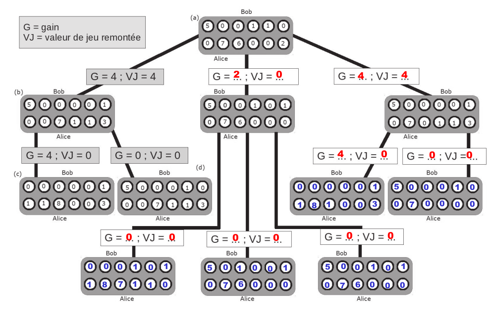

{{titre_concours("CCINP","2024")}}


!!! note
    * Ce corrigé peut contenir des erreurs ! Merci de me les signaler si vous en trouvez
    * Un code complet permettant de jouer à l'awale en joueur contre joueur ou contre une IA (algorithme min max) et crée au fil des questions est donné en fin de corrigé

## Enoncé

{{telecharger("Enoncé","CCINP2024.pdf")}}


## Partie I - Présentation et règles

### Question 1

Alice peut choisir de jouer n'importe quelle case *non vide* de son camp, donc ici les cases 2, 4 et 5

### Question 2

La situation initiale est :
{{awale([0,0,2,0,16,5,2,1,0,1,0,1])}}

Voici les différentes configurations obtenues selon le coup joué :


* Si Alice joue la case 2, son gain est nul
{{awale([0,0,0,1,17,5,2,1,0,1,0,1])}}

* Si Alice joue la case 4 elle récolte les cases 7 (3 graines), 8 (2 graines) et 9 (3 graines) pour un gain de 8:
{{awale([1,1,3,1,0,7,4,0,0,0,1,2])}}

* Si Alice joue la case 5, son gain est nul
{{awale([0,0,2,0,16,0,3,2,1,2,1,1])}}

### Question 3

Dans les deux situations, Alice ne peut jouer que la case 5.

* Dans la première situation, on obtient :
{{awale([0,0,0,0,0,0,2,2,2,2,2,0])}}
Mais la récolte d'Alice affame alors son adversaire et donc le coup n'est *pas valide* !

* Dans la seconde situation, on obtient :
{{awale([0,0,0,0,0,0,0,0,0,0,0,1])}}
Car Alice peut alors récolter les cases 6 à 10 (qui contiennent chacune 2 graines) pour un gain de 10.

## Partie II - Programmation de la structure du jeu

### Question 4

```python
    --8<-- "CCINP2024/CCINP2024.py:Q4"
```

### Question 5

```python
    --8<-- "CCINP2024/CCINP2024.py:Q5"
```

### Question 6

Au plus, une case contient la totalité des graines donc 48. Donc 6 bits sont nécessaires pour stocker le nombre de graines de chaque case comme $2^6 = 64$, on peut représenter sur 6 bits les entiers de $0$ à $65$.

### Question 7

```python
    --8<-- "CCINP2024/CCINP2024.py:Q7"
```

### Question 8

```python
    --8<-- "CCINP2024/CCINP2024.py:Q8"
```

!!! note
    On pouvait aussi utiliser la fonction d'initialisation `awale_jcj` donnée dans l'énoncé pour initialiser la copie et rensuite recopier ensuite les éléments différents.

### Question 9

```python
    --8<-- "CCINP2024/CCINP2024.py:Q9"
```

### Question 10

```python
    --8<-- "CCINP2024/CCINP2024.py:Q10"
```

### Question 11

```python
    --8<-- "CCINP2024/CCINP2024.py:Q11"
```


### Question 12

On a surligné la ligne à compléter (on vérifie simplement que les 3 conditions de l'énoncé sont valides)

```python hl_lines="6"
    --8<-- "CCINP2024/CCINP2024.py:Q12"
```

### Question 13


```python
    --8<-- "CCINP2024/CCINP2024.py:Q13"
```

### Question 14


```python
    --8<-- "CCINP2024/CCINP2024.py:Q14"
```

### Question 15


```python
    --8<-- "CCINP2024/CCINP2024.py:Q15"
```

### Question 16

```python
    --8<-- "CCINP2024/CCINP2024.py:Q16"
```

## Partie III - Programmation de l'Intelligence Artificielle (IA)


### Question 17

```python
    --8<-- "CCINP2024/CCINP2024.py:Q17"
```

### Question 18
 {.imgcentre width=800px}

 Alice jouera la case 5 (branche centrale), en effet la valeur de jeu remontée pour cette branche est 2 (elle gagne 2 graines et Bob ne peut obtenir aucun gain au coup suivant). La branche gauche remonte une valeur de jeu nulle (elle gagne 4 graines, mais un des coups suivants de Bob lui permet aussi de gagner 4 graines) et il en est de même pour la branche droite.


### Question 19

Les lignes qui devaient être complétées sont surlignées

```python hl_lines="4 12 18 19"
    --8<-- "CCINP2024/CCINP2024.py:Q19"
```

### Question 20


```python 
    --8<-- "CCINP2024/CCINP2024.py:Q20"
```

### Question 21

La ligne modifiée par rapport à `awale_jcj` a été surlignée.

```python hl_lines="6"
    --8<-- "CCINP2024/CCINP2024.py:Q21"
```

### Question 22
```sql
SELECT id_Joueur
FROM Joueur
WHERE niveau>1900
```

### Question 23
La requête suivante donne le nombre de parties victorieuse pour le joueur 1 lorsque la case "0" (lettre 'a') a été jouée au premier coup, on l'utilise dans une sous requête dans la réponse
```sql
SELECT COUNT(*)
FROM Partie
WHERE jeu LIKE "a%" AND resultat=1;
```

```sql
SELECT 100.0 * (SELECT COUNT(*)
        FROM Partie
        WHERE jeu LIKE "a%" AND resultat=1) / COUNT(*)
FROM Partie WHERE jeu LIKE "a%";
```

### Question 24
```sql
SELECT nom, prenom
FROM Joueur
ORDER BY niveau DESC
LIMIT 3 ;
```

### Question 25

```sql
SELECT nom , prenom , COUNT (*) AS nbVic
FROM Joueur
JOIN Partie ON id_Joueur = id_joueur1
WHERE resultat = 1.0
GROUP BY id_Joueur
HAVING nbVic > 100
ORDER BY nbVic DESC ;
```

## Totalité du programme Awalé

{{telecharger("Fichier Python complet du jeu","CCINP2024.py")}}