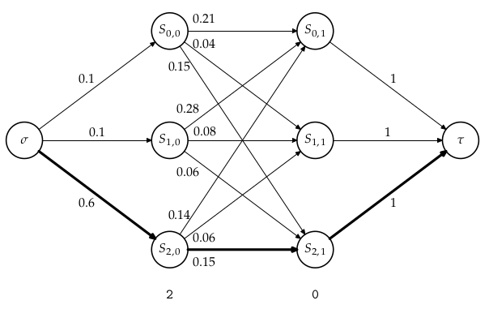

{{titre_concours("CCMP","2024")}}


!!! note
    Corrigé écrit par [V. Picard](https://vincent-picard.github.io/){target=_blank}

## Enoncé

{{telecharger("Enoncé","CCMP2024.pdf")}}


## Compression du message d'Alice : codage arithmétique

### Question 1

On peut utiliser le code suivant :

|Caractère|Code|
|---------|----|
| 'a'     | `0`|
| 'b'     |`10`|
| 'c'     |`11`|

Le codage de `s='abaabaca'` est alors : `0 10 0 0 10 0 11 0` (11 bits)

Le texte peut-être décodé sans ambiguité : lorsqu'on rencontre un `0`, on décode en `a`, lorsqu'on rencontre un `1`, on lit le bit suivant, si c'est un `0` on décode en `b` sinon en `c`.


###  Question 2

```python
--8<-- "CCMP2024/CCMP2024.py:Q1"
```

### Question 3

Pour l'entrée `abaabaca` la fonction `listeCaracteres` renvoie la liste `['a','b','c']` c'est à dire sans répétition la liste des caractères présents dans `s`. Son principe de fonctionnement est le suivant :  

* on parcourt les indices de la chaine `s`
* on maintient à jour dans la variable `listeCar` la liste des caractères  de `s[0:i]` sans doublons (c'est l'invariant de boucle initialement vrai)
* à l'itération d'indice `i`, si le caractère `s[i]` n'est pas présent dans `listeCar` on l'ajoute
* à la fin, l'invariant est vrai donc `listeCar` contient la liste des caractères de `s[0:n]=s`.

### Question 4

La boucle `for` du programme s'exécute exactement `n` fois. Comme rappelé dans l'énoncé le `append` de la ligne est de complexité constante mais le `in` de la ligne de 6 est de complexité linéaire en la taille de la liste qui est de taille maximale `k`. Les complexité est donc en $\mathcal{O}(nk)$.

### Question 5

La fonction renvoie pour la chaine `s` donnée en argument une liste de couples (tuples de deux éléments) `(c,k)` où `c` est un caractère de la chaine `s` et `k` le nombre d'occurrences du caractère `c` dans `s`. Par exemple sur l'entrée `analyseTexte("babaaaabca")` la fonction renvoie `[('b',3),('a',6),('c',1)]`.

### Question 6

La fonction appelle `listeCaracteres` qui a une complexité $\mathcal{O}(nk)$, puis elle effectue une boucle `for` qui itère `k` fois. le corps de la boucle fait appel `nbCaracteres(c,s)` qui a une complexité $\mathcal{O}(n)$. La complexité est donc :
$\mathcal{O}(nk) + k\mathcal{O}(n) = \mathcal{O}(nk) + \mathcal{O}(nk) = \mathcal{O}(nk)$.

### Question 7


```python
--8<-- "CCMP2024/CCMP2024.py:Q2"
```

La boucle `for` s'exécute `n` fois, le corps de la boucle ne contient que des opération élémentaires car le teste d'appartenance au dictionnaire est supposé en $\mathcal{O}(1)$. La complexité de cette nouvelle version est donc $n\mathcal{O}(1) = \mathcal{O}(n)$


### Question 8
```python
--8<-- "CCMP2024/CCMP2024.sql:Q8"
```

### Question 9
La requête suivante permet d'obtenir le nombre total $N$ de caractères en français dans l'ensemble de tous les oeuvres :
```sql
--8<-- "CCMP2024/CCMP2024.sql:Q9a"
```
On peut alors calculer le nombre d'occurrences de chaque symbole dans l'ensemble des oeuvres en français puis diviser le résultat par $N$ à l'aide d'une requête imbriquée :
```sql
--8<-- "CCMP2024/CCMP2024.sql:Q9b"
```


### Question 10

On applique l'algorithme proposé :

* On part de l'intervalle $[0;1[$ qui sera progressivement affiné.
* La première lettre `b` correspond à l'intervalle $[0.2;0.3[$
* Pour la lettre suivante `a` on doit prendre 20% de cet intervalle (fréquence de `a`) à partir du début : $[0.20;0.22[$
* Pour la lettre suivante `c` on doit prendre 20% de cet intervalle (fréquence de `c`) à partir de 30% : $[0.206;0.210[$

### Question 11
```python
--8<-- "CCMP2024/CCMP2024.py:Q11"
```

### Question 12

Le mot `'ad'` conduit à l'intervalle de codage $[0.1;0.18[$ :

|mot |intervalle|
|----|----------|
|`a` | $[0;0.2[$|
|`ad`| $[0.1;0.18[$|

Il nous faut donc calculer à quelle proportion de l'intervalle $[0.1;0.18[$ le nombre $x=0.123$ se situe :

$\dfrac{0.123-0.1}{0.18-0.1} \simeq 0.28$

Ce qui correspond à l'intervalle $[0.2;0.3[$, le prochain caractère est donc un `b`.

### Question 13

Le mot `ba` est codé par l'intervalle $[0.2;0.22]$ et peut donc être représenté par le flottant $0.2$.
Le mot `baa` est codé par l'intervalle $[0.2;0.204]$ et peut donc être représenté par le flottant $0.2$.
Comme $0$ est dans l'intervalle représentant `a`, on peut ajouter des `a` au mot sans changer le codage, il faut savoir quand le mot codé se termine.

### Question 14

On détermine le caractère $c$ correspondant à $x$ dans $[0;1[$ grâce à la fonction `decodeCar`, ceci est la première lettre du mot à décoder. On répète ensuite le processus avec le sous-intervalle correspondant à $c$ que l'on obtient en utilisant la fonction `codeCar`, on répète le processus jusqu'à aboutir au caractère de terminaison `#`.
```python
--8<-- "CCMP2024/CCMP2024.py:Q14"
```

## Décodage du message reçu par Bob à l'aide de l'algorithme de Viterbi

### Question 15

En excluant $\sigma$ et $\tau$, il y a $NK$ sommets (les sommets sont les $S_{i,j}$ avec $0 \leqslant i \leqslant K-1$ indiquant  du symbole émis et $0 \leqslant j \leqslant N-1$ indiquant l'indice d'observation). Chaque sommet possède $K$ arcs sortants exceptés ceux correspondants à la dernière émission (c'est à dire les $S_{j,N-1}, 0\leqslant j \leqslant N-1$. Donc il y a en tout $(N-1)K^2$ arcs.

### Question 16

On place :

* les sommets $\sigma$ et $\tau$
* Les sommets $S_{i,j}$ par couche (de la gauche vers la droite l'indice d'observation et de haut en bas le symbole émis)
* On relie tous les sommets de la première colonne à $\sigma$ et tous ceux de la dernière à $\tau$
* Chaque somme $S_{i,j}$ est relié à tous les sommets de la colonne suivante (les $S_{k,j+1}$).
* On sait que Alice a emis `[2, 0]` donc les arcs quittant $\sigma$ sont pondérés par la dernière ligne de la matrice $E$ (celle issue du symbole 2).
* Comme indiqué dans l'énoncé, *"les arcs internes entre $S_{i,j}$ et $S_{k,j+1}$ sont pondérés par la probabilité $E_{obs_{j+1},k}P_{i,k}$"*.

On obtient donc :


{.width=600px .imgcentre}

Le chemin de probabilité maximale est représenté en gras et correspondant au décodage `[2, 2]` (le dernier symbole a été corrigé)

## Question 17

Notons $C_N$, le nombre de chemins dans le graphe pour un message de longueur $N \in \mathbb{N}$. On a initialement $C_0=1$. Si le message est de longueur $N \in \mathbb{N}^*]$, on a initialement $K$ choix pour le premier arc menant à $S_{i,0}$. On peut alors voir le reste du chemin comme celui correspondant à un graphe possédant une colonne de moins et dans lequel l'état de départ est $S_{i,0}$. On obtient alors la relation de récurrence suivante :
$\left\{
    \begin{eqnarray}
    C_0 & = & 1 \\
    C_N & = & KC_{N-1} \text{ pour tout } N \in \mathbb{N}^*
    \end{eqnarray}
\right.$

C'est donc une suite géométrique de terme général $C_N = K^N$. On en conclut que le nombre de chemins est exponentiel en la longueur du message et que donc une exploration exhaustive n'est pas envisageable.

## Question 18
```python
--8<-- "CCMP2024/CCMP2024.py:Q18"
```

## Question 19

!!! warning "Attention"
    La fonction `initialiserGlouton` proposé dans le suhet comporte certaines erreurs. Tout d'abord le prototype de la fonction est `#!python initialiserGlouton(Obs:[int],E:[[float]], K) -> int` car `Obs` est une liste et non une matrice. De plus, il faut bien parcourir la *ligne* d'indice `Obs[0]` et non la colonne. Le programme proposé comporte une erreur de syntaxe à la ligne 2, en voici une version corrigée :
    ```python
    --8<-- "CCMP2024/CCMP2024.py:Q19a"
    ```

```python
--8<-- "CCMP2024/CCMP2024.py:Q19b"
```

## Question 20

La fonction `InitialiserGlouton` a un coût $\mathcal{O}(K) + \mathcal{O}(K) =  \mathcal{O}(K)$ correspondant à la création de la liste par compréhesion puis à la recherche du maximum. La boucle `for` de la fonction `glouton` s'exécute $N-1$ fois et le corps de cette boucle est de complexité $\mathcal{O}(K)$. La complexité est donc $\mathcal{O}(K) + (N-1)\times\mathcal{O}(K) = \mathcal{O}(NK)$  
Ce qui améliore nettement le complexité exponentielle de la recherche exhaustive.

## Question 21

L'algorithme choisit d'abord l'arc de probabilité $0.6$ puis celui de probabilité $0.5$ le chemin obtenu par l'algorithme glouton est donc `[0,0]` avec une probabilité $0.6 \times 0.5 = 0.3$.

Cependant, ce n'est *pas* le chemin optimal, en effet le décodage `[1,0]` a une probabilité $0.4 \times 0.9 = 0.36$.

Cet exemple prouve donc que l'approche gloutonne est abordable en terme de complexité mais ne conduit pas nécessairement au meilleur décodage possible.

## Question 22

En transformant chacune des probabilités $p$ pondérant les arcs par $1-p$, le chemin de probabilité maximale devient le chemin de probabilité minimale et on peut donc utiliser l'algorithme de Djikstra qui permet de rechercher les plus courts chemins à partir d'un sommet source dans un graphe pondéré.

## Question 23

La fonction `initialiserViterbi` fournie dans l'énoncé permet de déterminer les $T_{i,0}$ et les $argT_{i,0}$, on applique alors les formules de récurrences données dans l'énoncé afin de construire les termes suivantes i.e. les $T_{i,j}$ et les $argT_{i,j}$ pour $0 \leqslant j \leqslant N-1$. Ce qui donne :

```python
--8<-- "CCMP2024/CCMP2024.py:Q23"
```

## Question 24

La probabilité maximale dans la dernière colonne est $1.8e-05$ et correspond au symbole `0`, on utilise alors le deuxième tableau qui donne pour chaque symbole le prédécesseur :

$\left(\begin{matrix}
-1 & 2 & \color{red}{0} & \color{red}{0} & 2 & 1 & 1 & \color{red}{0} \\
-1 & 2 & 2 & 2 & 2 & \color{red}{1} & \color{red}{1} & 0 \\
-1 & \color{red}{2} & 0 & 0 & \color{red}{2} & 1 & 1 & 0 \\
\end{matrix}\right)$

La séquence d'état la plus probable est donc `[2,0,0,2,1,1,0,0]`

## Question 25

L'initialisation des tableaux $T$ et $argT$ a une complexité $\mathcal{O}(NK)$ (définition par compréhension en $\mathcal{O}(NK) puis remplissage de la première colonne en \mathcal{O}(K)$). La construction des tableaux s'effectue dans deux boucles imbriquées de tailles respectives $N-1$ et $K$ et fait appel à la fonction de recherche du maximum de complexité la taille de la liste c'est à dire $\mathcal{O}(K)$, ce qui donne une complexité en $\mathcal{O}((N-1)\times K \times K) = \mathcal{O}(NK^2)$. Au total on a donc une complexité temporelle en $\mathcal{O}(NK^2)$.

La complexité spatiale est celle de la taille des deux tableaux crées c'est à dire $\mathcal{O}(NK)$