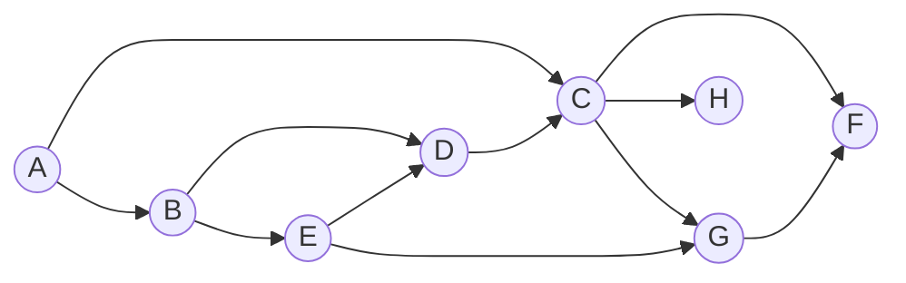




{{ titre_chapitre(num,niveau)}}

## Cours

{{ affiche_cours(num) }}

## Travaux pratique

{{exo("Représentation par liste d'adjacence",[],0)}}

On rappelle qu'un graphe peut-être représenté par liste d'adjacence et qu'en Python, on peut utiliser un dictionnaire dont les clés sont les noeuds du graphe et les valeurs  la liste des successeurs de la clé. Par exemple, le graphe 
<div class="centre">
    ```mermaid
    graph LR
    A(("A"))
    B(("B"))
    C(("C"))
    D(("D"))
    E(("E"))
    A --> B
    A --> C
    C --> E
    D --> E
    B --> C
    C --> D
    ```
    </div>

est représenté par le dictionnaire 

```python
ex_graphe = {
    'A' : [B,C],
    'C' : [E,D],
    'D' : [E],
    'B' : [C],
    'E' : [],
}
```

1. Ecrire en Python une fonction `ajoute_arc` qui prend en argument un dictionnaire représentant un graphe par liste d'adjacence ainsi que deux sommets et ajoute cet arc dans le dictionnaire.

    !!! aide
        Penser à prévoir le cas où les sommets n'existent pas encore dans le dictionnaire.

2. Utiliser cette fonction pour en partant d'un dictionnaire vide, construire le dictionnaire représentant le graphe ci-dessus

3. Le module `graphviz` de Python permet de visualiser un graphe, ajouter l'instruction permettant d'importer de module au début de votre programme.

4. Aucune connaissance sur l'utilisation de ce module n'est attendue aussi on fournit ci-dessous une fonction `visualise` permettant  de visualiser un graphe représenté par liste d'adjacence à l'aide d'un dictionnaire. Recopier cette fonction et l'utiliser afin de visualiser le graphe construit ci-dessus.
```python
def visualise(graphe):
        img_graphe = graphviz.Digraph()
        for s in graphe:
             img_graphe.node(s)
             for t in graphe[s]:
                  img_graphe.edge(s,t)
        img_graphe.view()
```

5. Ecrire une fonction `ajoute` qui crée un sommet dans le graphe. Si ce sommet existe déjà, la fonction ne fait rien.

6. Ecrire une fonction `supprimer` qui supprime un sommet ainsi que tous les arcs (entrant ou sortant) de ce sommet. Si ce sommet n'existe pas, la fonction ne fait rien.

6. Ecrire une fonction `supprime` qui permet d'enlever un arc dans le graphe (si l'arc n'existe pas la fonction ne fait rien)

7. Tester vos fonctions en construisant et en visualisant le graphe de votre choix.

{{exo("Représentation par matrice d'adjacence",[])}}

On rappelle qu'un graphe peut-être représenté par une matrice d'adjacence $M$, si $M_{ij}=1$ alors il y a un arc allant sur sommet $i$ au sommet $j$. En Python, on utilisera une liste de liste afin de représenté la matrice et pour simplifier, les noms des sommets seront leur index dans la liste.Par exemple, le graphe 
<div class="centre">
    ```mermaid
    graph LR
    A(("A"))
    B(("B"))
    C(("C"))
    D(("D"))
    E(("E"))
    A --> B
    A --> C
    C --> E
    D --> E
    B --> C
    C --> D
    ```
    </div>

est représenté par la liste de liste  :

```python
ex_graphe = [
    [0,1,1,0,1],
    [0,0,1,0,0],
    [0,0,0,1,1],
    [0,0,0,0,1],
    [0,0,0,0,0]
]
```
Le graphe vide  est représenté par la liste vide.

1. Ecrire une fonction `ajoute_sommet` qui prend en argument un graphe représentée par une liste de liste et ajoute un nouveau sommet.

    !!! aide
        Il faut donc ajouter une nouvelle liste et un 0 à la fin de toutes les lignes.

2. Ecrire une fonction `ajoute_arc` qui prend en argument l'indice de deux sommets et ajoute l'arc correspondant.

    !!! aide
        Penser à utiliser la fonction précédente pour ajouter des sommets si l'indice des sommets à ajouter dépasse la taille du graphe

3. Utiliser la fonction précédente afin de construire le graphe donnée en exemple ci-dessus en partant du graphe vide (qui est représenté par `[]`)

4. Comme dans l'exercice précédent, visualiser votre graphe à l'aide de la fonction fournie ci-dessous (ne pas oublier d'importer le module `graphviz`). On rappelle que les sommets sont ici nommés avec leur indice dans la matrice, donc $0, 1, \dots$

{{exo("Parcours en profondeur",[])}}

<div class="centre">

</div>

1. Visualisation d'un parcours *depth first search*  
Un [outil en ligne](https://visualgo.net/en/dfsbfs){target=_blank}, permet de visualiser le résultat du parcours en profondeur d'un graphe. Utiliser cet outil pour construire le graphe ci-dessus puis l'utiliser pour visualiser le parcours en profondeur.

    !!! attention
        Dans le menu bien choisir: **DFS**

2. Rappeler le principe de l'algorithme de parcours en profondeur (voir le cours ou le code en pseudo-langage donné dans l'outil de visualisation)

3. Ecrire cet algorithme en Python en utilisant la représentation du graphe sous forme d'une liste d'adjacence.

4. Tester votre implémentation en comparant avec les résultats obtenus sur l'outil de visualisation


{{exo("File et module deque",[])}}

On rappelle qu'une file est une structure de données de type {{sc("fifo")}} (premier entré, premier sorti). Les opérations de base (enfiler ou défiler) doivent s'effectuer de façon efficace (c'est à dire en $O(1)$)

1. Si on considère qu'une liste de Python est une file (la sortie de la file est à la fin), quelle opération permet d'enfiler ? de défiler ?

2. Ecrire les opérations `enfiler` et `defiler` sur une liste de Python.

3. Vérifier expérimentalement que `defiler` ne s'effectue pas en temps constant.

    !!! aide
        On peut mesurer le temps d'execution d'une opération à l'aide de la fonction `perf_counter` du module `time`

4. Le module `deque` (accessible avec `from collections import deque`) permet en Python une implémentation efficace des files. Les opérations de base sont données ci-dessous :
```python
ma_file = deque() #création d'une file vide
ma_file.appendleft(42) #On enfile 42
res = ma_file.pop() #on défile 42 (dans res)
```
Utiliser cette nouvelle implémentation et vérifier expérimentalement que les opérations s'effectuent bien en $O(1)$.

{{exo("Parcours en largeur",[])}}

<div class="centre">

</div>

1. Visualisation d'un parcours *breadth first search*  
Un [outil en ligne](https://visualgo.net/en/dfsbfs){target=_blank}, permet de visualiser le résultat du parcours en largeur d'un graphe. Utiliser cet outil pour construire le graphe ci-dessus puis l'utiliser pour visualiser le parcours en largeur.

    !!! attention
        Dans le menu bien choisir: **BFS**

2. Rappeler le principe de l'algorithme de parcours en largeur (voir le cours ou le code en pseudo-langage donné dans l'outil de visualisation)

3. Ecrire cet algorithme en Python en utilisant la représentation du graphe sous forme d'une liste d'adjacence.

    !!! aide
        On pourra utiliser le module `deque` pour gérer la file contenant les sommets à traiter mais aussi une simple liste (étant donné la taille du graphe, les considérations de performance sont sans importance)

4. Tester votre implémentation en comparant avec les résultats obtenus sur l'outil de visualisation

