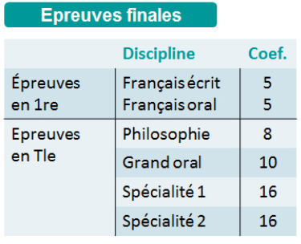
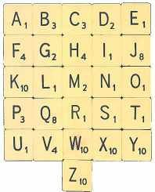
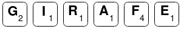



{{ titre_chapitre(num,niveau)}}

## Introduction

On rappelle que pour une *liste* de Python, les valeurs sont accessibles par l'intermédiaire de leur *indice*. Par exemple les éléments de la liste `#!python prenoms = ['Marie', 'Paul', 'Julie', 'Tom', 'Alice']`  sont accessibles via les indices `0, 1, 2, 3, 4` comme illustré ci-dessous :

| Elements | 'Marie' | 'Paul' | 'Julie' | 'Tom' | 'Alice' |
|----------|:-------:|:------:|:-------:|:-----:|:-------:|
| Indice   | 0       | 1      | 2       | 3     | 4       |


Un dictionnaire de Python est similaire à une liste mais les éléments appelées **valeurs** sont reperés par des **clés**. Un dictionnaire est donc comparable à un **tableau associatif** de clés et de valeurs, chaque clé (unique) étant associé à une valeur. Prenons un premier exemple, un dictionnaire permettant d'**associer** des clés (des prenoms) à des **valeurs** à une adresse mail :


| Clés     | 'Marie'          | 'Paul'          | 'Tom'            |
|----------|:----------------:|:---------------:|:----------------:|
| Valeurs  | 'marie@toto.com' | 'paul@truc.net' | 'tom@bidule.org' |

Pour créer ce dictionnaire en Python, on utilise la syntaxe suivante :

`#!python adresses = {'Marie' : 'marie@toto.com', 'Paul' : 'paul@truc.net', 'Tom' : 'tom@bidule.org'}`

c'est-à-dire :

* On liste entre accolades `{` `}` et séparés par des virgules `,` les paires clés/valeurs
* Les deux éléments d'une même paire sont séparés par le caractère `:`

## Opération de bases sur un dictionnaires 


* Affichage :  
    Pour afficher la totalité des paires d'un dictionnaire, on utilise l'instruction `print`
* Accès à une valeur :  
    Pour accéder aux valeurs de ce dictionnaire, on utilise une syntaxe similaire à celle des listes, mais on donne la clé entre crochets (`[` et `]`) et pas l'indice. Par exemple l'adresse mail de `'Paul'` s'obtient avec `adresses['Paul']`.

    !!! note
        Tenter d'accéder à une valeur via une clé inexistante produit une erreur `KeyError`

* Modifier une valeur :   
    Pour modifier une valeur dans un dictionnaire, on utilise l'affectation `=`. Par exemple pour modifier l'adresse de Tom : `adresses['Tom'] = tom@mel.org` 
* Supprimer une valeur :
    Pour supprimer une paire d'un dictionnaire on utilise l'instruction `del`. Par exemple pour supprimer `#!python del adresses['Marie']` supprimera la paire `'Marie' : 'marie@toto.com'` du dictionnaires `adresses`

{{ IDE("scripts/ex_dico.py",ID=1)}}

!!! retenir "A retenir"
    * Un **dictionnaire** permet de stocker des données sous la forme d'associations clés/valeurs
    * Pour créer un dictionnaire, on utilise la syntaxe :  
        `#!python mon_dico = {cle1 : valeur1, cle2 : valeur2, cle3:valeur3, ...}`. Un dictionnaire vide s'obtient avec `{}`.
    * On accède à une valeur par sa clé avec la syntaxe `#!python mon_dico[cle]`, si la clé n'existe on obtient l'erreur `KeyError`
    * On modifie une valeur existante ou créer une nouvelle association clé/valeur avec une affectation de la forme `#!python mon_dico[cle] = nouvelle_valeur`
    * On peut supprimer un couple clé/valeur avec `#!python del mon_dico[cle]`

{{ exo("Créer et manipuler un dictionnaire",[],0)}}

1. Créer un dictionnaire `coefficient` permettant d'associer à chaque épreuve finale du bac son coefficient (voir tableau ci-dessous) :
 {width=300px .imgcentre}
2. Ecrire une instruction `print` permettant d'afficher le coefficient du `'Grand oral'`.
2. Quelle instruction permet de modifier le coefficient de la philosophie en 9 ?
3. Quelle instruction permet de rajouter l'épreuve `'Option'` avec un coefficient 2 ?
4. Quelle instruction permet de supprimer l'épreuve `'Option'` crée ci-dessus ?

## Test d'appartenance à un dictionnaire

On peut tester si une clé existe ou non dans un dictionnaire avec `<cle> in <dico>` qui renverra `true` si `<cle>` est une clé présente dans `<dico>` et `<false>` sinon.

!!! note
    On peut aussi utiliser `#!python in` sur les listes pour y tester la présence d'un élément par exemple `2 in [1, 9, 4]` renvoie `false`. Pour des raisons qui seront détaillées plus loin dans le cours, on limitera volontairement l'utilisation du `in` aux dictionnaires et on l'évitera sur les listes.

{{ exo("Dictionnaire des nombres d'occurrences",[])}}

Ecrire une fonction `dico_occurrence` qui prend en entrée une chaîne de caractères `s` et renvoie un dictionnaire dont les clés sont les caractères présents dans `s` et les valeurs leurs nombres d'occurrences. Par exemple, `dico_occurrence("Bonjour")` doit renvoyer le dictionnaire `{'B' : 1, 'o':2, 'n':1, 'j':1, 'u':1, 'r':1}` car tous les caractères apparaissent une fois sauf `o` qui apparaît deux fois.

??? aide "Indices"
    1. Créer un dictionnaire vide
    2. Parcourir la chaine `s` caractère par caractère
    3. Si le caractère est déjà présent dans le dictionnaire incrémenter son nombre d'occurrence, sinon l'ajouter au dictionnaire avec une occurrence de 1.


## Parcourir un dictionnaire

On peut parcourir un dicionnaire par clés ou par valeurs et la syntaxe est similaire à celle déjà rencontrée sur les autres *itérables* (chaines de caractères, tuples, listes) : on utilise une boucle `for <cle> in <dico>`. Par exemple, dans la boucle `#!python for c in {"A":6, "T":12, "C":9, "G":14}` la variable `c` prendra les valeurs `"A"`, `"T"`, `"C"` et `"G"`.


{{ exo("Valeur d'un mot au Scrable",[])}}
Au jeu du Scrabble, chaque lettre a une valeur comme indiqué sur l'image ci-dessous :

{.imgcentre width=300px}

Le but de l'exercice est d'écrire une fonction `score` qui prend un argument un `mot` et renvoie la somme des valeurs des lettres de ce mot. Par exemple `valeur("GIRAFE")` doit renvoyer 10 en effet :
{.imgcentre width=250px}
et donc la valeur est $2+1+1+1+4+1 = 10$

1. Compléter  une première version de `score` qui parcours les lettres du mots et ajoute la valeur suivant la lettre rencontrée.
```python
def score(mot):
    total = 0
    for lettre in ....:
        if lettre == 'A' or lettre=='E' or lettre=='I' ..... :
            total += 1
        if lettre == 'D' or lettre == 'G' or .......:
            totel += 2
        ...
        ...
    return ...
```


2. Les dictionnaires à la rescousse

    1. Créer un dictionnaire `valeur` dont les clés sont les lettres de l'alphabet et qui associe à chaque lettre sa valeur.

    2. Utiliser ce dictionnaire afin d'écrire une version bien plus courte et lisible de la fonction `score`.

## Dictionnaires et mutabilité

Les dictionnaires sont des structures de données *mutables* de Python, on retrouve donc les deux conséquences déjà observées sur les listes, à savoir :

* lorsqu'on on crée un dictionnaire avec l'opérateur `=` à partir d'un dictionnaire existant, toute modification de l'un entraine une modification de l'autre :

    {{IDE("scripts/dict_mut1.py",ID=2)}}

    Pour crée une "vraie" copie d'un dictionnaire `dico`, on peut utiliser `dico.copy()`. Par exemple, ci-dessus, on écrira ligne 2 `#!python dico2 = dico1.copy()`. Les modifications apportées à la copie ne se répèteront pas sur l'original (et inversement)

* lorsqu'on passe un dictionnaire à une fonction, tout modification effectuée dans la fonction modifie effectivement le dictionnaire

    {{IDE("scripts/dict_mut2.py",ID=3)}}

D'autre part, les clés d'un dictionnaires doivent nécessairement être *non mutables*, donc les listes par exemple ne peuvent pas être clés d'un dictionnaire, une tentative en ce sens, déclenche un `TypeError`.

## Exercices de synthèse


{{ exo("Moyennes des élèves",[])}}

Voici un dictionnaire contenant  les notes obtenus par des élèves :
```python
notes = {
            "Albert"    : [7, 11, 15, 8, 9],
            "Alice"     : [14, 11, 6, 15],
            "Bob"       : [9, 9, 13, 14, 9],
            "Louise"    : [11, 13, 12, 14, 14],
            "Michelle"  : [2, 5, 4, 9],
            "Luc"       : [18, 14, 18, 11]
        }
```

1. Ecrire une fonction moyenne qui prend en argument une liste non vide d'entiers et renvoie la moyenne des éléments de cette liste.

2. Créer un dictionnaire possédant les mêmes clés (les prénoms) et contenant la moyenne de chaque élève.


{{ exo("Codage et décodage",[])}}

Le dictionnaire suivant représente un code, les clés sont les lettres de l'alphabet (en majuscule) et les valeurs sont les lettres par lesquelles les remplacer pour effectuer le codage :
```python
code = {'A': 'Y', 'B': 'S', 'C': 'B', 'D': 'I', 'E': 'T', 
        'F': 'Q', 'G': 'N', 'H': 'U', 'I': 'X', 'J': 'F',
        'K': 'C', 'L': 'W', 'M': 'K', 'N': 'H', 'O': 'E',
        'P': 'G', 'Q': 'O', 'R': 'P', 'S': 'L', 'T': 'M',
        'U': 'A', 'V': 'J', 'W': 'Z', 'X': 'V', 'Y': 'R',
        'Z': 'D'}
```
Par exemple le codage du mot `FACILE` est : `QYBXWT` (en effet la clé `F` est associée à la valeur `Q`, la clé `A` à la valeur `Y`, ...)

1. Ecrire une fonction qui prend en entrée une chaine de caractère et renvoie son codage. Si des caractères autres que des lettres majuscules sont présentes dans la chaine (ponctuation, espace, ...) ils sont laissées intactes. Tester votre fonction en déterminant le codage de la phrase `C'EST VRAIMENT SUPER DE FAIRE DU PYTHON !`. Tester votre réponse dans le formulaire suivant :   {{ check_reponse("B'TLM JPYXKTHM LAGTP IT QYXPT IA GRMUEH !")}}

2. Créer un dictionnaire `decode` qui "inverse" le dictionnaire `code` c'est-à-dire que la valeur associée à `Y` est `A`, celle associée à `B` est `S`, ...

3. Ecrire une fonction qui prend en entrée une chaine de caractère et renvoie son décodage. Tester votre fonction en décodant le message suivant : `LAGTP ! JEAL YJTD PTALLX W'TVTPBXBT`.


{{ exo("A la recherche du mot caché",[])}}

Vous pouvez télécharger ci-dessous un fichier `mot_cache.txt` :  
{{telecharger("mot_cache.txt","./files/C5/mot_cache.txt")}}    

ce fichier contient de nombreux caractères : tous ceux de code {{sc('ascii')}} compris entre 33 (`!`) et 126 (`~`). Tous ces caractères apparaissent au moins à 50 reprises (et jusqu'à 100 fois) *à l'exception de quelques uns* qui apparaissent rarement (moins d'une dizaine de fois).  
Retrouver les caractères qui apparaissent rarement, ranger les dans l'ordre de leur nombre d'apparition pour obtenir le mot caché. Vous pouvez vérifier votre résultat ci-dessous :
{{ check_reponse("Bravo") }}

!!! aide
    * Revoir si nécessaire comment ouvrir un fichier en Python et en lire le contenu.
    * On pourra construire un dictionnaire dont les clés sont les caractères et les valeurs leur nombre d'apparition.

{{ exo("S'entrainer sur CodEx",[])}}

Quelques exercices CodEx pour s'entrainer sur les dictionnaire :

* [Anniversaire](https://codex.forge.apps.education.fr/exercices/anniversaires/){target=_blank}
* [Concours de l'Eurovision](https://codex.forge.apps.education.fr/en_travaux/eurovision/){target=_blank}
* [Décomposition en facteurs premiers](https://codex.forge.apps.education.fr/exercices/decomposition_facteurs_premiers/){target=_blank}
* [Dictionnaire de J'aime](https://codex.forge.apps.education.fr/exercices/dictionnaire_aime/){target=_blank}
* [Pangramme](https://codex.forge.apps.education.fr/exercices/pangramme_1/){target=_blank}

## Problèmes


{{exo("Algorithme de Luhn",[])}} 


L'[algorithme de Luhn](https://fr.wikipedia.org/wiki/Formule_de_Luhn), du nom de son inventeur 
[Hans Peter Luhn](https://fr.wikipedia.org/wiki/Hans_Peter_Luhn){.target =_blank} est célèbre car il est notamment utilisée pour vérifier qu'un numéro de carte de crédit est valide. Pour valider un numéro donné on calcule à partir de ses chiffres une valeur appelée *somme de contrôle*, si cette valeur est divisible par 10 alors le numéro est valide.

Le but de l'exercice est de mettre en oeuvre cet algorithme puis de le tester. 


1. On commence par écrire  une fonction annexe qui sera utile dans le calcul de la somme de contrôle. Ecrire une fonction de `mult2` qui prend en entrée un entier naturel $c$ tel que $0\leqslant c \leqslant 9$ et renvoie $2c$  lorsque $0\leqslant 2c \leqslant 9$ et la somme des deux chiffres de $2c$ sinon. On vérifiera les préconditions à l'aide d'instructions `#!python assert`.

    Le calcul de la somme de contrôle consiste à faire la somme des chiffres du numéro à tester en utilisant au préalable la fonction `mult2` sur les chiffres dont le rang est pair (c'est à dire en partant de la fin du nombre, le 2e chiffre, le 4e, ...). Par exemples :

    * pour `267` on doit faire `2 + mult2(6) + 7` ce qui donne  `2+3+7 = 12`.
    * pour  `15782`, on doit faire la somme `1 + mult2(5) + 7 + mult2(8) + 2`, ce qui donne : `1+1+7+7+2 = 18`.
    * pour  `124586`, on doit faire la somme `mult2(1) + 2 + mult2(4) + 5 + mult2(8) + 6`, ce qui donne : `2+2+8+5+7+6 = 30`.

    On rappelle que le numéro est valide lorsque cette somme de contrôle est divisible par 10, ainsi des trois exemples précédents, seul le dernier est un numéro valide.

2. Vérifier (à la main) que le numéro `4762` est valide mais pas le numéro `5438`.

3. Ecrire une fonction de signature `valide` qui prend en entrée un numéro `n` et renvoie un booléen indiquant si ce numéro est valide.

    !!! aide
        On rappelle que `n%10` permet d'obtenir le dernier chiffre d'un nombre écrit en base 10.


    On donne ci-dessous la définition en Python d'une liste de 100 numéros dont un seul n'est pas valide :

    ```python
    numeros = [42893834, 469308860, 816927776, 146369152, 577477938, 242383354, 198853863, 497604926, 965166499, 896414216, 252023627, 504900275, 833686900, 25200593, 448977637, 675139265, 651805400, 403834260, 40891723, 34557363, 350052114, 215953688, 947025672, 269564290, 364657825, 610215303, 787228626, 336651237, 451740674, 687031351, 15139298, 19798024, 156340226, 357230580, 691330690, 258981679, 599613932, 890184567, 281750117, 564780427, 311762298, 533773735, 594844219, 145449195, 84137843, 568985378, 345751986, 735943243, 497983155, 386643704, 295664130, 848035267, 127760916, 242689800, 117599563, 492418736, 378068621, 429991706, 829069962, 354972812, 117023051, 844209254, 374770840, 273363275, 726603368, 591265053, 57508467, 326217296, 6613137, 339258576, 416161248, 843538950, 398195826, 11005451, 988988143, 482333671, 105154348, 859903643, 743440430, 603137506, 771710878, 564268084, 451172761, 899471783, 806957882, 93935849, 917054033, 185026515, 523927549, 746123991, 539999326, 640950606, 115496762, 439933680, 439477399, 842100126, 556362267, 496985862, 693480949, 562975391]
    ```

4. Déterminer à l'aide d'un programme utilisant la fonction de validation lequel de ces numéros est invalide.
Tester votre réponse {{check_reponse("842100126")}}:

5. Ecrire une fonction qui prend en entrée un tableau d'entiers et renvoie le nombre de numéros valide dans ce tableau. Par exemple sur le tableau `numeros` de 100 entiers  donné en exemple, cette fonction doit renvoyer 99 puisque un seul numéro est invalide.


6. Ecrire une fonction qui prend en entrée un entier `n` et détermine quel chiffre ajouter à droite de ce nombre de façon à ce que le nombre ainsi formé soit un numéro valide. Par exemple pour 732, cette fonction renvoie 8 car le nombre 7328 est valide : `mult2(7) + 3 + mult2(2) + 8 = 5 + 3 + 4 + 8 = 20`

{{exo("Nombres harshad",[])}} 

On dit qu'un entier strictement positif est un *nombre harshad* (ou nombre de Niven) lorsqu'il est divisible par la somme de ses chiffres dans une base donnée. Dans cet exercice, on s'intéresse aux nombres harshad en base 10. Par exemples, $48$ est un nombre harshad puisque 48 est divisible par $12$, de même $63$ (divisible par 9) ou encore $190$ (divisible par 10) sont aussi des nombres harshad. Par contre $28$, ou encore $104$ ne sont pas des nombres harshad. Pour en savoir plus on pourra consulter [la page wikipedia dédiée](https://fr.wikipedia.org/wiki/Nombre_harshad){target = _blank}.

1. Ecrire une fonction `est_harshad` qui prend en argument un entier `n` et renvoie `True` si et seulement si `n` est un nombre harshad.

2. Ecrire une fonction `liste_harshad` qui prend en argument deux entiers `debut` et `fin` et renvoie la liste des nombres de harshad compris entre `debut` (inclus) et `fin` (exclu). Par exemple `liste_harshad(10,20)` doit renvoyer la liste `[10, 12, 18]` car ce sont les trois nombres harshad compris entre 10 (inclus) et 18 (exclu). Combien il y a-t-il de nombres harshad entre 10 (inclus) et 1000000 (exclu) ? Vérifier votre réponse : {{check_reponse("95418")}}.

3. On s'intéresse maintenant aux suites de nombres consécutifs qui sont tous harshad. Par exemple, on pourra vérifier que $110, 111, 112$ forment une suite de trois nombres harshad consécutifs. Ecris une fonction `consecutifs` qui prend en argument une liste *quelconque* d'entiers triés dans l'ordre croissant et renvoie le nombre de valeurs maximales consécutifs dans cette liste ainsi que la première de ces valeurs. Par exemple `consecutifs([2,6,7,10,12,13,14,20,21])` doit renvoyer le tuple `(3,12)` car il y a un maximum de 3 valeurs consécutives dans la liste et la première est 12.

4. Parmi les nombres harshad compris entre 10 (inclus) et 1000000 (exclu), combien au maximum en trouve-t-on de consécutifs ? Et quel est le premier de ces nombres ? {{check_reponse("131052")}}

{{exo("Nombre de jours entre deux dates",[])}}

On s'intéresse dans cet exercice au calcul du nombre de jours entre deux dates `d1` et `d2` données au format JJ/MM/AAAA. On propose pour cela, l'algorithme (naïf) suivant : on calcule de façon répété le lendemain de la date `d1` jusqu'à obtenir la date `d2`.

1. Créer un dictionnaire `nb_jours` qui fait correspondre à chaque numéro de mois son nombre de jours.

2. Ecrire une fonction qui renvoie `True` si et seulement si l'entier donné en argument est une année [bissextile](https://fr.wikipedia.org/wiki/Ann%C3%A9e_bissextile){target=_blank}. Une année est bissextile si elle est divisible par 4 mais pas par 100 ou s'il est divisible par 400.

3. Ecrire une fonction `lendemain` qui prend en argument trois entiers `j`, `m` et `a`  et renvoie les trois entiers correspondant au lendemain de cette date. Par exemple `lendemain(30,6,1950)` renvoie `1,7,1951`.

4. Créer une fonction `extrait` qui prend en argument une chaine de caractère représentant une date au format `JJ/MM/AAAA` et renvoie un tuple de trois entiers : le jour, le mois et l'année de cette date. Par exemple `extrait("25/01/1942")` renvoie le tuple 25, 1, 1942.

4. En déduire une fonction `ecart` qui prend en argument deux dates et renvoie le nombre de jours qui sépare ces deux dates. On considère que l'écart entre deux dates consécutives est 1.

5. Calculer l'écart entre le `25/01/1942` et le `17/12/2022` et vérifier votre réponse : {{check_reponse("29546")}}.