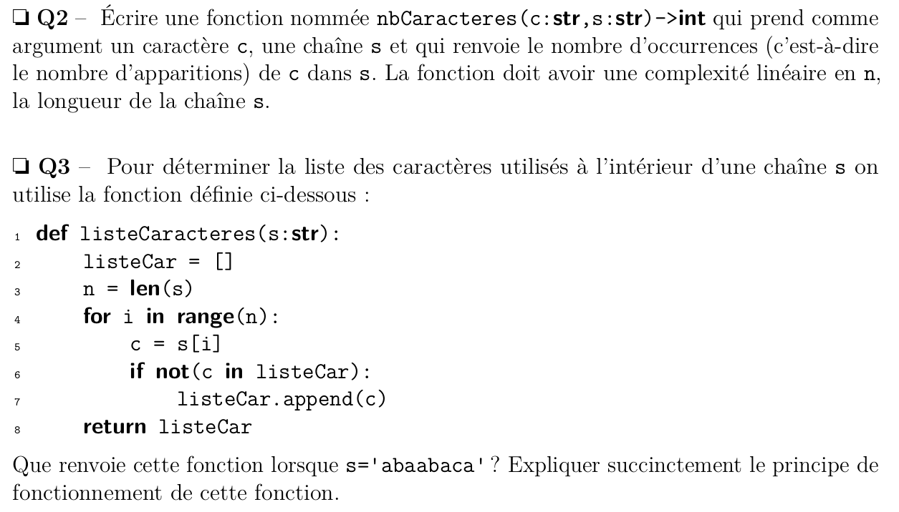



{{ titre_chapitre(num,niveau)}}

## Exemple introductif

On considère la fonction suivante :

```python
--8<-- "C4/imax_bad.py:1:8"
```

Pour chacun des appels suivants, quel sera le résultat renvoyé par cette fonction ?

* `imax([12, 18, 11, 9, 10])` 
* `imax([7, 7, 7, 7])` 
* `imax([-11, -15, -3])` 
* `imax([])`

Selon vous, ces résultats sont-ils ceux attendus par le concepteur de la fonction ?

## Définitions

L'exemple introductif ci-dessus est celui d'une fonction sans **spécification**, c'est à dire qu'on ne dispose pas d'une description formelle et détaillée de ses caractéristiques, en particulier, on ne sait pas :

* quel est le type des arguments et quelles sont leurs valeurs admissibles, c'est ce qu'on appelle les **préconditions**.
* ce que renvoie la fonction, ni si elle produit d'autres effets (affichages, modification des arguments, ...), c'est ce qu'on appelle les **postconditions**

En Python, l'usage est :

* de fournir une spécification sous la forme d'une [*docstring*](https://peps.python.org/pep-0257/){target=_blank} c'est à dire d'une chaine de caractères écrite entre trois guillemets et située immédiatement après la ligne du `#!python def` de la fonction. Cette docstring précise les types attendus en entrée pour les arguments et le type renvoyé.
* d'inclure des vérification des postconditions et des préconditions, si ces vérifications échouent le programme s'arrête en produisant un message d'erreur. Ces verifications sont effectuées à l'aide d'instructions `assert` qui prennent la forme suivante : `#!python assert <condition>, <message d'erreur>`. Par exemple `#!python assert len(l) != 0, "La liste doit être non vide"` vérifie que la liste `l` n'est pas vide, dans le cas contraire le programme s'arrête avec le message "La liste doit être non vide"
* d'indiquer *dans le code même de la fonction*  des annotations de type. C'est à dire qu'après chaque argument d'une fonction, on indique son type précédé du caractère `:` et qu'on indique le type renvoyé par la fonction en le précédant de `->`. Par exemple, une fonction `exemple` prenant en argument une liste `l` et un entier `n` et renvoyant un booléen s'écrira : `#!python def exemple(l : list, n: int) -> bool`

    !!! note
        Ces *annotations de type* ne sont ni obligatoires ni vérifiées à l'execution, cependant dans les sujets de concours récents (depuis 2023), elles apparaissent régulièrement à titre d'exemples :

        * un extrait du sujet CCMP de 2024 :
        {width=600px, .imgcentre}
        * un extrait du sujet CCINP de 2024 :
        {width=600px, .imgcentre}

## Retour sur l'exemple

L'exemple donné ci-dessous, devrait donc plutôt s'écrire :

```python linenums="1"
--8<-- "C4/imax_good.py:1:12"
```

1. La signature de la fonction inclus maintenant les annotations de type et elle est suivie par une spécification de la fonction.
2. Les instructions `assert` permettant de vérifier les préconditions
3. Grâce à la précondition, on peut accéder sans risque à `l[0]` car on sait que la liste contient au moins un élément.


Le comportement correct d'une fonction peut être *validé* (mais pas *prouvé*) par l'utilisation d'un jeu de test. C'est à dire un ensemble de couple d'entrées de la fonction et de sorties attendues. On teste en particulier les *cas limites* (*edge cases* en anglais), par exemple dans le cas d'une fonction travaillant sur les listes, le cas des listes vides ou réduites à un seul élément. Les instructions `assert` permettent de vérifier que la fonction passe les tests. Dans le cas de la fonction ci-dessus, on pourrait par exemple ajouter les tests suivants :

```python
# Test avec une liste contenant un unique élément :
assert imax([15]) == 0
# Test avec un maximum négatif
assert imax([-12,-3,-15]) == 1
# Test avec le maximum situé en dernière position
assert imax([1, 9, 5, 2, 10]) == 4
# Test avec plusieurs occurences du maximum
assert imax([1, 2, 7, 7, 3, 7, 4, 7]) == 2
```

## Exercices de synthèse

{{ exo("Ecrire la spécification d'une fonction",[])}}

On considère la fonction Python suivante :
```python linenums="1"
def cherche_position(element,liste):
    for pos in range(len(liste)):
        if liste[pos]==element:
            return pos
    return -1
```

1. Prédire la valeur renvoyée par `cherche_position("Y",["P","Y","T","H","O","N"])` puis vérifier en testant la fonction.
2. Même question pour `cherche_position("A",["P","Y","T","H","O","N"])`
3. Même question pour `cherche_position("M",["P","R","O","G","R","A","M","M","E"])`
4. Que fait cette fonction ? Ecrire sa chaîne de documentation.
5. Ajouter les annonations de type à cette fonction.
6. Proposer des tests afin de valider le comportement de cette fonction.


{{ exo("Puissance",[])}}


```python
def puissance(x,n):
    p = x
    for k in range(n-1):
        p = p * x
    return p
```

1. Que fait cette fonction ? Ecrire sa chaîne de documentation.
2. Proposer des préconditions sur les arguments.
3. Montrer que l'algorithme utilisé dans cette fonction a une complexité linéaire.

