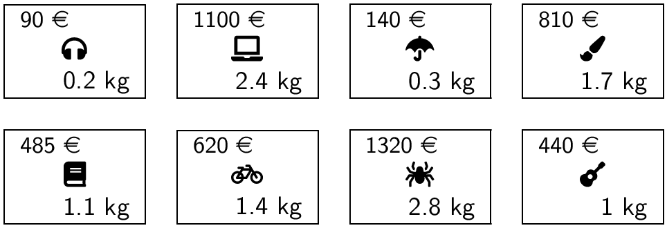



{{ titre_chapitre(num,niveau)}}

## Cours

{{ affiche_cours(num) }}

## Travaux pratiques


{{exo("Révision : Un serpent dans le terminal",[],0)}}


{.imgcentre width=400px}

Vous avez peut-être reconnu sur la capture d'écran ci-dessus une version minimaliste d'un célèbre jeu vidéo : [*snake*](https://fr.wikipedia.org/wiki/Snake_(genre_de_jeu_vid%C3%A9o)){target=_blank}, dans lequel le joueur dirige un serpent qui doit, sans entrer en collision contre lui-même ou contre les bords de l'écran, atteindre le plus possible de nourriture (`@` dans l'image ci-dessus). Chaque nourriture consommée accroît la taille du serpent ainsi que sa vitesse. Une version jouable en ligne est disponible [ici](https://playsnake.org){target=_blank}. 

Le but du TP est d'écrire, une version de ce jeu. L'interface graphique sera simplement le terminal et nous nous limiterons à l'affichage des caractères {{sc("ascii")}} standards. Pour cela nous allons transformer le terminal en interface graphique dans laquelle on peut afficher afficher n'importe quel caractère à la ligne et à la colonne donnée. On pourra définir les caractères utilisés dans le jeu à l'aide de variables globales en début de programme, par exemple dans la capture d'écran ci-dessus :
```python
--8<-- "C7/snake.py:car"
```


1. A propos de l'interface graphique  
Nous allons utiliser le module [curses](https://docs.python.org/fr/3/howto/curses.html){target=_blank} qui permet d'afficher des caractères dans le terminal en donnant simplement leur coordonnées. On doit donc écrire en début de programme `#!python import curses`. 
Afin d'utiliser correctement cette interface graphique, on doit définir une fonction `snake`  puis l'appeler avec les deux instructions suivantes :
```python
terminal = curses.initscr()
curses.wrapper(snake)
```
Dans la fonction `snake` les premières instructions ci-dessous initialisent le terminal et récupère sa taille :
```python
def snake(terminal):
    #Initialiser l'écran
    curses.cbreak()             # Désactiver la bufferisation de ligne
    curses.curs_set(0)          # Cacher le curseur
    curses.noecho()             # Ne pas afficher les touches tapées
    terminal.nodelay(1)         # Rendre getch() non-bloquant
    terminal.keypad(True)       # Accès aux touches spéciales
    terminal.clear()            # vide le terminal
    # Récupérer les dimensions du terminal
    maxl, maxc = terminal.getmaxyx()
    maxl = maxl-1               # pour que maxl contienne le numéro de la dernière ligne
    maxc =  maxc - 1            # idem pour maxc
```
Une fois cette initialisation effectuée, on peut afficher n'importe quel caractère {{sc("ascii")}} dans le terminal en utilisant la fonction `terminal.addch` qui prend en argument la ligne, la colonne et enfin le caractère affiché. Par exemple `#!python terminal.addch(5, 7, 'X')` affiche un `X` à la ligne 5 et à la colonne 7. Le coin supérieur gauche du terminal est l'origine (ligne 0, colonne 0). Enfin, les modifications apportées au terminal sont *bufferisées* (mises en attente), la fonction `terminal.refresh()` permet de mettre à jour un terminal en executant toutes les modifications en attente. 

    1. Pour vérifier que tout fonctionne correctement, ajouter à la fonction `snake` les instructions permettant d'afficher un `X` au centre du terminal. Puis utiliser la fonction `sleep` du module `time` qui permet d'attendre le nombre de secondes donné en argument(à importer en début de programme) afin de visualiser le résultat.        

    2. Ecrire la fonction `make_border` qui prend en argument `maxl` et `maxc` et qui dessine une bordure autour du terminal (dans la capture d'écran donnée en exemple au début du TP cette bordure est constituée de caractères `+`). 

        !!! aide
            On notera bien que la fonction `terminal.addch` :

            * prends comme premier argument la *ligne* et comme second la *colonne*
            * que le coin supérieur gauche est le point de coordonnées $(0,0)$.
            * on doit utiliser `refresh()` pour visualiser les modifications apportées au terminal.
    
    3. Compléter la fonction `snake` en appelant la fonction `make_border` et ajouter un temps d'attente afin de visualiser le résultat. Vous devriez obtenir un résultat similaire à la capture d'écran suivante :
    {.imgcentre width=400px}

2. Représentation interne du serpent  
On décide de stocker dans une liste de Python les positions occupées par le serpent, le premier élément de cette liste est la position de la queue du serpent et le dernier élément est la tête du serpent. Par exemple la liste `[(3,1), (3,2), (3,3), (3,4), (3,5)]` représente un serpent dont la tête est située en ligne 3 et colonne 5 et la queue en ligne 3 colonne 1. 

    1. Ecrire une fonction `init_snake` qui prend en argument `maxl`, `maxc` et un entier `size` et qui renvoie la liste des positions occupées par un serpent horizontal, centrée au milieu de l'écran. Cette fonction doit aussi mettre à jour le terminal afin d'y afficher le serpent. On notera bien que la tête du serpent est représenté par un caractère différent du reste.

    2. Appeler cette fonction depuis la fonction `snake` afin de faire afficher le serpent dans sa position de départ.


3. Génération aléatoire de nourriture  
On rappelle que la fonction `randint` permet de générer en entier aléatoire entre les deux bornes (incluses) données en argument. Lorsqu'on génère une position pour la nourriture elle ne doit pas être dans le serpent. On doit donc disposer d'une fonction qui teste si un couple de coordonnées `(l,c)` fait partie ou non des positions occupées par le serpent.

    1. Ecrire une fonction `in_list(x, lst)` qui renvoie `True` si `x` est dans `lst` et `False` sinon.

    2. En utilisant `in_list`, écrire une fonction de signature `make_food(pos_snake, maxl,maxc)` où `pos_nake` est la liste des positions occupées par le serpent et `maxl`, `maxc` les dimensions du terminal qui renvoie un tuple de coordonnées `(fl,fc)` contenant les lignes et colonnes de la nourriture. Cette fonction mettra aussi à jour le terminal à l'aide de `terminal.addch`.

    2. Tester votre fonction en appelant la fonction de génération de nourriture depuis le `main`.

3. Déplacement du serpent  
On initialise dans la fonction `snake` une variable `dir_snake` qui contiendra un entier indiquant la direction dans laquelle avance le serpent. On pourra définir des variables globales en début de programme afin d'utiliser de façon "transparente" ces entiers : `#!python RIGHT, UP, LEFT, DOWN = 0, 1, 2, 3`. Le serpent étant initialement horizontal avec la tête dirigée vers la droite on écrira `dir_snake = RIGHT`.

    1. Un déplacement du serpent peut générer une collision (avec lui-même ou les bordures), ou un augmentation de sa taille (s'il atteint la nourriture). Ecrire une fonction `!#python move_snake(pos_snake, dir_snake, maxl, maxc, fl, fc)` qui déplace le serpent et renvoie un entier indiquant si le serpent est entré en collision ou s'il doit grandir. On pourra définir ces entiers par des variables globales en début de programme :

        ```python
        GROW = 1
        COLLISION = 2
        ```

        !!! aide
            On pourra  :
            
            * déterminer la prochaine position de la tête du serpent en utilisant la position précédente et la direction 
            * si cette position est hors de l'écran ou se trouve dans le serpent alors renvoyer immédiatement `COLLISION`
            * sinon ajouter cette position à la liste des positions occupées par le serpent et supprimer la queue tout en mettant à jour l'affichage du terminal
            * renvoyer `GROW` si la nouvelle position est celle de la nourriture

    2. Tester votre fonction en modifiant la fonction `snake` et en effectuant quelques déplacements éventuellement en modifiant la direction du serpent

4. Boucle principal du jeu  

    On pourra partir du squelette suivant afin d'écrire dans la fonction `snake` la boucle principal du jeu:
    ```python
    while (running):
        sleep(delay)
        event = move_snake(pos_snake,dir_snake, maxl, maxc, fl, fc) #déplacer le serpent
        if event==GROW:                                             #nourriture consommée
            fl,fc = make_food(maxl,maxc,pos_snake)                  #recrée la nourriture
            delay = 0.9 * delay                                     #augmente la vitesse du jeu
        if event==COLLISION:                                        #collision > fin du jeu
            running = False
        kpress = terminal.getch()                                   #récupère la touche pressée
        if (kpress == curses.KEY_UP):                               #modifie en conséquence la direction
            dir_snake = UP
        elif (kpress == curses.KEY_DOWN):
            dir_snake = DOWN
        ....
    ```

5. Améliorations possibles

    * Faire afficher un score
    * Enregistrer dans un fichier les meilleures performances
    * Utiliser de la couleur
    * Introduire des caractères spéciaux ou des emojis comme :apple: pour la nourriture
    * Modifier le jeu en introduisant des bonus ou des malus, ...


{{ exo("Implémentation du rendu de monnaie en Python",[]) }}

Le but de l'exercice est de compléter une fonction `rendu` écrite en Python qui implémente l'algorithme glouton pour le problème du rendu de monnaie. La fonction prend en argument :

* un flottant `somme` qui est la somme à rendre
* une liste `valeurs` contenant la somme des valeurs du système monétaire utilisé qu'on suppose *déjà triée* par ordre décroissant

Et elle doit renvoyer comme résultat une liste contenant les pièces à utiliser. On renvoie une liste vide lorsque l'algorithme échoue à trouver une solution. On rappelle que la stratégie gloutonne pour ce problème consiste à rendre à chaque étape la pièce de plus forte valeur possible.

1. Questions préliminaires

    a. Que doit renvoyer `rendu(18,[15,10,5,2,1])` ? Quelle est la solution optimale à ce problème ?

    b. Que doit renvoyer `rendu(17,[10,9,8,3])` ? Quelle est la solution optimale à ce problème ?

2. Recopier et compléter le code de la fonction ci-dessous :
    ```python linenums="1"
    def rendu(somme,valeurs):
        #la solution de l'algorithme initialisée à la liste vide
        solution = .....
        #la position dans la liste valeurs de la pièce testée
        indice = ....
        while somme!=0 and indice<len(valeurs):
            piece = valeurs[.....]
            # on teste si la piece est inférieure à la somme à rendre
            if piece<=......:
                # Si oui l'ajouter à la solution et diminuer la somme à rendre
                somme=...............
                solution...........(.....)
            else:
                # Sinon passer à la pièce suivante
                indice = ........
        if somme==0:
            return solution
        else:
            return []
    ```
3. Quel est le rôle du test `somme==0` en ligne 16 ? Que renverrait cette fonction pour le problème de la question **1.b)** si on supprime entièrement ce test (lignes 16 à 19) et qu'on le remplace par `return solution` ?

4. Tester cette fonction sur les exemples de l'exercice **1**.

{{exo("Problème du sac à dos",[])}}

Le but de l'exercice est d'implémenter la stratégie gloutonne afin de résoudre le problème du sac à dos. On prend comme exemple un sac ayant un poids maximal de **4kg** et les objets suivants :

{.imgcentre width=600px}

1. On représente un objet par un `tuple` en Python `(valeur,poids)`, par exemple les écouteurs sont représentés par le tuple `(90, 0.2)`. Créer la liste `objets` en python contenant les 8 tuples représentant chacun des 8 objets ci-dessus.

2. On rappelle que la première étape de la stratégie gloutonne est de classer les objets en utilisant un critère pertinent, par exemple le rapport `valeur/poids`. Ecrire une fonction `rapport` qui prend en argument un `objet` (donc un tuple) et renvoie le rapport `valeur/poids` de cet objet.

    !!! aide
        Pour récupérer la valeur et le poids d'un objet représenté par un tuple, on peut *décompacter* le tuple :
        `#!python valeur, poids = objet`

3. En utilisant `sorted` écrire une fonction `trie_objets` qui prend en argument une liste d'objets et renvoie cette liste triée par ordre décroissant du rapport valeur/poids.

    !!! aide
        * le paramètre `reverse` à `True` permet d'obtenir l'ordre décroissant.
        * le paramètre `key` permet de donner la clé de tri (c'est la fonction `rapport` de la question précédente).

4. Ecrire la fonction `glouton` qui prend en argument une liste d'objets et un poids maximal et renvoie la valeur obtenue pour le sac. Tester votre fonction sur l'exemple donné en introduction et vérifier votre résultat : {{check_reponse("1660")}}

5. Modifier la fonction précédente afin qu'elle renvoie aussi le contenu du sac.


{{exo("Somme maximale dans une matrice carrée",[])}}

On considère une matrice carrée de taille $n\times n$, $M_{i,j}$ ($0 \leqslant i \leqslant n-1$ et $0 \leqslant j \leqslant n-1$) à coefficients entiers et on s'intéresse aux chemins depuis la première valeur en haut à gauche ($M_{0,0}$) jusqu'à la dernière en bas et à droite ($M_{n-1,n-1}$) qui n'utilisent que les déplacements vers la droite ($\rightarrow$) ou vers le bas ($\downarrow$). Et on cherche à déterminer la somme obtenue si on se déplace avec  une stratégie gloutonne. Par exemple,
dans la matrice suivante :

$\left(\begin{matrix}
1 & 3 & 2 & 4 \\
5 & 6 & 1 & 2 \\
7 & 8 & 9 & 1 \\
4 & 2 & 3 & 5
\end{matrix}\right)$

La stratégie gloutonne donnera le chemin suivant en rouge et une somme de **38**.

$\left(\begin{matrix}
\textcolor{red}{1} & 3 & 2 & 4 \\
\textcolor{red}{5} & 6 & 1 & 2 \\
\textcolor{red}{7} & \textcolor{red}{8} & \textcolor{red}{9} & 1 \\
4 & 2 & \textcolor{red}{3} & \textcolor{red}{5}
\end{matrix}\right)$

En cas d'égalité entre les choix, on choisit (arbitrairement) d'aller vers la droite ($\rightarrow$).

1. En donnant un exemple montrer que la stratégie gloutonne ne donne pas toujours la somme optimale.

2. Ecrire une fonction `glouton` qui renvoie la somme obtenue la stratégie gloutonne

    !!! aide
        Utiliser deux variables `ligne` et `colonne` qui indique la position courante dans la matrice :

        * `ligne` et `colonne` sont initialisées à 0 car on démarre depuis le coin supérieur gauche
        * on choisit d'augmenter `ligne` ou `colonne` en comparant les valeurs se trouvant dans ces deux directions, *attention* cela n'est possible que si on a pas encore atteint la dernière ligne et la dernière colonne.
        * on se déplace tant qu'on a pas atteint la dernière position en bas et à droite

3. Tester votre fonction sur l'exemple suivant et vérifier votre résultat : {{check_reponse("261")}}
    ```python
     exemple = [
        [11, 19, 12,  2, 18, 18,  2,  9, 12, 17]
        [17, 14, 12, 10,  7, 18, 12,  5, 11,  7]
        [ 4,  8,  2, 12,  2, 17, 16, 13,  1,  6]
        [13,  8, 20, 10,  3, 12, 17, 12, 12,  9]
        [ 8,  3, 14, 17, 16, 10, 13, 10,  5, 20]
        [ 9, 13, 17,  9, 10,  1, 11, 19, 20, 19]
        [ 1,  6, 18, 15, 10,  2,  7,  9,  4, 20]
        [ 3,  8, 17, 18, 20, 19, 16,  8,  2, 14]
        [19, 17, 18,  9, 20, 15,  6,  5, 16,  3]
        [13, 14, 14,  9, 16,  8, 17, 15,  9, 11]
            ]
    ```

4. Modifier votre fonction afin qu'elle renvoie aussi le parcours dans la matrice sous la forme d'une liste de 0 (pour indiquer un déplacement à droite) et de 1 (pour indiquer un déplacement en bas).


{{exo("Choix d'activités",[])}}

On considère $n$ activités $A_i$ ($i \leqslant i \leqslant n-1$) ayant chacune une heure de début ($d_i$) et une heure de fin ($f_i$). Par exemple :

* $A_0 = (3,5)$ signifie que l'activité 0 commence à 3 heures et se termine à 5h
* $A_1 = (4,8)$ et donc $A_1$ est incompatible avec $A_0$ puisque leurs plages horaires respectives se chevauchent
* $A_2 = (6,7)$
* $A_3 = (1,2)$

Le but de l'exercice est de mettre en place une stratégie gloutonne sur ce problème, le choix local est de prendre l'activité qui se termine le plus tôt. Dans l'exemple ci-dessus, on classerait les activité par heure de fin croissante :
`[(1, 2), (3,5), (6,7), (4,8)]` et donc on pourrait prendre les activités $A_3$, $A_0$ et $A_2$.

1. Mettre en oeuvre cette stratégie en Python en écrivant une fonction `choix_activites` qui prend en argument une liste d'activités (données sous la forme de tuple `(debut,fin)`) et renvoie le nombre d'activités obtenu en  suivant la stratégie gloutonne

2. Modifier la fonction précédente afin qu'elle renvoie la liste des activités à choisir.