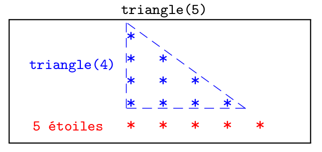
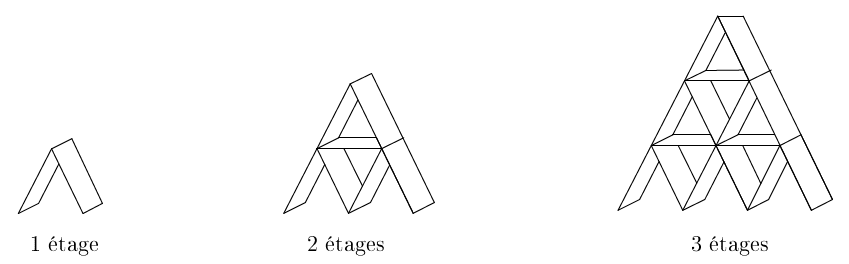
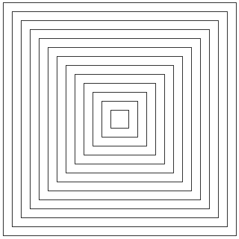


 
{{ titre_chapitre(num,niveau)}}

## Cours

{{ affiche_cours(num) }}


## Exemple introductif

On veut écrire une fonction qui produit l'affichage de triangles de `n` lignes, la première ligne contenant un `*`, la seconde deux `*` et ainsi de suite. Par exemple pour `n=4`, la fonction doit afficher :
```
*
**
***
****
```

Une des possibilités est d'utiliser une boucle, on dit que la fonction est **itérative**  :
```python
def triangle(n):
    for i in range(1,n+1):
        print("*"*i)
```
{{IDE()}}

En observant la représentation ci-dessous, on constate aussi qu'il est possible de définir un triangle de `5` lignes par rappport à un triangle de `4` lignes, et plus généralement un triangle de `n` lignes par rapport à un triangle de `n-1` lignes : 

{widtht=500px .imgcentre}

En effet, construire un triangle de `n` lignes c'est :

* construire un triangle de `n-1` lignes
* ajouter une ligne de `n` étoiles

on vient de donner une méthode de construction **récursive**, qui doit se compléter en précisant qu'elle n'est valable que pour `n>0`. Cette définition trouve se traduit en python par :
```python
def triangle_recursif(n):
    if n>0:
        triangle_recursif(n-1)
        print('*'*n)
```

## Définition

!!! retenir "A retenir"
    Une fonction est dite **récursive** lorsqu'elle fait appel à elle-même. Par conséquent,

    * une fonction récursive permet, comme une boucle, de répéter des instructions puisque le bloc d'exécution de la fonction est rappelé (mais avec des paramètres différents).
    * une même fonction peut donc se programmer de façon *itérative* (avec des boucles) ou de façon récursive (en s'appelant elle-même).
    * une fonction récursive doit toujours contenir *au moins* une condition d'arrêt (sinon elle s'appellera elle-même à l'infini)


## Exemples corrigés

### Factorielle d'un entier

La [factorielle d'un entier](https://fr.wikipedia.org/wiki/Factorielle){target=_blank} est le produit de cet entier par tous ceux qui le précèdent (excepté 0). Cette fonction a [déjà été programmé de façon itérative](http://127.0.0.1:8000/cpge-info/itc/bases/#exercice-7-factorielle) mais elle s'exprime aussi par rapport à elle même et donc peut être programmé de façon récursive, en effet :  
$n! = n  \times \underline{(n-1)\times \dots \times 1}$ et puisque la partie soulignée vaut $(n-1)!$ :  
$n! = n \times (n-1)!$  
Cette écriture se traduit directement en Python par :
```python linenums="1"
def factorielle(n):
    if n==0:
        return 1
    else:
        return n*factorielle(n-1)
```

Il faut bien comprendre que par exemple pour calculer `factorielle(4)` python procédera de la façon suivante :

* calculer `factorielle(3)` et le multiplier par 4
* calculer `factorielle(2)` et le multiplier par 3
* calculer `factorielle(1)` et le multiplier par 2
* calculer `factorielle(0)` et le multiplier par 1
* comme la condition d'arrêt donc `factorielle(0)=1`, on peut remonter dans le calcul et obtenir 24

### Somme des éléments d'une liste

La somme des élements d'une liste $l = [l[0],\dots l[1]]$ peut s'exprimer ainsi :

* si la liste est vide c'est zéro (condition d'arrêt)
* sinon c'est le premier élément de la liste plus la somme de la liste à partir du second élément

c'est donc une définition récursive puisque nous avons exprimé la somme d'une liste à partir de la somme d'une (autre) liste. En python, il suffit de pouvoir exprimer la liste à partir du second élement à l'aide du tranche et on peut écrire :

```python
def somme(l):
    if l==[]:
        return 0
    else:
        return l[0] + somme(l[1:])
```

### Retourner une chaine de caractère

!!! note
    En cas de besoin, on conseille de revoir les [tranches](https://fabricenativel.github.io/cpge-info/itc/listes/#tranches){target=_blank} avant d'aborder cet exemple.

On veut écrire une fonctions récursive qui renvoie la chaine de caractère donnée en argument à l'envers. Par exemple `envers("Python")` doit renvoyer `"nohtyP"`. Comme précédemment, afin d'écrire une version récursive de cette fonction, il faut exprimer l'envers d'une chaine par rapport à l'envers d'une autre chaine (plus courte). On peut remarquer que pour écrire une chaine à l'envers, il suffit d'écrire son dernier caractère puis l'envers du reste de la chaine ce qui se traduit en Python par :

```python
def envers(chaine):
    if chaine=="":
        return ""
    else:
        return chaine[-1] + envers(chaine[0:-1])
```

{{exo("A vous de jouer !",[],0)}}

1. Ecrire une version récursive des fonctions suivantes :

    1. Fonction `puissance`, qui prend en argument un nombre $x$ et un entier $n$ (positif) et renvoie $x^n$.

    2. Fonction `palindrome`, qui prend en argument une chaine de caractère et qui renvoie `true` lorsque cette chaine est un palindrome

    3. Fonction `maximum`, qui prend en argument une liste d'entiers et renvoie le maximum des éléments de cette liste.

    4. Fonction `occurences`, qui prend en argument une liste d'entiers `l` et un entier `n` et renvoie le nombre d'apparitions de `n` dans `l`.

5. Modifier la fonction `triangle_recursif` de l'[exemple introductif](#exemple-introductif) afin d'afficher le même triangle mais "pointe vers le bas".


2. {{exo("Exponentiation rapide",[])}}

Pour calculer $a ^ {13}$ on peut effectuer $13$ multiplications en calculant $1\times a \times a \dots \times a$, une autre méthode consiste à calculer d'abord $a^6$ puis à l'élever au carré et à multiplier par $a$. C'est à dire qu'on utilise l'égalité $a^{13} = \left(a^6\right)^2 \times a$. On obtient donc une nouvelle écriture récursive qui s'avère encore plus simple à mettre en oeuvre lorsque l'exposant est paire, par exemple $a^{20} = \left(a^{10}\right)^2$.

1. Vérifier sur le cas de $a^{13}$ que le nombre de multiplications nécessaires est inférieur à celui de la méthode naïve
2. Ecrire une fonction Python implémentant ce nouvel algorithme (on fera bien attention à traiter le cas de l'exposant paire et celui de l'exposant impaire)


{{ exo("Chateau de cartes",[]) }}

Un [château de cartes](https://fr.wikipedia.org/wiki/Ch%C3%A2teau_de_cartes){target=_blank} est un échafaudage de cartes à jouer. On a représenté ci-dessous des chateaux de cartes à 1, 2 et 3 étages (crédit : [DREAMaths](https://math.univ-lyon1.fr/dream/?page_id=2523){target=_blank}):



1. On note $c_n$ le nombre de cartes nécessaires pour construire un chateau de cartes à $n$ étages. Etablir une relation de récurrence entre $c_n$ et $c_{n-1}$.

2. Ecrire  une fonction récurrente qui renvoie $c_n$ pour la valeur $n$ fournie en argument .

3. Calculer $c_{100}$ à l'aide de votre programme. Vous pouvez vérifier le résultat fourni par votre programme ci-dessous :  {{ check_reponse("15050") }}

4. Retrouver ce résultat par le calcul


{{ exo("Additions et soustractions",[]) }}
On suppose qu'on ne dispose que de deux opérations : ajouter 1 ou retrancher 1.

1. Écrire à l'aide de ces deux opérations, une version itérative de l'addition de deux entiers.
2. Même question avec une version récursive.


{{ exo("Algorithme d'Euclide de calcul du pgcd",[]) }}
1. Revoir si besoin [l'algorithme d'Euclide](https://fr.wikipedia.org/wiki/Algorithme_d%27Euclide){target=_blank} permettant de calculer le {{sc("pgcd")}} de deux entiers.
3. Donner une implémentation itérative de cet algorithme
4. Donner une implémentation récursive de cet algorithme


{{ exo("Chiffres romains",[])}}

En [numération romaine](https://fr.wikipedia.org/wiki/Num%C3%A9ration_romaine){target=_blank}, les nombres s'écrivent avec les symboles suivants :

* I valant 1
* V valant 5
* X valant 10
* L valant 50
* C valant 100
* D valant 500
* M valant 1000

On lit un nombre de la gauche vers la droite, si la valeur d'un symbole est inférieure à celle du suivant alors on retranche sa valeur du total, sinon on l'ajoute. Par exemple, `XIV` vaut `14` car la valeur du `I` doit être retranchée (car inférieure à celle de `V`).

1. Ecrire une fonction de signature `#!c int valeur_symbole(char s)` qui renvoie la valeur du symbole donné en argument.

    !!! note
        On peut utiliser une suite de `if` imbriqués ou alors [un `switch`](https://fr.wikipedia.org/wiki/Switch_(instruction)){target=_blank} (mais qui n'est pas au programme de MP2I).

2. Ecrire une fonction **récursive** de signature `#!c int valeur(char s[])` qui renvoie la valeur du nombre romains `s` donné sous la forme d'une suite de caractères.

{{ exo("Dessin récursif",[]) }}

!!! warning "Attention"
    L'exercice suivant utilise le module `turtle`, pour utiliser ce module, on écrira toujours en début de programme :
    ```python
    import turtle
    crayon = turtle.Turtle()
    papier = turtle.Screen()
    ```
    Afin de disposer d'un objet `crayon` et d'un `papier` (ces noms sont à choisir librement). 
    En fin de programme, on écrira toujours
    ```python
    papier.exitonclick()
    ```
    De façon à ce que la fenêtre graphique contenant le dessin attende un click pour se refermer.

    Le crayon est initialement situé en $(0,0)$ et orienté vers la droite. Pour manipuler le crayon, on dipose notamment  de :

    * `crayon.forward(l)` pour le faire avancer de `l` pixels
    * `crayon.left(d)` et `crayon.right(d)` afin de tourner à droite ou à gauche de `d` degrés.
    * `crayon.penup()` et `crayon.pendown()` pour relever ou abaisser le crayon.
    * `crayon.goto(x,y)` pour déplacer le crayon au point de coordonnées `(x,y)`

    On pourra consulter [la documentation complète du module](https://docs.python.org/fr/3.9/library/turtle.html){target=_blank}.


1. Ecrire une fonction `carre` qui prend en argument un entier `n` et dessiner à partir de la position et de l'orientation courant de la tortue un carré de côté `n` pixels.
1. Dessiner une suite de carrés imbriqués tel que représenté ci-dessous (le carré initial mesure 300 pixels de côté et la taille diminue ensuite de 30 pixels à chaque carré)  
{.imgcentre width=400px}

2. Si vous aviez donné une version itérative de ce dessin, en faire une version récursive et inversement.


{{ exo("Dessin du flocon de Von Koch",[]) }}

!!! warning "Attention"
    L'exercice suivant utilise le module `turtle` déjà rencontré dans l'exercice précédent.

La [courbe de Koch](https://fr.wikipedia.org/wiki/Flocon_de_Koch){target=_blank} est une figure qui se construit de manière récursive. Le cas de base d'ordre 0 et de longueur $l$ s'obtient en traçant un segment de longueur $l$ . Le cas récursif d'ordre $n>0$ s'obtient en traçant successivement quatre courbes d'ordre $n-1$ et de longueur $l/3$ de la façon suivante :

{.imgcentre width=400px}

1. A l'aide du module `turtle`, produire une image tel que ci-dessous qui représente la courbe de Koch d'ordre 5. Le résultat produit ci-dessus a été obtenu grâce à l'appel `koch(600,5)` (la largeur de l'image est de 500px et sa hauteur 300)
{.imgcentre width=500px}

2. En utilisant cette fonction construire le flocon de Koch, c'est-à-dire la figure obtenu en construisant les courbe de Koch sur les trois côtés d'un triangle équilatéral.


{{ exo("Suite look and say",[])}}

La [suite *look and say*](https://en.wikipedia.org/wiki/Look-and-say_sequence){target=_blank} a pour premiers termes : `1, 11, 21, 1211, 111221, 312211, ...` en effet chaque terme s'obtient en *regardant* puis en *disant* le terme précédent. Le premier terme `1` se lit "un un" et donc le second terme est `11` qui se lit `deux un` et donc le troisième terme est `21` qui se lit `un deux un un` et donc le quatrième terme est `1211` et ainsi de suite. Le but de l'exercice est de générer à l'aide de Python les termes de cette  suite.

1. Ecrire une fonction `suivant` qui prend en argument une chaine de caractères `terme` représentant un terme de la suite et renvoie le terme suivant.

    !!! aide
        On pourra procéder en parcourant la chaine `s` tout en mettant à jour deux variables :

        * l'une contenant le caractère courant
        * l'autre son nombre d'apparition

        Lorsque le caractère suivant n'est pas le caractère courant on remet à 1 nombre d'apparition.

    Tester votre fonction en calculant le **15e** terme de la suite : {{check_reponse("311311222113111231131112132112311321322112111312211312111322212311322113212221")}}

2. Faire une conjecture sur les chiffres pouvant apparaitre dans les termes de cette suite. Puis prouver cette conjecture (on pourra raisonner par récurrence).

3. On souhaite maintenant utiliser le fait que les seuls chiffres apparaissant dans la suite *look and say* sont 1, 2 et 3 afin d'écrire une version récursive du calcul du terme suivant. Pour cela, le cas récursif consiste à considérer les trois premiers chiffres du terme précédent et le cas de base est celui d'un terme contenant moins de 3 chiffres. Ecrire cette version récursive.
