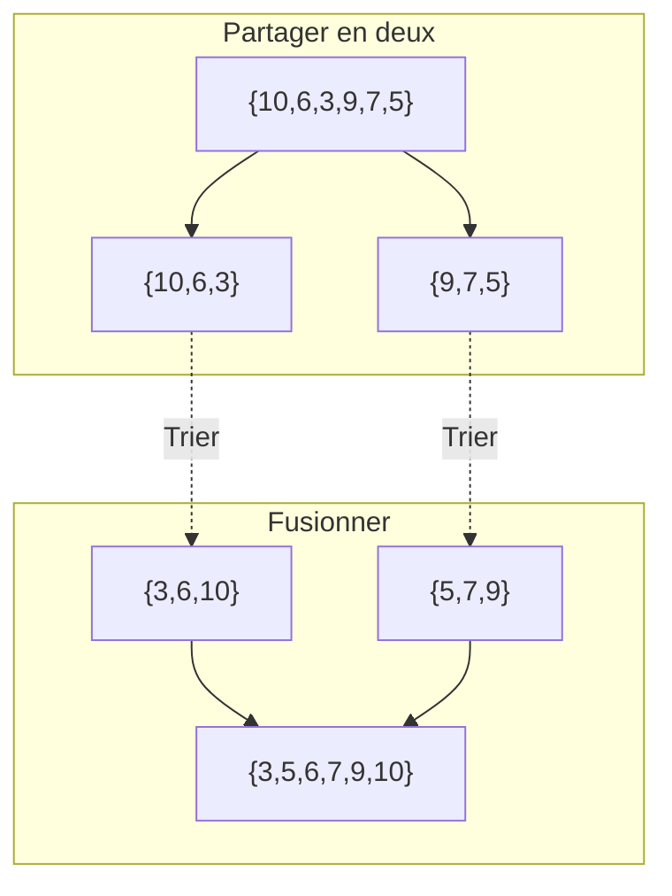




{{ titre_chapitre(num,niveau)}}

## Cours

{{ affiche_cours(num) }}

{{ telecharger("Memento de Python","Cours/C16/memo.pdf")}}

Les exemples vu en cours

* ??? python "Syracuse"
    ```python
    --8<-- "C16/syracuse.py"
    ```

* ??? python "Série harmonique"
    ```python
    --8<-- "C16/harmo.py"
    ```

* ??? python "Calcul du PGCD"
    ```python
    --8<-- "C16/pgcd.py"
    ```

* ??? python "Recherche simple dans une liste"
    ```python
    --8<-- "C16/est_dans.py"
    ```

* ??? python "maximum des éléments d'une liste"
    ```python
    --8<-- "C16/max_liste.py"
    ```

## Travaux pratiques


{{ exo("Factorielle",[],0)}}

On appelle *factorielle* d'un entier $n$ et on note $n!$ le produit de cet entier par tous ceux qui le précèdent à l'exception de zéro. Et on convient d'autre part que $0!=1$. Par exemple $5! = 5 \times 4 \times \times 3 \times 2 \times 1 = 120$. Ecrire une fonction `factorielle` qui prend en argument un entier `n` et renvoie sa factorielle.

Vérifier en entrant ici la valeur de $42!$ : {{check_reponse("1405006117752879898543142606244511569936384000000000") }}


{{ exo("Calcul des termes d'une suite",[])}}

On considère la suite $(u_n)_{n \in \mathbb{N}}$ définie par $u_0 = 0.7$ et $u_{n+1} = 3.5 u_n(1-u_n)$. Calculer $u_{2024}$ (on donnera la valeur arrondie au centième).

Vérifier votre réponse : {{check_reponse("0.38")}} (valeur arrondie au centièmre)

{{ exo("Calcul d'une somme",[])}}

Calculer la somme des entiers compris entre 1 et 100000 qui se terminent par 7 ou sont divisibles par 19.

Vérifier votre réponse : {{check_reponse("736847875")}}

{{ exo("Somme des codes des caractères",[])}}
En informatique, chaque caractère est associé à un entier : son code *unicode*, par exemple le code *unicode* du caractère `A` est 65. En Python, pour obtenir le code *unicode* d'un caractère on utilise la fonction `ord`, ainsi `ord('A')` vaut 65. Déterminer la somme de de tous les codes *unicode* des caractères de la phrase "*faire un peu de Python, c'est vraiment trop bien !*" ?  
**Attention** : les guillemets ne font pas partie de la phrase. 

!!! note "Remarques"
    L'unicode étend le code {{sc("ascii")}} qui est parfois plus connu. En effet, lorsque le code {{sc("ascii")}} d'un caractère existe, il correspond à son code unicode. Ainsi le code {{sc("ascii")}} de `A` existe (et vaut donc aussi 65), mais `ù` n'est pas un caractère {{sc("ascii")}} et n'a donc pas de code {{sc("ascii")}} mais a bien un code unicode : 249.


Vérifier votre réponse : {{ check_reponse("4491")}}

{{ exo("Nombre de 2 dans la factorielle d'un nombre",[])}}
On rappelle que la factorielle d'un entier naturelle $n$, notée $n!$, est le produit des entiers *strictement* positifs inférieurs ou égaux à $n$. Par exemple $5! = 5 \times 4 \times 3 \times 2 \times 1 = 120$. Quel est le nombre de 2 dans l'écriture décimale de $100!$ ?

Vérifier votre réponse : {{check_reponse("19")}}


{{ exo("Nombres premiers",[])}}

1. Ecrire une fonction `racine` qui prend en entrée un entier `n` positif et renvoie le plus grand entier `k` tel que `k * k <= n`.
    Par exemple, `racine(9)` renvoie 3 et `racine(18)` renvoie 4.

2. Ecrire une fonction qui prend en argument un nombre et renvoie `True` lorsque ce nombre est premier et `False` sinon.

    !!! aide
        On peut se contenter de tester si les entiers $k$ compris entre 2 et la partie entière de $\sqrt{n}$ inclus divisent $n$ et utiliser la question 1.

3. Ecrire une fonction `somme_premiers` qui prend en entrée un entier `n` et calcule la somme des nombres premiers inférieurs ou égaux à `n`. Par exemple `somme_premiers(10)` vaut `2 + 3 + 5 + 7 = 17`

4. Tester votre fonction en calculant `somme_premiers(10000)` :  {{check_reponse("5736396")}}


{{ exo("Parcours de chaine de caractères",[])}}

1. Ecrire une fonction `contient` qui prend en argument une chaine de caractères `chaine` et un caractere `c` et qui renvoie `True` si `c` est dans `chaine` et  `False` sinon.

2. Ecrire une fonction `occurrence` qui prend en argument une chaine de caractères `chaine` et un caractere `c` et qui renvoie le nombre d'apparitions de `c` dans `chaine`.

3. On considère la chaine `mystere` ci-dessous composée de caractères très semblables difficiles à distinguer à l'oeil nu :
```
mystere = "O0oQ0OoQD0OQ0o0OQD80oQ0OoQD0OQ0o0OQD8O0oQ0OoQD0OQ0o0OQD80oQ0OoQD0OQ0o0OQD8O0oQ0OoQD0OQ0o0OQD80oQ0OoQD0OQ0o0OQD8O0oQ0OoQD0OQ0o0OQD80oQ0OoQD0OQ0o0OQD8O0oQ0OoQD0OQ0o0OQD80oQ0OoQD0OQ0o0OQD8O0oQ0OoQD0OQ0o0OQD80oQ0OoQD0OQ0o0OQD8O0oQ0OoQD0OQ0o0OQD80oQ0OoQD0OQ0o0OQD8O0oQ0OoQD0OQ0o0OQD80oQ0OoQD0OQ0o0OQD8O0oQ0OoQD0OQ0o0OQD80oQ0OoQD0OQ0o0OQD8O0oQ0OoQD0OQ0o0OQD80oQ0OoQD0OQ0o0OQD8O0oQ0OoQD0OQ0o0OQD80oQ0OoQD0OQ0o0OQD8O0oQ0OoQD0OQ0o0OQD80oQ0OoQD0OQ0o0OQD8O0oQ0OoQD0OQ0o0OQD80oQ0OoQD0OQ0o0OQD8O0oQ0OoQD0OQ0o0OQD80oQ0OoQD0OQ0o0OQD8O0oQ0OoQD0OQ0o0OQD80oQ0OoQD0OQ0o0OQD8O0oQ0OoQD0OQ0o0OQD80oQ0OoQD0OQ0o0OQD8O0oQ0OoQD0OQ0o0OQD80oQ0OoQD0OQ0o0OQD8O0oQ0OoQD0OQ0o0OQD80oQ0OoQD0OQ0o0OQD8O0oQ0OoQD0OQ0o0OQD80oQ0OoQD0OQ0o0OQD8O0oQ0OoQD0OQ0o0OQD80oQ0OoQD0OQ0o0OQD8O0oQ0OoQD0OQ0o0OQD80oQ0OoQD0OQ0o0OQD8O0oQ0OoQD0OQ0o0OQD80oQ0OoQD0OQ0o0OQD8"
```
Combien de `0` contient cette chaine ?  
Vérifier votre réponse : {{check_reponse("220")}}


{{ exo("Conjecture de syracuse",[])}}

La [conjecture de syracuse](https://fr.wikipedia.org/wiki/Conjecture_de_Syracuse){target=_blank} est l'hypothèse selon laquelle la suite  $(u_n)_{n \in \mathbb{N}}$ définie par son premier terme $u_0$ et la relation de récurrence :  
$u_{n+1} = \left\{ \begin{array}{ll} \dfrac{u_n}{2} & \mathrm{\ si\ } u_n \mathrm{\ est \ paire} \\ 3u_n+1 & \mathrm{\ sinon} \\ \end{array} \right.$  
atteint 1. Dans la suite de cette exercice on supposera cette conjecture vérifiée (bien qu'elle n'ait pas été mathématiquement prouvée, la conjecture a été vérifiée numériquement pour tous les entiers jusqu'à $2^{58}$).

1. Ecrire la fonction `terme_suivant` qui prend en argument un entier $n$ et renvoie $\dfrac{n}{2}$ si $n$ est paire et $3n+1$ sinon.
2. Ecrire une fonction `duree_vol` qui prend en argument un entier $u_0$ et renvoie le plus petit entier $n$ appelé *durée de vol* tel que $u_n=1$. Par exemple `duree_vol(7)` doit renvoyer 16, en effet les termes successif de la suite sont `7, 22, 11, 34, 17, 52, 26, 13, 40, 20, 10, 5, 16, 8, 4 ,2, 1`.  
Tester votre fonction en calculant la durée de vol de 123456789 :   
Vérifier votre réponse : {{check_reponse("177")}}

3. Quelle est la plus grande durée de vol lorsque $1 \leq u_0 \leq 10000$ ?  
Vérifier votre réponse : {{check_reponse("261")}}

4. Vérifier que cette durée de vol maximale est atteinte pour une seule valeur de $u_0$, quelle est cette valeur ?  
Vérifier votre réponse : {{check_reponse("6171")}}

5. L'altitude maximale est la valeur maximale atteinte par la suite de Syracuse. Ecrire une fonction prenant $u_0$ et renvoyant l'altitude maximale atteinte. Par exemple l'altitude maximal de $u_0 = 7$ est $52$ (voir les termes de cette suite à la question 2.).

6. Quelle est l'altitude maximale de $9331$ ?  
Vérifier votre réponse : {{check_reponse("345544")}}


{{exo("Opérations sur les listes",[])}}
On considère la liste `carres` des $k$ premiers carrés des entiers *strictement* positifs, par exemple si $k=6$, `carres = [1, 4, 9, 16, 25, 36]`. Sur cette liste on effectue les opérations suivantes :

* on enlève les deux derniers éléments
* s'ils ont même parité on calcule leur somme, sinon leur différence (plus grand moins plus petit)
* on rajoute la valeur calculée à l'étape précédente (la somme ou la différence) la fin de la liste

Par exemple pour `carres = [1, 4, 9, 16, 25, 36]`

* les deux derniers éléments sont `25` et `36`, ils sont enlevés de la liste qui devient `[1, 4, 9, 16]`
* ces deux entiers n'ont pas la même parité, on fait la différence `36 - 25 = 11`
* on ajoute cette valeur à la fin de la liste qui devient `[1, 4, 9, 16, 11]`
On renouvelle ce processus sur la liste obtenue jusqu'à ce qu'elle contienne un unique élément (dans l'exemple ci-dessous on obtient successivement `[1, 4, 9, 5]` puis `[1, 4, 14]` puis `[1, 18]` et enfin `[17]`).

Quel est l'élément restant dans le cas $k=100$ ?

{{ check_reponse("18910")}}


{{ exo("Somme des entiers dans un fichier",[])}}

Le fichier `entiers.txt` téléchargeable ci-dessous contient sur chaque ligne un entier. Ecrire un programme Python qui lit ce fichier et fait la somme de ces entiers.
{{telecharger("entiers.txt","../itc/files/C16/entiers.txt")}}

Vérifier la réponse fournie par votre programme ci-dessous :
{{ check_reponse('-1113')}}


{{ exo("Recherche dans un dictionnaire",[])}}

Pour cette exercice on utilise le dictionnaire téléchargeable ci-dessous:
{{ telecharger("Dictionnaire","../itc/files/C16/dictionnaire.txt")}}

1. Combien il y a-t-il de mots dans ce dictionnaire ?
2. Lister tous les mots de 17 lettres de ce dictionnaire.
3. Quel est le plus grand mot de ce dictionnaire ?
4. Lister tous les mots de 5 lettres qui ont un *d* en deuxième position et se terminent par un *e*.
5. Lister tous les mots palindromes de ce dictionnaire (un mot palindrome est un mot pouvant se lire indifféremment dans les deux sens par exemple *kayak* ou *été*)


{{ exo("Problème de Joseph",[]) }}


<div class="centre"><iframe width="560" height="315" src="https://www.youtube.com/embed/uCsD3ZGzMgE" title="YouTube video player" frameborder="0" allow="accelerometer; autoplay; clipboard-write; encrypted-media; gyroscope; picture-in-picture" allowfullscreen></iframe></div>

Le but de l'activité est d'écrire un programme permettant de résoudre le [problème de Joseph](https://fr.wikipedia.org/wiki/Probl%C3%A8me_de_Jos%C3%A8phe){target=_blank} en révisant les listes de Python.


1. On représente un cercle de `n` soldats par la liste `[1,2,...,n]`. Ecrire une fonction `soldats(n)` qui renvoie la liste `[1,2,....,n]`

2. Afin de repérer l'épée, on décide que le soldat qui la tient se situe *toujours en première position de la liste*. Ainsi avec 5 soldats le cercle initial est `[1,2,3,4,5]` (`1` tient l'épée, il élimine 2 et passe l'épée à 3), donc après une étape la liste sera `[3,4,5,1]` (`3` tient l'épée) 

3. Programmer une fonction `josephus(n)` qui renvoie le soldat survivant pour un cercle de `n` soldats.

4. Quel sera le survivant dans une cercle de 10000 soldats ?  

Vérifier votre réponse : {{check_reponse("3617")}}

{{ exo("Triangle de Pascal",[]) }}

Ecrire un programme qui prend en argument un entier $1 \leq n \leq 10$ et affiche les $n$ premières lignes du [triangle de Pascal](https://fr.wikipedia.org/wiki/Triangle_de_Pascal){target=_blank}. Par exemple `pascal(4)` affiche :
```
1
1 1
1 2 1
1 3 3 1
1 4 6 4 1
```

!!! aide
    * On rappelle que le coefficient situé ligne $n$ et colonne $k$ noté $\displaystyle{\binom{n}{k}}$ se déduit de ceux de la ligne précédente grâce à la formule de Pascal : $\displaystyle{\binom{n}{k} = \binom{n-1}{k-1} + \binom{n-1}{k}}$
    * On pourra utiliser deux tableaux, l'un représentant la ligne précédente et un second la ligne en cours de construction.


{{ exo("Crible d'Erastothène",[]) }}

On rappelle qu'un nombre premier est un entier naturel ayant exactement deux diviseurs 1 et lui-même, ainsi 13 est premier mais pas 15. Le [crible d'Erastothène](https://fr.wikipedia.org/wiki/Crible_d%27%C3%89ratosth%C3%A8ne) est un algorithme permettant de trouver tous les nombres premiers inférieurs ou égaux à un entier `n` donné. 

!!! abstract "Algorithme"
    * on crée une liste de booléens `premiers` de taille `n+1`
    * on initialise le tableau à `true` sauf `premiers[0]` et `premiers[1]` qui sont à `false` puisque  $0$ et $1$ ne sont pas premiers.
    * on parcourt ce tableau si `premiers[i]` est à `true` alors on met tous ses multiples (sauf lui-même) à `false`
    * le parcours s'arrête dès que l'entier `i` est supérieur à $\sqrt{n}$.  

1. Ecrire une fonction `crible` qui prend en paramètre un entier `n` et implémente cet algorithme. L'utiliser pour afficher les nombres premiers inférieurs à 100.

    !!! aide
        Vous devriez obtenir : `2 3 5 7 11 13 17 19 23 29 31 37 41 43 47 53 59 61 67 71 73 79 83 89 97`

2. Ecrire une fonction `somme_premiers` qui prend en argument un entier `seuil` et renvoie la somme de tous les nombres premiers inférieurs ou égaux à `seuil`. Par exemple `somme_premiers(100)` renvoie `1060`

3. Calculer la somme des 10000 premiers nombres premiers  
Vérifier votre réponse : {{check_reponse("5736396")}}

{{ exo("Tri par insertion",[] )}}
!!! abstract "Algorithme"
    * L'algorithme du *tri par insertion* consiste à considérer qu'une partie de la liste (initialement vide) située au début est déjà triée. On parcourt ensuite le reste de la liste et on insère chaque élément à la bonne position dans la partie déjà triée.  
    * Pour réaliser cette insertion, on pourra echanger l'élement avec son voisin de gauche tant qu'il lui est supérieur et que le début de la liste n'est pas atteint.

1. Programmer cet algorithme.

2. Créer la liste  $u$ telle que le terme d'indice $i$ de $u$ soit  $u_i = i^2 - 564i + 77760$, pour $0\leqslant i <> 5000$, trier cette liste par ordre croissant, et donner la valeur du terme d'indice $2024$  
Vérifier votre réponse : {{check_reponse("3032800")}}


{{ exo("Evolution d'une chaine de caractères",[]) }}
On considère une chaine de caractères initialement constituée de $k$ caractères `.` suivie d'un caractère `#` puis de $k$ caractères `.`. Par exemple pour $k=5$ la chaine est `.....#.....` (5 `.` suivi d'un `#` puis de 5 `.`). Cette chaine évolue de la façon suivante :

* si un `.` est entre un `#` et un `.`, il se transforme en `#` sinon il reste un `.`
* si un `#` est entre deux `#` ou s'il a un `#` à sa gauche et un `.` à sa droite, il se transforme en `.` sinon il reste un `#`
* le premier et le dernier caractère ayant un seul voisin, ils ne sont pas affectés par ces règles d'évolutions et restent toujours des `.`

Par exemple dans le cas $k=5$ : les étapes successives d'évolution sont :

* `.....#.....` (état initial :)
* `....###....` (étape 1)
* `...##..#...` (étape 2)
* `..##.####..` (étape 3)
* `.##..#...#.` (étape 4)
* `.#.####.##.` (étape 5)

Dans le cas $k=256$, et à l'étape 1000, combien de `#` contient la chaine ?

??? Question "Corrigé"
    L'évolution d'une case ne dépend que de son état et de celle de ses voisines immédiates, on commence donc par écrire une fonction `evolution_case` qui prend en argument l'état de la case elle-même (`centrale`), celle de la case précédente -(`precedente`) et celle de la case suivante (`suivante`) et on respecte scrupuleusement les informations de l'énoncé pour renvoyer l'état de case centrale après évolution.

    ```python
    --8<-- "C16/wolfram.py:1:11"
    ```

    Il reste ensuite à utiliser cette fonction pour faire évoluer une liste de cases représentée par une chaine de caractères(`cases`) et construire le nouvel état après évolution (chaine de caractère `netat`).

    ```python
    --8<-- "C16/wolfram.py:13:18"
    ```

    Pour terminer l'exercice, il reste alors à créer la chaine de départ (par exemple en utilisant `#!python "."*256+"#"+"."*256), à la faire évoluer 100 fois puis à compter le nombre de `#` qu'on y trouve.

Vérifier votre réponse : {{check_reponse("263")}}


{{ exo("Le tri fusion",[])}}

L'algorithme du **tri fusion** consiste à :  

* *(diviser)* partager le tableau à trier en deux moitiés (à une unité près), 
* *(régner)* trier chacune des deux moitiés, 
* *(combiner)* les fusionner pour obtenir la liste triée. 

On a schématisé le tri du tableau `[| 10; 6; 3; 9; 7; 5 |]` suivant ce principe ci-dessous :


1. Ecrire  une fonction `separe` qui sépare une liste en deux listes de même longueur (à une unité près). On pourra utiliser les tranches, ou écrire (par exemple) une fonction renvoyant deux listes : celles des termes de rang pair et celle des termes de rang impair.

2. Ecrire une fonction `fusion` qui prend en argument deux listes supposées *déjà triées* et les fusionne.

3. Si vous avez utilisé un algorithme itératif à la question précédente (en manipulant des indices dans chacune des deux listes), écrire une version récursive de la fusion, à l'inverse si vous avez utilisé une version récursive, proposez une version itérative.

3. Donner une implémentation du tri fusion en Python.

4. Ecrire une fonction `liste_aleatoire` qui prend en argument un nombre d'éléments `n`, deux bornes `vmin` et `vmax` et renvoie une liste de `n` entiers tirés au sort dans l'intervalle `[vmin;vmax]` (les bornes sont comprises). On rappelle que pour générer un entier aléatoire on peut utiliser la fonction `randint` du module `random`.

5. Les nombres aléatoires générées par un ordinateur dépendent d'une valeur appelée *graine* (ou *seed* en anglais). Ainsi en fixant la valeur de la graine, la liste de nombres générés est toujours la même. Importer la fonction `seed` depuis le module `random` et fixer la valeur de la graine a 42, puis générer une liste de 500 nombre aléatoire entre 1 et 10000. Trier cette liste, quelle valeur se trouve à l'indice 250 de cette liste ? {{check_reponse("4650")}}

{{ exo("Boîte de plus grand volume",[])}}

Le fichier `boites.txt` est téléchargeable ci-dessous, chaque ligne de ce fichier contient la référence d'un modèle de boîte sous la forme d'un code à 4 lettres suivi de trois entiers représentant les dimensions de la boîte. A titre d'exemple, les trois premières lignes du fichier sont :
```
NWLR 283 75 46 
QBHC 117 70 79 
ZOWK 262 66 31
```
Donc, la boite de référence `NWLR` a comme dimension `283x75x46`.
{{telecharger("boites.txt","../itc/files/C16/boites.txt")}}

Trouver la référence de la plus de plus grand volume, et vérifier votre résultat dans le formulaire suivant :   {{ check_reponse("ZSDW") }}


{{ exo("Suite look and say",[])}}

La [suite *look and say*](https://en.wikipedia.org/wiki/Look-and-say_sequence){target=_blank} a pour premiers termes : `1, 11, 21, 1211, 111221, 312211, ...` en effet chaque terme s'obtient en *regardant* puis en *disant* le terme précédent. Le premier terme `1` se lit "un un" et donc le second terme est `11` qui se lit `deux un` et donc le troisième terme est `21` qui se lit `un deux un un` et donc le quatrième terme est `1211` et ainsi de suite. Le but de l'exercice est de générer à l'aide de Python les termes de cette  suite.

1. Ecrire une fonction `suivant` qui prend en argument une chaine de caractères `terme` représentant un terme de la suite et renvoie le terme suivant.

    !!! aide
        On pourra procéder en parcourant la chaine `s` tout en mettant à jour deux variables :

        * l'une contenant le caractère courant
        * l'autre son nombre d'apparition

        Lorsque le caractère suivant n'est pas le caractère courant on remet à 1 nombre d'apparition.

    Tester votre fonction en calculant le **15e** terme de la suite : {{check_reponse("311311222113111231131112132112311321322112111312211312111322212311322113212221")}}

2. Faire une conjecture sur les chiffres pouvant apparaitre dans les termes de cette suite. Puis prouver cette conjecture (on pourra raisonner par récurrence).

3. On souhaite maintenant utiliser le fait que les seuls chiffres apparaissant dans la suite *look and say* sont 1, 2 et 3 afin d'écrire une version récursive du calcul du terme suivant. Pour cela, le cas récursif consiste à considérer les trois premiers chiffres du terme précédent et le cas de base est celui d'un terme contenant moins de 3 chiffres. Ecrire cette version récursive.

{{exo("Conversion de base - Opérateurs bit à bit",[])}}


On rappelle que 'algorithme des divisions successives  permet de convertir un nombre écrit en base 10 dans une base $b$ quelconque ($b \geqslant 2$).

Il consiste tant que $n$ n'est pas nul à :

* Ajouter le reste dans la division euclidienne de $n$ par $b$ à l'écriture en base $b$
* remplacer $n$ par le quotient de $n$ dans la division euclidienne par $b$

 Si $b>10$, on utilise comme chiffre les lettres de l'alphabet, on déclare donc en début de programme une chaine de caractères :

```python
CHIFFRES="0123456789ABCDEFGHIJKLMNOPQRSTUVWXYZ"
```

1. Ecrire une fonction `dec_to` qui prend en argument un entier `n` (type `int`) écrit en base 10 et une base `b` (supérieur ou égale à 2) et renvoie l'écriture de `n` dans la base `b`

2. Tester votre programme en convertissant `816203` en hexadécimal : {{check_reponse("C744B")}}

Dans le cas particulier de la base 2, on peut aussi utiliser les *opérations bit à bit* qui consistent à effectuer des opérations logiques usuelles (`not`, `and`, `or`, ...) bit par bit sur la représentation binaire des entiers. Les opérateurs associés en Python sont :

* `&` pour le `and`
* `|` pour le `or`
* `~` pour le `not`
* `^` pour le `xor`

Prenons un exemple, si on effectue un `&` entre les entiers :

* {{binaire_dec("10110011")}} et 
* {{binaire_dec("00110101")}}

alors, le résultat obtenu sera {{binaire_dec("00110001")}} car on effectue le et logique entre les bits de poids $2^7, 2^6, \dots, 2^0$. 

D'autre part, les opérateurs `>>` (resp. `<<`) permettent de décaler à droite (resp. à gauche) une représentation binaire du nombre de rang donné. Par exemple `25 << 2` donne {{binaire_dec("1100100")}} car on décale de deux rang à droites la représentation.

En utilisant ces opérateurs, ecrire une fonction qui renvoie la représentation binaire (sous forme d'une chaine de caractères) de l'entier positif donné en argument.

{{exo("Chiffrement XOR",[])}}

On rappelle que l'opérateur `^` correspond en Python à une opération bit à bit entre les représentations binaires. Par exemple, puisque

* {{binaire_dec("1010101")}}  et 
* {{binaire_dec("1110011")}} alors

`85^115 = 38` ({{binaire_dec("0100110")}})car on effectue un *ou exclusif* entre les bits correspondant des deux représentations.

Le chiffrement XOR ([xor cipher](https://en.wikipedia.org/wiki/XOR_cipher){target=_blank}) est un algorithme de chiffrement qui consiste à effectuer l'opération bit à bit XOR entre les caractères du texte à chiffrer et une clé donnée.  Prenons un exemple en supposant qu'un caractère est représenté par son code ASCII, on veut coder le texte "PYTHON" avec la clé "ab". On transforme "PYTHON" en la suite de ces codes ascii : PYTHON devient `80 89 84 72 79 78` et de même la clé "ab" devient `97 98` on effectue maintenant l'opération XOR entre les codes du texte et de la clé en la répétant autant de fois que nécessaire :

* `80 ^ 97 = 49`
* `89 ^ 98 = 59`
* `84 ^ 97 = 53`
* `72 ^ 98 = 42`
* `79 ^ 97 = 46`
* `78 ^ 98 = 44`

Le chiffrement donne donc les valeurs `49 59 53 42 46 44` qui retranscris en caractère donne `1;5*.,`.

1. Ecrire la fonction `chiffrexor` qui prend en argument deux chaines de caractères (le texte et la clé) et renvoie le résultat du chiffrement XOR.

    !!! aide
        On rappelle que  

        * la fonction `ord` prend en argument un caractère et renvoie son code
        * la fonction `chr` prend en argument un code et renvoie le caractère associé

        On notera bien que certains caractères ASCII ne sont pas imprimables et que donc le résultat du chiffrement XOR peut parfois ne peut s'afficher correctement.

2. Tester votre fonction en chiffrant le message `BRAVO VOUS AVEZ REUSSI` avec la clé `python` (l'exemple est construit de façon à avoir un résultat constitué de caractères imprimables) {{check_reponse("2+5> N&6!;O/&<.H=+%*'!")}}

3. Déterminer pour un entier `n` le résultat de `n ^ n` et celui de `n ^ 0` en déduire une méthode permettant de déchiffrer un codage XOR.

{{exo("Mediane",[])}}

1. Ecrire une fonction `mediane` qui prend en argument une liste d'entiers *supposée déjà trié* et renvoie sa [médiane](https://fr.wikipedia.org/wiki/M%C3%A9diane_(statistiques)){target=_blank}.

    !!! aide
        On prendra la valeur centrale dans le cas d'un tableau contenant un nombre impair d'éléments et la moyenne arithmétique entre les deux valeurs centrales dans le cas contraires.

2. On s'intéresse dans la suite de l'exercice à la recherche de la médiane de la fusion de deux tableaux triées, on veut donc écrire une fonction `mediane_fusion` qui prend en entrée *deux listes d'entiers* `lst1` (de longueur `n1`) et `lst2` (de longueur `n2`) et renvoie la médiane de la fusion.

    a. **Concaténation et tri**  
        On propose ici d'utiliser la méthode consistant à concaténer les deux tableaux `lst1` et `lst2`, à trier le résultat  (avec une fonction de tri intégrée à Python) puis à calculer la médiane en utilisant la fonction écrite à la question 1.Donner la complexité de cette méthode puis en proposer une implémentation sous la forme d'une fonction `med_fusion_tri`.

    b. **Parcours des deux listes**  
        On propose maintenant d'utiliser deux indices `i1` et `i2` afin de parcourir en alternance chacune des deux listes jusqu'à obtenir au moins la moitié des éléments. Pour cela, on initialise ces deux indices `i1` et `i2` à 0, puis à chaque étape après comparaison entre les éléments `lst1[i1]` et `lst2[i2]` on incrémente `i1` ou `i2`. Lorsque la somme des deux indices vaut la moitié de `n1+n2` cela signifie qu'on a atteint la médiane. Donner la complexité de cette méthode et en proposer une implémentation sous la forme d'une fonction `med_fusion_parcours`

    c. **Recherche dichotomique**
    
    1. On suppose qu'on a partitionné les éléments des deux listes `lst1` et `lst2` en prenant les `k` premiers éléments de `lst1` et les `l` premiers éléments de `lst2`. Donner les conditions portants sur `k` et `l` pour que cette partition représente la moitié gauche de la liste triée issue de la fusion de `lst1` et `lst2` (on pourra s'aider d'un schéma).

    2. En déduire une stratégie de recherche par dichotomie afin de déterminer la valeur correcte de `k`, nombre d'éléments à prendre dans `lst1`, la mettre en place en écrivant une fonction `med_dicho`. Quelle est la complexité de cette nouvelle méthode ?

        !!! aide
            On fera attention aux cas limites dans les indices.