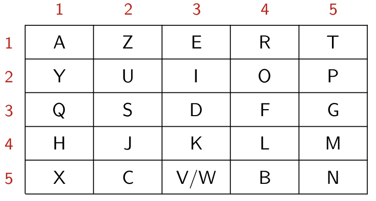
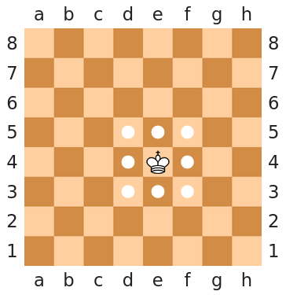



{{ titre_chapitre(num,niveau)}}

## Cours

{{ affiche_cours(num) }}

## Travaux pratiques

{{exo("Recherche simple dans une liste",[],0)}}

On souhaite écrire une fonction `recherche` en Python qui prend en argument une liste `lst` et une élément `elt` renvoie `True` ou `False` suivant que `elt` se trouve ou non dans `lst`. On donne ci-dessous la réponse d'un élève :

```python linenums="1"
def recherche(elt,lst):
    ''' Renvoie True si element est dans liste, False sinon '''
    for x in liste:
        # Si x est bien égal à élément renvoyer True sinon renvoyer False
        if x=element: 
            return True
        else:
            return False
```

1. Recopier ce code puis corriger l'erreur commise sur le test d'égalité à la ligne 5.
2. Vérifier que les tests `recherche(3,[3,10,7])` et `recherche(4,[3,10,7])` renvoient les valeurs attendues.
3. En faisant un test adapté, montrer que cette fonction n'est pas correcte.
4. Doit-on renvoyer `False` si le *premier* élément testé est différent de celui recherché comme indiqué dans le commentaire ligne 4 ?
5. Corriger cette fonction.
6. En vous inspirant de la fonction `recherche` écrire une fonction `occurrences` qui prend en argument une liste `lst` et un élément `elt` et renvoie le nombre d'apparitions de `elt` dans `lst`. Par exemples `#!python occurrences([2,7,1,2,8,2,6],2)` renvoie `3` et `#!python occurrences([2,7,1,2,8,2,6],5)` renvoie 0. 

{{exo("Comptage des éléments d'une liste",[])}}

On suppose qu'on a procédé à une élection, on dispose :

* d'une liste `candidats` donnant les noms des candidats par exemple `#!python ['A', 'B', 'C', 'D']`, 
* d'une liste `votes` représentant les votes. par exemple `#!python ['C', 'B', 'C', 'C', 'D', 'B', 'D', 'B']`, on suppose que cette liste ne contient *que des noms de candidats*

On  veut écrire une fonction `resultats` qui renvoie une dictionnaire dont les clés seront les noms des candidats et les valeurs leurs nombre de vote. . Par exemple, avec les deux listes données en exemple ci-dessus, `resultats` doit renvoyer le dictionnaire `#!python {'A': 0, 'B':3, 'C':3, 'D':2}`

1. Ecrire une version de la fonction `resultats` qui  utilise une fonction `occurrences` qui prend en argument une liste `lst` et un élément `elt` et renvoie le nombre d'apparitions de `elt` dans `lst` (voir exercice précédent). Combien de comparaisons effectue chaque appel à occurrences ? En déduire le nombre de comparaisons effectué par cette version de `resultats`

2. Ecrire une version de la fonction `resultats` qui part d'un dictionnaire dont les clés sont les candidats et les valeurs 0, parcourt la liste `votes` et incrémente la valeur associée au candidat rencontré. Quelle est le nombre de comparaisons effectués par cette version de `resultats` ?

{{exo("Recherche dichotomique dans une liste triée",[])}}

Si une liste est **triée**, un algorithme de recherche plus efficace que la recherche simple (voir exercice 1), appelée *recherche dichotomique* existe. Il consiste pour recherche un élement `x` dans une liste `lst` de longueur `n` à

* comparer `x` à `lst[n//2]`
* en cas d'égalité on renvoie `true`
* sinon on recommence la recherche dans la liste `lst[n//2]` si `x < lst[n//2]` et `lst[n//2+1:]` sinon

Le but de l'exercice est d'écrire une fonction `dichotomie` qui implémente de façon *récursive* cet algorithme.

1. Quelle sont les cas de base de l'arrêt de la récursion ? 
2. Ecrire la fonction `dichotomie`
3. Donner une version itérative de cette fonction.
4. Modifier votre fonction afin qu'elle renvoie l'indice de `x` lorsque `x` est présent dans `lst` et `-1` sinon.

{{ exo("Recherche des deux éléments les plus proches dans une liste",[])}}

Ecrire une fonction `plus_proche` qui prend en argument une liste et renvoie les deux éléments les plus proches de cette liste.

!!! aide
    On pourra procéder en utilisant tous les couples possibles de deux indices c'est à dire pour une liste de longueur `n`:

    * `(0,1), (0,2), ... (0,n-1)`
    * `(1,2), (1,3), ... (1,n-1)`
    * `(2,3), ... (2, n-1)`

    C'est à dire qu'on doit utiliser *deux* boucles imbriquées.

{{exo("Recherche d'un motif dans un texte",[])}}

Pour recherche si un motif `m` (par exemple `"math"`) se trouve dans une texte `t` (par exemple `"C'est super l'informatique"`)on peut utiliser l'algorithme suivant :

* on parcourt chaque caractère de `c`
* si le caractère rencontré correspond au premier caractère du motif `m`, alors on avance dans le motif tant que les caractères coïncident
* si on atteint la fin du motif alors `m` se trouve bien dans `c` sinon on passe au caractère suivant de `c`.

On peut visualiser le fonctionnement de cet [algorithme en ligne ](https://boyer-moore.codekodo.net/recherche_naive.php){target=_blank} (crédit : N. Reveret et L. Abdal).

1. Ecrire une implémentation de cet algorithme en Python
2. Modifier votre fonction afin qu'elle renvoie l'indice de la première apparition du motif `m` s'il est présent (ou `-1` sinon)
3. Modifier de nouveau cette fonction afin qu'elle renvoie la liste des indices des occurrences du motif dans la chaine. Par exemple `recherche("ici","ici, ou encore ici ou même là")` renvoie la liste [0,15].


{{exo("Carré de Polybe",[])}}

Le [carré de Polybe](https://fr.wikipedia.org/wiki/Carr%C3%A9_de_Polybe){target=_blank} est une méthode de chiffrement ancienne qui consiste à placer 25 lettres de l'alphabet dans un carré de côté 5 puis à chiffrer chaque lettre en utilisant son numéro de ligne et de colonne. Voici un exemple d'un tel carré :

{.imgcentre width=500px}

On notera que puisque l'alphabet contient 26 lettres, on doit regrouper deux lettres sous le même codage, ici on a choisit *V* et *W*. En utilisant ce carré, le chiffrement de "*BONJOUR*" serait *54 24 55 42 24 22 14*. On admettra dans la suite de l'exercice que la lettre *W* n'apparait pas dans les messages (ou qu'elle est remplacée par la lettre *V*), et qu'on peut donc donner un carré de Polybe sous la forme d'une liste de 5 listes contenant chacune 5 lettres. Un exemple d'un carré de Polybe est donné ci-dessous dans lequel on a écrit les lettres dans l'ordre dans lequel elles apparaissent sur un clavier d'ordinateur :
```python
clavier = [    
['A','Z','E','R','T'],
['Y','U','I','O','P'],
['Q','S','D','F','G'],
['H','J','K','L','M'],
['X','C','V','B','N']
]
```
On suppose dans la suite de l'exercice que le chiffrement d'un texte est donné sous la forme d'une liste d'entiers. Par exemple le chiffrement de "*BONJOUR*" avec le carré ci-dessus serait représenté en Python par la liste `#!python [54, 24, 55, 42, 24, 22, 14]`. De plus, comme l'espace n'est pas représenté dans le carré, on décide (arbitrairement) de le représenter par l'entier 10.

1. Ecrire une fonction `dechiffre` qui prend en argument une liste d'entiers représentant et un carré de Polybe et renvoie le message déchiffré.

    !!! aide
        N'oublier pas de traiter à part le cas de l'entier 10 qui représente le caractère espace.

2. Le carré donné en exemple a été construit en écrivant de haut en bas et de gauche à droite les lettres dans l'ordre dans lequel elles apparaissent sur un clavier *AZERTY*. Construire le carré de Polybe dans lequel on écrit les lettres de l'alphabet dans l'ordre *par colonne*, c'est à dire que la première colonne du carré sera *ABCDE*. En utilisant ce nouveau carré, déchiffrer le message suivant `[21, 34, 11, 25, 53, 10, 25, 53, 15, 44, 10, 11, 25, 51, 55, 10, 34, 51, 15, 44, 44, 42, 10, 44, 53, 10, 12, 11, 34, 10, 44, 53, 10, 22, 53, 53, 41]`: et vérifier votre réponse : {{check_reponse("BRAVO VOUS AVEZ REUSSI SO FAR SO GOOD")}}

3. On veut maintenant pouvoir chiffrer un message à l'aide d'un carré de Polybe donné, écrire une fonction `cree_dico` qui prend en argument un carre de Polybe et renvoie sous la forme d'un dictionnaire les codes de chacune des lettres. Par exemple avec le carré de Polybe `clavier` donné en exemple plus haut, cette  fonction renvoie le dictionnaire `#!python {'A' : 11, 'Z' : 12, 'E' : 13, ..., 'B' : 54, 'N' : 55}`.

4. Ecrire en utilisant la fonction précédente, une fonction `chiffre` qui prend en argument un message sous forme de chaine de caractère et un carré de Polybe et renvoie le message chiffré. Par exemple `#!python chiffre("BONJOUR",clavier)` doit renvoyer `#!python [54, 24, 55, 42, 24, 22, 14]`. Chiffrer le message "BRAVO LES PCSI" avec le carré dans lequel les lettre sont écrites par colonne et vérifier votre réponse : {{check_reponse("[44, 15, 14, 51, 34, 10, 23, 51, 44, 10, 14, 31, 44, 42]")}}

{{exo("La promenade du roi",[])}}

Aux échecs, le roi peut se déplacer d'une case dans chacune des directions possibles, comme illustré ci-dessous (crédits : [wikipedia](https://fr.wikipedia.org/wiki/Roi_%28%C3%A9checs%29){target=_blank}).

{.imgcentre width=400px}

Une promenade du roi est une liste de déplacements du roi codé comme sur une rose des vents (voir ci-dessous)

{.imgcentre width=300px}

C'est à dire que par exemple un déplacement d'une case vers le haut et la droite est représenté par `'NE'` ou qu'un déplacement vers le bas est représenté par '`S`'. Par exemple, si le roi se trouve initialement en *E4* (comme ci-dessus) et que sa promenade est `['E','E','NE','S','O','SO']` alors il visitera successivement les cases *E4* (le départ),*F4*, *G4*, *H5*, *H4*, *G4*, *F3*. Si un déplacement ferait sortir le roi de l'échiquier (par exemple s'il se trouve en `A1` et que le déplacement est `SE`) alors le roi ne bouge pas.

1. Ecrire une fonction `deplacement` qui prend en argument une case représentée par une chaine de caractère (comme par exemple `"E4"`) et renvoie la position du roi après ce déplacement. Par exemple `deplacement("E4","N")` renvoie `"E5"`, `deplacement("B5","NO")` renvoie `"A6"` et `deplacement("F8","N")` renvoie `"F8"` (ce déplacement sort de l'échiquier et donc le roi ne bouge pas).

    !!! aide
        On pourra utiliser un dictionnaire dont les clés sont les codages de déplacement (`"N", "NE", "E", ....`) et les valeurs associées les modifications des numéros de lignes et de colonnes.

2. Ecrire une fonction `promenade` qui prend en argument position initiale ainsi qu'une liste de déplacements (codée sous la forme ci-dessous) et renvoie la liste des cases parcourue par le roi.

3. On veut maintenant exploitée la liste des cases parcourues par le roi afin de déterminer combien de cases ont été visitées, écrire une fonction `comptabilise` qui prend en argument une liste de cases et renvoie un dictionnaire dont les clés sont les cases et les valeurs associées le nombre de fois où la case a été visitée.

4. On considère la liste de déplacements suivante :
```python
['S', 'NE', 'O', 'S', 'SO', 'N', 'S', 'NE', 'SO', 'O', 'NE', 'SO', 'SO', 'NO', 'E', 'NO', 'S', 'E', 'O', 'E', 'NE', 'NO', 'O', 'E', 'SE', 'SE', 'SE', 'S', 'N', 'SO', 'SO', 'S', 'O', 'S', 'NE', 'E', 'S', 'N', 'NE', 'O', 'NE', 'S', 'SO', 'N', 'SO', 'S', 'SE', 'E', 'NE', 'E', 'E', 'N', 'NO', 'NE', 'NO', 'S', 'NO', 'E', 'O', 'E', 'S', 'N', 'E', 'S', 'N', 'SO', 'N', 'NO', 'NE', 'NE', 'SO', 'N', 'SE', 'N', 'N', 'S', 'S', 'S', 'SE', 'O', 'N', 'S', 'N', 'SE', 'SO', 'N', 'SO', 'SO', 'NO', 'SE', 'O', 'N', 'O', 'O', 'O', 'N', 'S', 'SE', 'O', 'NE']
```
Combien de cases ont été visitées ? {{check_reponse("42")}}

5. Quelles sont les cases a avoir été le plus visité ? {{check_reponse("F5, F6")}} (donner les cases séparées par des virgules et dans l'ordre de la lecture)