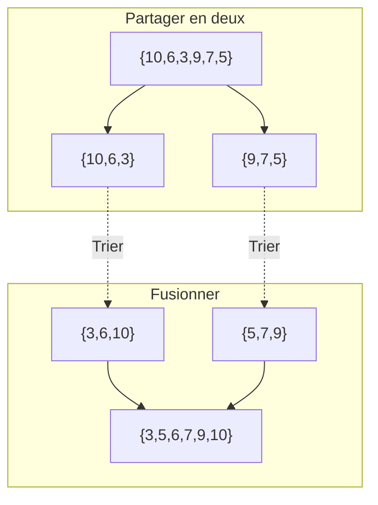



{{ titre_chapitre(num,niveau)}}

## Cours

{{ affiche_cours(num) }}

## Travaux pratiques

!!! aide
    Pour générer une liste d'éléments à trier au hasard on pourra utiliser la fonction `randint` du module `random` et créer une liste d'entiers aléatoires par compréhension:
    ```python
    from random import randint
    # Génère  au hasard 10 entiers compris entre 1 et 20
    test = [randint(1,20) for i in range(10)]
    ```


{{ exo("Liste triée",[],0)}}

Ecrire une fonction `est_triee` qui prend en argument une `liste` et qui renvoie `True` si `liste` est triée par ordre croissant et `False` dans le cas contraire.

!!! Attention
    On ne doit pas trier la liste, simplement vérifier si elle l'est déjà ou pas.


{{ exo("Retour sur le tri par sélection",[]) }}

On rappelle l'algorithme du tri par sélection vu en cours :

!!! abstract "Algorithme"
    Pour trier les éléments d'un tableau par ordre croissant, l'algorithme du *tri par sélection* consiste à :  

    * rechercher le plus petit élement du tableau à partir de l'indice **0**
    * échanger cet élément avec celui situé à l'indice **0**
    * rechercher le plus petit élement du tableau à partir de l'indice **1**
    * échanger cet élément avec celui situé à l'indice **1**
    * et ainsi de suite jusqu'à atteindre la fin du tableau

1. Ecrire les étapes du tri par sélection pour la liste `[12,19,10,13,11,15,9,14]`

2. Ecrire une fonction `echange` qui prend en argument une liste et deux indices $i$ et $j$ et échange les éléments d'indice $i$ et $j$ de cette liste.
3. Ecrire une fonction `indice_min_depuis` qui prend en argument une liste et un indice $i$ et renvoie l'indice du minimum des éléments de ce tableau depuis l'indice $i$.
4. Programmer et tester l'algorithme du tri par sélection.


{{ exo("Retour sur le tri par insertion",[]) }}

1. Rappeler le principe de l'algorithme et écrire les étapes du tri par insertion pour la liste `[12,19,10,13,11,15,9,14]`

2. Ecrire une fonction `insere` qui prend un argument une liste et `l` et un indice `i` et qui insère l'élément d'indice `i` de `l` dans la liste `l[0],...l[i-1]` *en supposant cette liste déjà triée*

    !!! aide
        On rappelle qu'on peut procéder en échangeant l'élément d'indice `i` avec son voisin de gauche tant que ce dernier existe et qu'il est supérieur

3. En déduire une fonction qui implémente en Python l'algorithme du tri par insertion


{{ exo("Tri à bulles",[])}}

Le [tri à bulles](https://fr.wikipedia.org/wiki/Tri_%C3%A0_bulles){target = _blank} est un algorithme de tri qui consiste à parcourir de façon répétitive un tableau, si deux éléments ne sont pas de bon ordre, alors on inverse leur position. A la fin du premier parcours, le plus grand élément se trouve forcément en dernière position. Le parcours suivant s'arrête donc à l'avant-dernier élément, et ainsi de suite. Par exemple, sur le tableau `{12, 9, 17, 11, 3}` les étapes du tri seront :

* après premier parcours : `{9, 12, 11, 3, 17}` 
* après second parcours : `{9, 11, 3, 12, 17}`
* après troisième parcours : `{9, 3, 11, 12, 17}`
* après quatrième parcours : `{3, 9, 11, 12, 17}`

Le but de l'exercice est d'implémenter cet algorithme

1. 2. Ecrire une fonction `echange` qui prend en argument une liste et deux indices $i$ et $j$ et échange les éléments d'indice $i$ et $j$ de cette liste.
2. Ecrire une fonction de signature `parcours`  qui prend en argument une liste `l` ainsi qu'un indice `i` qui parcours `l` jusqu'à l'indice `i` en échangeant l'élément avec son voisin de droite s'il lui est inférieure. 
3. Ecrire une fonction `void tri_bulles(int tab, int size)` qui trie en place le tableau `tab`. Proposer des tests pour valider le comportement de cette fonction.

{{ exo("Le tri fusion",[])}}

L'algorithme du **tri fusion** consiste à :  

* *(diviser)* partager le tableau à trier en deux moitiés (à une unité près), 
* *(régner)* trier chacune des deux moitiés, 
* *(combiner)* les fusionner pour obtenir la liste triée. 

On a schématisé le tri du tableau `[| 10; 6; 3; 9; 7; 5 |]` suivant ce principe ci-dessous :


1. Ecrire  une fonction `separe` qui sépare une liste en deux listes de même longueur (à une unité près).

2. Ecrire une fonction `fusion` qui prend en argument deux listes supposées *déjà triées* et les fusionne.

3. Donner une implémentation du tri fusion en Python.


{{ exo("Le tri rapide",[])}}

Le [tri rapide *(quicksort)*](https://en.wikipedia.org/wiki/Quicksort){target=_blank} est un algorithme de tri développé par T. Hoare en 1959. Le tri rapide repose comme le tri fusion sur une méthode diviser pour régner. La séparation en deux sous tableaux s'effectue en choisissant (aléatoirement) un pivot, et en mettant d'un côté les nombres inférieurs au pivot et de l'autre les nombres supérieurs. Par conséquent, la longueur des sous listes  obtenue dépend du pivot choisi. Par contre on s'affranchit de la phase de fusion puisqu'elle consiste simplement à concaténer les deux sous listes.

Par exemple, sur le tableau $[10, 6, 3, 9, 7, 5]$ si on choisit comme pivot 5, alors la séparation en deux sous listes donnera d'un côté $[3]$ (les valeurs strictement inférieures ou égales au pivot) et de l'autre $[10, 6, 9, 7]$ (les valeurs strictement supérieures).

On propose ici d'implémenter cet algorithme en Python en choisissant comme *pivot le dernier élément du tableau*. 


1. Ecrire la fonction `partitionne` qui prend en argument une liste et renvoie deux listes, l'une formée des éléments inférieurs ou  égaux au dernier élément de la liste et l'autre formée des éléments strictement supérieurs.
2. Ecrire la fonction `tri_rapide` qui prend en argument une liste et renvoie cette liste triée.

