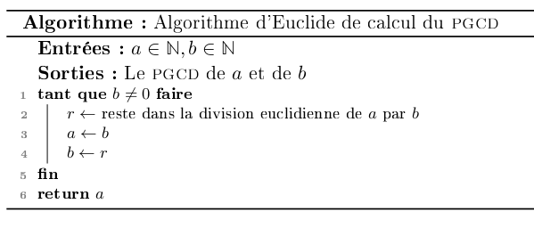

hide: - navigation  in index.md

{{dm(2,"Le jeu de la vie ")}} 

## Exercice 1 : Algorithme d'Euclide

L'[algorithme d'Euclide](https://fr.wikipedia.org/wiki/Algorithme_d%27Euclide){target=_blank} est un algorithme permettant de calculer le {{sc("pgcd")}} de deux entiers naturels $a$ et $b$. Il consiste, tant que $b$ n'est pas nul à effectuer la division euclidienne de $a$ par $b$, en notant $r$ le reste de cette division, on remplace $a$ par $b$ et $b$ par $r$ et on réitère le processus, lorsque $b$ vaut 0, l'algorithme s'arrête et le {{sc("pgcd")}} est $a$. Par exemple avec $a = 120$ et $b=84$ on obtient :

| a | b | q | r |
|---|---|---|---|
|120| 84| 1 | 36| 
|84 | 36| 2 | 12|
|36 | 12| 3 | 0 |
|12 | 0 | x | x |

Comme $b=0$ l'algorithme s'arrête et le {{sc("pgcd")}} de 120 et 84 est 12.

1. Faire fonctionner cet algorithme avec $a=42$ et $b=98$

    ??? Question "Corrigé"
        | a | b | q | r |
        |---|---|---|---|
        | 42| 98| 0 | 42|
        | 98| 42| 2 | 14|
        | 42| 14| 3 |  0|

        Le reste est nul, donc l'algorithme s'arrête et le {{sc("pgcd")}} est 14.

2. Ecrire cet algorithme en pseudo-langage en préciser les entrées, les sorties et les préconditions

    ??? Question "Corrigé"
        {width=500px}

3. Donner une implémentation *itérative* de cet algorithme en C.

    ??? Question "Corrigé"
        ```c linenums="1"
            --8<-- "DM2/euclide.c:Q3"
        ```
4. Prouver que cet algorithme termine

    !!! aide
        On pourra utiliser sans le démontrer le théorème de la division euclidienne.

    ??? Question "Corrigé"
        Montrons que `b` est un variant de boucle.

        * `b` est entier par précondition et reste entier car le reste dans une division euclidienne est un entier.
        * `b` est strictement positif par condition d'entrée dans la boucle,
        * Les valeurs prises par `b` sont strictement décroissantes car d'après le théorème de la division euclidienne, le reste `r` d'une division par `b` est strictement inférieur à `b`. La nouvelle valeur de `b` (le reste dans la division de `â` par `b`) est donc strictement inférieur à celle d'entrée dans la boucle.

        Donc `b` est un variant de boucle et l'algorithme termine.

5. Prouver la correction totale de cet algorithme.

    !!! aide
        On pourra noter $a_0$ (resp $b_0$) les valeurs initiales de $a$ (resp $b$), et utiliser l'invariant suivant  : {{sc("pgcd")}}$(a_0,b_0)$ = {{sc("pgcd")}}$(a,b)$

    ??? Question "Corrigé"
        On note $a_0$ (resp $b_0$) les valeurs initiales de $a$ (resp $b$), montrons l'invariant $I$ : {{sc("pgcd")}}$(a_0,b_0)$ = {{sc("pgcd")}}$(a,b)$

        * $I$ est vrai en entrant dans la boucle, car on a alors $a=a_0$ et $b=b_0$.
        * On supose $I$ vrai, en entrant dans la boucle, c'est à dire {{sc("pgcd")}}$(a_0,b_0)$ = {{sc("pgcd")}}$(a,b)$, les valeurs de `a` (resp `b`) après passage dans la boucle sont `b` (resp `r`). Or {{sc("pgcd")}}$(a,b)$={{sc("pgcd")}}$(b,r)$, donc $I$ est conservé

        Puisqu'en sortie de boucle $b=0$, la conservation de l'invariant donne {{sc("pgcd")}}$(a_0,b_0)$ = {{sc("pgcd")}}$(a,0) = a$, donc l'algorithme est correct.

6. Donner une implémentation récursive en C (et éventuellement en OCaml).

    ??? Question "Corrigé"
        ```c linenums="1"
            --8<-- "DM2/euclide.c:Q5"
        ```

7. Créer un type structuré `fraction` permettant de représenter une fraction (dont avec un deux champs de type entier, l'un pour le numérateur et l'autre pour le dénominateur)

    ??? Question "Corrigé"
        ```c linenums="1"
            --8<-- "DM2/euclide.c:Q6"
        ```

8. Ecrire une fonction simplifie de prototype `#!c void simplifie(fraction *f)` qui ne renvoie rien et modifie la fraction (type `struct` défini à la question précédente) passée en paramètre de façon à la rendre irréductible.

    ??? Question "Corrigé"
        ```c linenums="1"
        --8<-- "DM2/euclide.c:Q7"
        ```

9. Ecrire  une fonction addition de prototype `#!c fraction addition(fraction f, fraction g)` qui renvoie la somme des deux fractions passées en argument.

    ??? Question "Corrigé"
        ```c linenums="1"
        --8<-- "DM2/euclide.c:Q8"
        ```

!!! lien "Pour aller plus loin"
    Pour aller plus loin, on pourra écrire les fonctions correspondantes aux autres opérations de base (différence, multiplication et division), écrire un module `fraction.h` et faire de la compilation séparée.

## Exercice 2 : Programmation en C

### Jeu de la vie unidimensionnel 

On s'intéresse dans cet exercice, à une version unidimensionnelle du [jeu de la vie](https://fr.wikipedia.org/wiki/Jeu_de_la_vie){target=_blank}, c'est à dire qu'on fait évoluer des cellules ayant deux états possibles (vivantes ou mortes) dans un tableau unidimensionnel (et pas sur une grille). La règle d'évolution est la suivante : une cellule devient ou reste vivante uniquement lorsqu'elle avait exactement une voisine vivante au tour précédent. 

Par exemple, dans la configuration suivante, 
{{make_jeuvie(['...##.#.#.'],[1,2,3,4])}} 
l'évolution suivante sera :
{{make_jeuvie(['..###.....'],[5,6,7])}}

En effet :

* la cellule numérotée `5` est devenue vivante (elle était morte au tour précédent) car elle avait une seule voisine (la cellule  `1`)
* la cellule numérotée `6` est l'évolution de la celulle `1` qui est restée vivante (elle n'avait qu'une voisine vivante, la cellule `2`)
* la cellule numérotée `7` est l'évolution de la celulle `2` qui est restée vivante
* Les cellules `3` et `4` meurent car elles n'avaient aucune voisine.

!!! note
    Le "jeu" se déroule en théorie dans un tableau infini, ici on supposera qu'on se restreint à un tableau de taille donnée `TAILLE` et que cette constante est définie en début de programme à l'aide de, par exemple, `#define TAILLE 100`. Par conséquent, on ne passera pas aux fonctions la taille du tableau (on utilisera la constante `TAILLE`). Et on ne fait pas évoluer la première et la dernière case du tableau qui restent toujours des cellules mortes.

1. Les cellules n'ayant que deux états possibles on représente un état du jeu par un tableau de booléens. Ecrire une fonction de signature `#!c void affiche(bool etat[])` qui prend en argument un état du jeu et l'affiche dans le terminal sous la forme d'une chaine de caractère où `#` indique les cellules vivantes et `.` les cellules mortes. Par exemple (avec une taille de 10), si le tableau `etat `contient les valeurs `{false,false,false,true,true,false,true,false,true,false}` , l'affichage produit dans le terminal sera `...##.#.#.`.

    ??? Question "Corrigé"
        ```c linenums="1"
        --8<-- "DM2/lineaire.c:Q1"
        ```

2. Ecrire une fonction  `#!c bool* evolution(bool etat[])` qui renvoie le nouvel état du jeu après une application de la règle d'évolution. Par exemple, si le tableau `etat` contient `{false,false,false,true,true,false,true,false,true,false}`, alors la fonction evolution renvoie `false, false, true, true, true, false, false, false, false, false`.

    ??? Question "Corrigé"
        ```c linenums="1"
        --8<-- "DM2/lineaire.c:Q2"
        ```

3. Définir la constante `TAILLE` à 100 et définir un état de jeu ou toutes les cellules sont mortes sauf la cellule d'indice 50 qui est vivante et faire afficher l'évolution de l'état du jeu pour les 50 premières étapes. Le début de l'affichage devrait être :
```
..................................................#.................................................
.................................................#.#................................................
................................................#...#...............................................
...............................................#.#.#.#..............................................
..............................................#.......#.............................................
.............................................#.#.....#.#............................................
............................................#...#...#...#...........................................
...........................................#.#.#.#.#.#.#.#..........................................
..........................................#...............#.........................................
.........................................#.#.............#.#........................................
```

    ??? Question "Corrigé"
        ```c linenums="1"
        --8<-- "DM2/lineaire.c:Q3"
        ```

4. Ecrire une fonction `compte` qui prend en argument un état du jeu et renvoie le nombre de cellules vivantes.

    ??? Question "Corrigé"
        ```c linenums="1"
        --8<-- "DM2/lineaire.c:Q4"
        ```

5. On prend la constante `TAILLE` égale à 1000, et un tableau initialement vide à part la cellule d'indice 500 qui est vivante. Combien de cellules vivantes contient le tableau après 2024 évolutions ?   
Vérifier votre réponse : {{check_reponse("128")}}

??? Question "Corrigé"
        En prenant les données de l'énoncé et en utilisant la fonction `compte` sur le résultat final, on trouve **128** cellules vivantes

### Généralisation et règles de Wolfram

Comme l'évolution d'une cellule ne dépend que de son état antérieur et de celui de ses voisines immédiates (à droite et à gauche). Ces trois cellules (la centrale et les deux voisines) peuvent être dans **8** configurations différentes, et donc une règle d'évolution possible est la donnée du nouvel état de la cellule centrale pour ces 8 configurations. Par exemple, la règle d'évolution dans la partie précédente correspond à

| Ancien état | Nouvel état de la cellule centrale|
|-------------|-----------------------------------|
|    `###`    | `.` |
|    `##.`    | `#` |
|    `#.#`    | `.` |
|    `#..`    | `#` |
|    `.##`    | `#` |
|    `.#.`    | `.` |
|    `..#`    | `#` |
|    `...`    | `.` |

Si on lit de haut en bas la règle on obtient `.#.##.#.` qui, interprété comme un entier positif en binaire (avec  `#` correspondant au 1 et `.` au 0) donne $\overline{01011010}^{2} = \overline{90}^{10}$. Pour cette raison, la règle utilisée dans la partie précédente s'appelle [regle 90](https://en.wikipedia.org/wiki/Rule_90){target=_blank}. Et on peut donc associer à tout entier de l'intervalle $[0;255]$ une règle d'évolution.

1. Déterminer la règle de transformation pour l'entier 110

    ??? Question "Corrigé"
        $\overline{110}^{10} = \overline{01101110}^{2}$  
        Et donc la règle est de transformation est :

        | Ancien état | Nouvel état de la cellule centrale|
        |-------------|-----------------------------------|
        |    `###`    | `.` |
        |    `##.`    | `#` |
        |    `#.#`    | `#` |
        |    `#..`    | `.` |
        |    `.##`    | `#` |
        |    `.#.`    | `#` |
        |    `..#`    | `#` |
        |    `...`    | `.` |


2. Ecrire une fonction de signature `bool* evolution_rule(bool etat[], int rnum)` qui prend en entrée un etat (sous la forme d'un tableau de booléens) et un numéro de règle `rnum` et renvoie l'état du jeu après une évolution. 

    ??? Question "Corrigé"
        ```c linenums="1"
        --8<-- "DM2/lineaire.c:Q5"
        ```

3. Tester votre fonction en retrouvant  l'évolution visible sur les pages wikipédia dédiées  pour les règles suivantes

    * La [règle 30](https://en.wikipedia.org/wiki/Rule_30){target = _blank}
    * La [règle 110](https://en.wikipedia.org/wiki/Rule_110){target = _blank}
    * La [règle 184](https://en.wikipedia.org/wiki/Rule_184){target = _blank}


