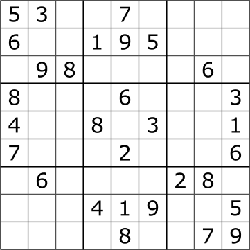
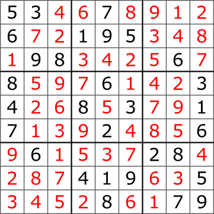

hide: - navigation  in index.md

{{dm(5,"Résolution de sudoku mis sous forme normale conjonctive")}} 

Le but de l'exercice est de résoudre un [sudoku](https://en.wikipedia.org/wiki/Sudoku){target=_blank} en :
* le transformant en un problème de satisfiabilité d'une formule logique (mise sous forme normale conjonctive)
* d'utiliser une implémentation de l'algorithme de Quine afin de résoudre ce problème de satisfiabilité

La première partie concerne l'implémentation de l'algorithme de Quine qu'on testera sur un exemple simple. La transformation du sudoku en un problème de satisfiabilité s'effectue dans le seconde partie. Le langage d'implémentation proposé est OCaml, mais on pourra éventuellement dans un second temps effectuer aussi une implémentation en C.

## Partie I : Implémentation de l'algorithme de Quine

Etant donné un ensemble $\mathcal{V}$ de $n$ variables logiques  numérotées à partir de **1** c'est à dire $\mathcal{V} = \left(p_i\right)_{i \leqslant 1 \leqslant n}$ on représente en OCaml :

* un *littéral* $p_i$ par l'entier $i$ et un littéral $\neg p_i$ par $-i$.
* une *clause* par une liste d'ntiers
* une *forme normale conjonctive* par une liste de liste d'entiers

Par exemple avec 3 variables logiques $p_1, p_2$ et $p_3$; la forme normale conjonctive $(p_1 \vee p_2 \vee \neg p_3) \wedge (\neg p_2 \vee \neg p_3) \wedge (\neg p_1 \vee p_3)$ est représentée par la liste de liste d'entiers : `[[1; 2; -3]; [-2; -3]; [1; 3]]`

1. Nombre de variables dans la formule logique

    Ecrire une fonction qui renvoie le maximum en valeur absolue d'une liste d'entier et en déduire une fonction `maxvar : int list list -> int` qui renvoie le maximum en valeur absolue d'une liste de liste d'entiers. Par exemple `maxvar [[2; 3]; [1; -4]]` doit renvoyer 4.

2. Choix d'une variable à instancier  
    La première étape de l'algorithme de Quine est de choisir une variable à instancier, dans le cas particulier du sudoku nous verrons que certaines clauses ne contiennent qu'un unique littéral. On propose donc d'instancier en premier les variables logiques correspondantes. C'est à dire qu'on est amené à rechercher dans une liste de liste d'entiers l'un des entiers apparaissant dans une liste contenant un seul élément. Si aucune liste ne contient qu'un élément, on choisit (arbitrairement) d'instancier une variable se trouvant dans une liste de longueur minimale. Par exemple :

    * Le choix du littéral dans `[[1; -4]; [2; -3; 4]; [-3]; [1; -3]]` doit renvoyer `-3`  en effet c'est l'unique clause contenant un seul littéral
    * Le choix du littéral dans `[[3]; [1; 2; 3; -5]; [-2]; [-1; 5]]` peut renvoyer `3` ou `-2` (au choix du)
    * Le choix du littéral dans `[[2; 6; 1]; [-1; 3 ; 4]; [5; 6]; [2; 3; -4]]` peut renvoyer `5` ou `6` (l'un des littéraux se trouvant dans la clause contenant le minimum de littéraux)
    * Le choix du littéral dans `[[-1; -2]; [3; 4]]` peut renvoyer `-1`, `-2`, `3` ou `4` car les deux clauses sont de longueur minimal

    Ecrire une fonction, `choix_litteral : int list list -> int` qui choisit un littéral dans une forme normale conjonctive.

    !!! aide
        On pourra procéder récursivement de la façon suivante :
        * Dès qu'on rencontre une clause contenant un seul littéral on renvoie ce littéral
        * Sinon on maintient à jour dans les paramètres d'appel de la fonction la taille minimale des clauses déjà rencontrées ainsi qu'un littéral d'une de ces clauses. On renvoie cette valeur si on atteint la fin de la liste.

3. Substitution d'un littéral dans une forme normal conjonctive

    A présent qu'on a choisit un littéral, on doit instancier la variable correspondante dans la forme normale conjonctive (voir le cours sur l'algorithme de Quine). On rappelle que lorsqu'on instancie un littéral dans une clause :

    * si le littéral est vrai alors la clause devient vraie (une clause est une disjonction de littéraux, dont un littéral vraie rend la clause vraie). Lorsque la clause est vraie, elle peut être *entièrement supprimée* de la forme normale conjonctive.
    * si le littéral est faux alors il peut être supprimée de la clause. Si la clause obtenue est vide alors cela signifie que la forme normale conjonctive n'est pas satisfiable.

    Par exemple, si on substitue le littéral $p_1$ par vraie dans `[1; 2; -3]; [-1; 3]; [2; 3]` alors la première clause est satisfaite et est supprimée, la seconde clause devient `[3]` (car $\neg p_1$ est faux) et la dernière clause n'est pas affectée car elle ne contient pas $p_1$. La nouvelle forme normale conjonctive est `[3]; [2; 3]`.

    Ecrire la fonction `substitue : int list list -> int -> bool -> int list list` qui substitue un littéral dans une forme normale conjonctive et renvoie la nouvelle forme normale conjonctive obtenue.

3. Algorithme de Quine

    En utilisant les deux fonctions précédentes, écrire une implémentation de l'algorithme de Quine sous la forme d'une fonction `quine : int list list -> bool * bool array` qui prend en argument une liste de liste d'entiers (représentant une forme normale conjonctive) et renvoie `true` et une valuation qui satisfait cette *fnc* si elle est satisfiable et `false` et une valuation quelconque sinon.

    !!! aide
        On pourra éventuellement :
        * Utiliser `maxvar` afin de déterminer le nombre de variables logiques dans la `fnc`
        * créer la valuation sous la forme d'un tableau de booléens tel que le booléen à l'indice $i$ représente la valuation de la variable logique $p_{i+1}$.
        On rappelle que si la *fnc* est vide alors elle est vraie, si elle contient une clause vide alors elle est fausse. 

4. Test de l'algorithme de Quine

    Tester votre algorithme sur la formule logique `[[-2; -3]; [-1; 3]; [2; -3]; [2; 3]]`, vous devriez obtenir que cette formule est satisfiable, la seule valuation la rendant vraie est `[|false; true; false |]`.

## Partie II : Application à la résolution de sudoku

Le [sudoku](https://en.wikipedia.org/wiki/Sudoku){target=_blank} est un célèbre jeu de réflexion dans lequel on doit placer les chiffres de 1 à 9 dans une grille de façon à ce qu'une ligne, une colonne ou une sous grille de dimension 3x3 contienne un unique exemplaire de chacun des chiffres.

Voici un exemple de sudoku, ou les sous grilles (de taille 3x3) appelées *blocs* sont délimitées par des traits en gras (credits : [Wikipedia,Tim Stellmach](https://commons.wikimedia.org/w/index.php?curid=57831926){target=_blank}):
{width=300px .imgcentre}

La solution est :
{width=300px .imgcentre}

Le problème de remplissage du sudoku peut se ramener à celui de la satisfiabilité d'une formule logique. On commence par noter pour $0 \leqslant i \leqslant 8$, $0 \leqslant j \leqslant 8$ et $1 \leqslant k \leqslant 9$, $p_{i,j,k}$ la variable logique qui vaut vrai si la valeur $k$ se trouve à la ligne $i$ et à la colonne $j$. Dans le sudoku donné en exemple ci-dessus $5$ se trouve en $(0,0)$ et donc $p_{0,0,5}$ est vraie. 

0. Numérotation des variables

    On adopte une numérotation avec un seul indice, la variable $p_{i,j,k}$ sera celle de numéro $81i + 9j+ k$. On a donc en tout **729** variables logiques, numérotées de 1 à 730. Ecrire la fonction qui associe au triplet $(i,j,k)$ l'indice correspondant.

1. Présence d'au moins une valeur dans chaque case du Sudoku

    Chaque case de la grille doit contenir une valeur. C'est à dire que pour la case $(0,0)$ on doit avoir l'un des $p_{0,0,k}$ pour $ 1 \leqslant k \leqslant 9$ qui est vrai. Ce qui donne pour cette case la clause `[1; 2; 3; 4; 5; 6; 7; 8; 9]`. Ecrire la fonction  `au_moins : () -> int list list` qui ne prend aucun argument et renvoie la *fnc* indiquant que chacune des 81 cases du sudoku contient au moins une valeur.

2. Présence d'au plus une valeur dans chaque case du Sudoku

    Une case du Sudoku ne peut pas contenir deux valeurs simultanément. Prenons de nouveau l'exemple de la case $(0,0)$, pour deux valeurs distinctes $k_1$ et $k_2$ on ne peut pas avoir simultanément les variables $p_{0,0,k_1}$ et $p_{0,0,k_2}$ vraies, autrement dit l'une ou l'autre doit être fausse. C'est à dire qu'on obtient pour la case $(0,0)$, pour toute couple $(k_1,k_2)$, $1 \leqslant k_1 < k_2 \leqslant 9$ la clause `[-k1; -k2]`. Ecrire une fonction `au_plus : () -> int list list` qui ne prend aucun argument et renvoie la *fnc* indiquant que chacune des 81 cases du sudoku contient au plus une valeur.

3. Valeur différentes dans une ligne, une colonne ou un bloc

    Il reste à exprimer que si nous prenons une liste de 9 cases constituant une ligne, une colonne ou un bloc du sudoku alors une même valeur ne peut pas apparaitre deux fois sur ces 9 cases. Prenons l'exemple de la première ligne, dont les indices des cases sont `[(0,0); (0,1); (0,2); (0,3); (0,4); (0;5); (0;6); (0;7); (0;8)]` si on choisit deux cases distinctes dans cette liste par exemple les deux premières, alors pour toute valeur $ 1 \leqslant k \leqslant 9$ on ne doit pas avoir $p_{0,0,k}$ et $p_{0,1,k}$ vraies en même temps. 

    1. Ecrire la fonction  `ligne : int -> int list` qui renvoie la liste des cases de la ligne `i`

    2. Ecrire la fonction  `colonne : int -> int list` qui renvoie la liste des cases de la colonne `i`

    3. Ecrire la fonction  `bloc : int -> int list` qui renvoie la liste des cases du bloc `i`

    4. Ecrire la fonction `differents : int list -> int list list` qui prend en argument une liste de case et renvoie la *fnc* indiquant que deux cases distinctes d'une liste de cases ne peuvent pas avoir la même valeur

    5. En appliquant la fonction `differents` aux lignes, colonnes et blocs, produire la *fnc* qui indique que deux cases situées  dans une même ligne, colonne ou bloc n'ont pas la même valeur.

### Partie III : Résolution dans des cas particuliers

    Dans un sudoku, certaines valeurs sont déjà placées, ainsi dans le sudoku donné en exemple, la valeur 5 est déjà placée dans  la case $(0,0)$ ce qui signifie $p_{0,0,5]$ est vrai et que donc la clause `[5]` doit faire partie de ce sudoku. On donne de façon classique un sudoku sous la forme d'une chaine de 81 caractères, celle qui représente le sudoku donnée en exemple est `"530070000600195000098000060800060003400803001700020006060000280000419005000080079"`, c'est à dire qu'on lit le sudoku dans l'ordre de gauche à droite et de haut en bas et qu'on indique par un `0` une valeur manquante.

    1. Ecrire une fonction `initialisation : str -> int list list` qui prend en entrée une chaine de caractères représentant un sudoku et renvoie la liste des clauses (ne comprenant chacune qu'un unique littéral) représentant les valeurs déjà placées dans ce sudoku.

    2. Ecrire la fonction de résolution qui concatène toutes les contraintes écrites plus haut (`au_moins`, `au_plus`, `differents`) ainsi que la contrainte d'initialisation du sudoku de la question précédente et renvoie la valuation qui rend vraie le sudoku.

    3. Ecrire une fonction exploitant la valuation afin d'afficher le sudoku

    