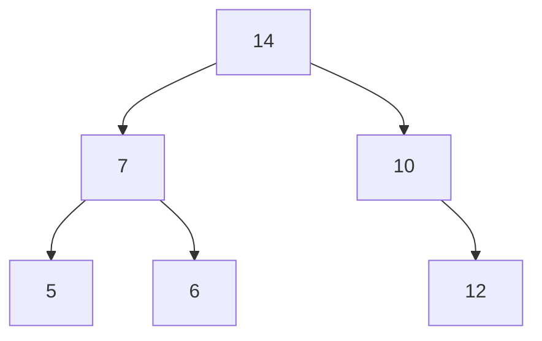




{{ titre_chapitre(num,niveau)}}

{{ citation("Trees sprout up just about everywhere in computer science","D. Knuth")}}

## Cours

{{ cours(num) }}

## Travaux dirigés

{{ td(num) }}


## Travaux pratiques

{{exo("Implémentation des arbres binaires en C",[],0)}}

On rappelle la structure de données vue en cours et permettant de représenter une arbre binaire en C :
```c
    --8<-- "C12/arbres_binaires.c:4:12"
```
On donne aussi, la fonction permettant de créer un arbre binaire en donnant ses deux sous arbres et son étiquette :
```c
    --8<-- "C12/arbres_binaires.c:15:22"
```

1. En utilisant cette représentation, créer une variable `t` de type arbre binaire représentant l'arbre suivant ;  


    ??? aide "Visualisation de l'arbre"
        Visualisation de l'arbre, on donne ci-dessous une fonction permettant de visualiser l'arbre. **Attention**, cette fonction utiliser une variable globale `#!c int ninv = 0` que vous devrez déclarer en début de programme.

        ```c
            --8<-- "C12/arbres_binaires.c:31:86"
        ```

2. Ecrire et tester la fonction `taille`  de signature `#!c int taille(ab a)` et qui renvoie le nombre de noeuds de l'arbre binaire donné en argument.

3. Ecrire et tester la fonction `hauteur`  de signature `#!c int hauteur(ab a)` et qui renvoie la hauteur de l'arbre binaire donné en argument.

4. Ecrire une fonction permettant `detruit` de signature `#!c void detruit(ab *a)` qui permet de détruire un arbre binaire en *libérant l'espace mémoire* occupé par ses noeuds. Après l'appel à cette fonction, `a` est le pointeur `NULL`.

## Humour d'informaticien

{.imgcentre width=500px}
Finally after years of search I found a real tree ... 