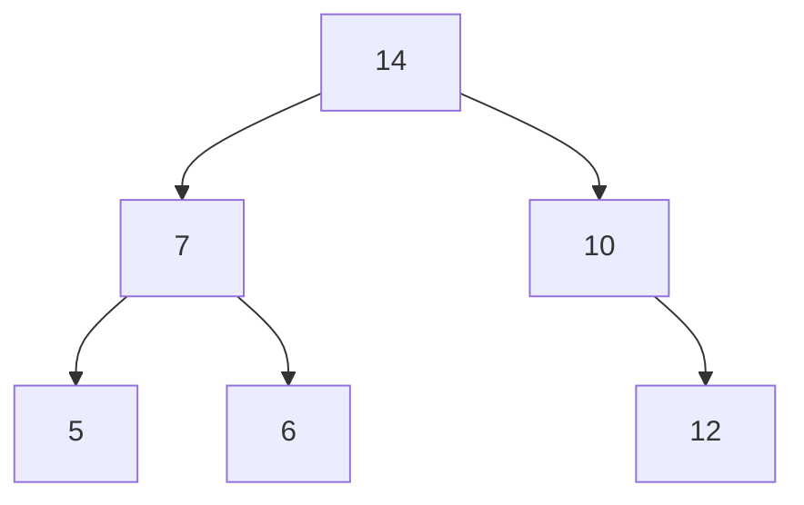
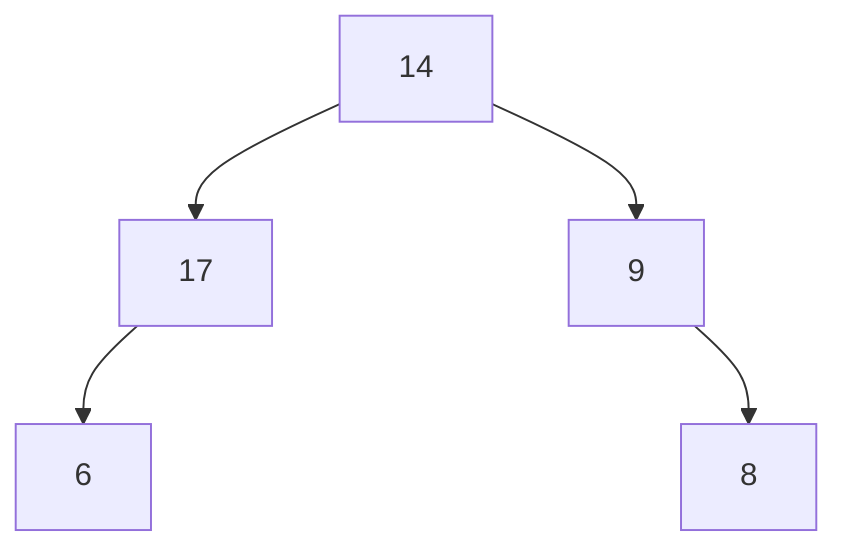




{{ titre_chapitre(num,niveau)}}

{{ citation("Trees sprout up just about everywhere in computer science","D. Knuth")}}

## Cours

{{ affiche_cours(num) }}

## Travaux dirigés

{{ td(num) }}


## Travaux pratiques
 
{{exo("Implémentation des arbres binaires en C",[],0)}}

On rappelle la structure de données vue en cours et permettant de représenter une arbre binaire en C :
```c
    --8<-- "C12/arbres_binaires.c:struct"
```
On donne aussi, la fonction permettant de créer un arbre binaire en donnant ses deux sous arbres et son étiquette :
```c
    --8<-- "C12/arbres_binaires.c:cree"
```

1. En utilisant cette représentation, créer une variable `t` de type arbre binaire représentant l'arbre suivant ;  


    ??? aide "Visualisation de l'arbre"
        On donne ci-dessous une fonction permettant de visualiser l'arbre.

        ```c
            --8<-- "C12/arbres_binaires.c:voir"
        ```

2. Ecrire une fonction `est_vide` de signature `#!c bool est_vide(ab a)` permettant de tester si l'arbre donné en paramètre est vide.

2. Ecrire et tester la fonction `taille`  de signature `#!c int taille(ab a)` et qui renvoie le nombre de noeuds de l'arbre binaire donné en argument.

3. Ecrire et tester la fonction `hauteur`  de signature `#!c int hauteur(ab a)` et qui renvoie la hauteur de l'arbre binaire donné en argument.

4. Ecrire une fonction permettant `detruit` de signature `#!c void detruit(ab *a)` qui permet de détruire un arbre binaire en *libérant l'espace mémoire* occupé par ses noeuds. Après l'appel à cette fonction, `a` est le pointeur `NULL`.
    
6. Ecrire une fonction `insere_noeud` de signature `#!c void insere_noeud(ab *t, int v)` qui insère à un emplacement aléatoire un noeud portant l'étiquette `v` dans l'abre `*t`. 

    !!! aide
        Pour insérer un noeud de façon aléatoire, on pourra procéder de la façon suivante :

        * Si l'arbre est vide il devient l'arbre `(NULL,v,NULL)`
        * Sinon on descend aléatoirement à gauche ou à droit pour y faire l'insertion.
        * On rappelle qu'en C, `rand()` génère un entier aléatoire entre 0 et le plus grand entier représentable
        * Une méthode possible d'initialisation du générateur aléatoire de nombre est d'utiliser le temps : `#!c srand(time(NULL));` disponible après `#!c #include <time.h>`

5. Ecrire une fonction `arbre_aleatoire` de signature `#!c ab arbre_aleatoire(int n)` qui génère un arbre binaire aléatoire de `n` noeuds portant comme étiquette les entiers $0, \dots, n-1$. 

    !!! aide
        On pourra procéder de la façon suivante :
        
        * générer une permutation aléatoire de $\{0,\dots,n-1\}$ en utilisant par exemple le [mélange de Fischer-Yates](https://fr.wikipedia.org/wiki/M%C3%A9lange_de_Fisher-Yates){target=_blank},
        * insérer les entiers dans l'ordre de la permutation en utilisant la fonction `insere_noeud` de la question précédente.

        


{{exo("Implémentation des arbres binaires en OCaml",[])}}

On rappelle l'implémentation des arbres binaires avec des étiquettes entières  en OCaml vu en cours :
```OCaml
    --8<-- "C12/arbres_binaires_int.ml:type_int"
```

1. En utilisant cette représentation, créer une variable `t` de type `ab` représentant l'arbre suivant ;  


    ??? aide "Visualisation de l'arbre"
        On donne ci-dessous une fonction permettant de visualiser l'arbre.

        ```OCaml
            --8<-- "C12/arbres_binaires_int.ml:voir"
        ```

2. Ecrire une fonction `est_vide` de signature `ab -> bool` permettant de tester si l'arbre donné en paramètre est vide.

2. Ecrire et tester la fonction `taille`  de signature `ab -> int` et qui renvoie le nombre de noeuds de l'arbre binaire donné en argument.

3. Ecrire et tester la fonction `hauteur`  de signature `ab -> int` et qui renvoie la hauteur de l'arbre binaire donné en argument.

4. En utilisant la méthode de votre choix (deux sont proposées dans l'exercice précédent), écrire en OCaml une fonction `arbre_alaetoire` de signature `int -> ab` et qui renvoie un arbre aléatoire de $n$ noeuds.

{{exo("Arbre complet représenté par un tableau",[])}}

Cet exercice concerne la représentation d'un arbre binaire complet de taille $n$ par un tableau de taille $n$ et  est à traiter *au choix* en OCaml ou en C.  Pour chaque question, le tableau `tab` da taille `n` est la représentation en machine d'un arbre binaire complet de taille `n`.

1. Ecrire une fonction qui pour le noeud situé à l'indice `i` renvoie l'indice du parent ($-1$ pour la racine)

2. Ecrire une fonction qui pour le noeud situé à l'indice `i` renvoie les indices des fils gauches et droit ($-1$ s'il n'existent pas)

3. Ecrire une fonction renvoyant la hauteur de l'arbre.


{{ exo("Parcours récursif en C",[])}}

1. Ecrire en langage C, une fonction qui affiche les noeuds dans l'ordre :

    a. d'un parcours prefixe  
    b. d'un parcours infixe  
    c. d'un parcours postfixe  

2. On souhaite à présent créer une liste chainée contenant les noeuds dans l'ordre du parcours préfixe  

    a. Implémenter une structure de liste chainée en C dans laquelle on conservera un pointeur sur la premier élément de la liste et aussi un pointeur sur le dernier élément de la liste. De cette façon, on peut concaténer deux listes en temps constant.

    b. En utilisant cette implémentation, écrire une fonction renvoyant une liste chainée contenant les noeuds de l'arbre dans l'ordre d'un parcours prefixe. 

{{ exo("Parcours récursif en OCaml",[])}}

1. Ecrire en OCaml, en utilisant l'opérateur de concaténation `@` une fonction `prefixe : 'a ab -> 'a list` qui renvoie le parcours préfixe de l'arbre binaire donné en argument.

2. Comme cela a été vu en {{sc("td")}}, on rappelle que le parcours précédent est de compléxité quadratique (car l'opérateur `@` est de complexité linéaire par rapport à la longueur de la première liste). On cherche donc maintenant à écrire une version de complexité linéaire du parcours préfixe. d'un arbre binaire. Pour cela on propose d'écrire une fonction auxilaire `prefixe_aux : 'a ab -> 'a list -> 'a list` qui prend en argument un arbre binaire *et une liste* `acc` et renvoie le parcours prefixe de l'arbre suivi du contenu de `acc`.

    !!! aide
        Utiliser la fonction auxiliaire pour traduire le fait que le parcours préfixe de l'arbre `(g, v, d)` est `v` suivi du parcours préfixe de `g` suivi du parcours préfixe de `d`.

3. Réprendre le question précédentes pour le parcours infixe et pour le parcours postfixe.

{{ exo("Parcours en largeur en C",[])}}

Ecrire une fonction de signature `#!c void largeur(ab a)` qui affiche les noeuds dans l'ordre d'un parcours en largeur. Comme expliqué en cours, on peut utiliser une *file* qu'on pourra implémenter par exemple par une liste chainée (avec un pointeur de tête et un pointeur de queue).


{{ exo("Parcours en largeur en OCaml",[])}}

Ecrire une fonction de signature `ab -> unit` qui affiche les noeuds dans l'ordre d'un parcours en largeur. Comme expliqué en cours, on peut utiliser une *file* qu'on pourra implémenter à l'aide du module `Queue` de Caml dont on rappelle ci-dessous quelques fonctions :

* `Queue.create` de signature `unit -> 'a Queue.t` qui crée une file d'attente vide, par exemple `#!ocaml let ma_file = Queue.create ()`
* `Queue.is_empty` de signature (`'a Queue.t -> bool`) qui teste si la file est vide ou non
* `Queue.push` de signature (`'a -> 'a Queue.t -> unit`) qui enfile un élément, par exemple `#!ocaml Queue.push 10 ma_file`
* `Queue.pop` de signature (`'a Queue.t -> 'a`) qui défile un élément, par exemple `#!ocaml let elt = Queue.pop ma_file`

{{ exo("Arbre binaire de recherche en C",[])}}

Pour l'implémentation des arbres binaires de recherche en C, on reprend la structure utilisée pour les arbres binaires :
```c
    --8<-- "C12/abr.c:struct"
```

1. Ecrire une fonction `insere` de signature `#!c void insere(abr *t, int v)` qui insère la valeur `v` dans l'arbre binaire `t`. 

2. Construire et visualiser l'arbre binaire obtenu en insérant successivement les valeurs $7, 5, 9, 2$ et $11$.

3. Ecrire une fonction `present` de signature `#!c bool present(abr t, int v)` qui teste l'appartenance de la valeur `v` à l'arbre `t`.


!!! note
    
    Pour écrire l'implémentation de la suppression d'une clé dans un {{sc("abr")}} en C, on recommande de commencer par l’implémentation en OCaml ci-dessous.

{{ exo("Arbre binaire de recherche en OCaml",[])}}

Pour l'implémentation des arbres binaires de recherche en OCaml, on reprend la structure utilisée pour les arbres binaires :
```OCaml
    --8<-- "C12/abr.ml:type"
```

1. Ecrire une fonction `insere` de signature `abr -> int -> abr` qui insère une valeur dans un  {{sc("abr")}} et renvoie l'{{sc("abr")}} obtenu. 

2. Construire et visualiser l'arbre binaire obtenu en insérant successivement les valeurs $7, 5, 9, 2$ et $11$.

3. Ecrire une fonction `present` de signature `abr -> int -> bool` qui teste si une valeur appartient ou non à un `abr`.

4. Ecrire une fonction `min_arb : abr -> int` qui renvoie la plus petite clé présente dans un {{sc("abr")}} non vide. 

5. Ecrire une fonction `max_arb : abr -> int` qui renvoie la plus grande clé présente dans un {{sc("abr")}} non vide. 

6. Ecrire une fonction `supprime : abr -> int -> abr` qui supprime une clé dans un {{sc("abr")}}.

    !!! aide
        On rappelle que l'algorithme de suppression distingue plusieurs cas :

        * si l'arbre est vide ou que la clé n'est pas présente alors on renvoie l'arbre.
        * sinon on descend récursivement dans l'arbre jusqu'à trouver la clé $x$, dans un noeud $(g, x, d)$ si ce noeud est une feuille on le supprime sinon on peut soit remplacer $x$ par le maximum de $g$ (si $g$ est non vide) soit remplacer $d$ par le minimum de $d$ (si $d$ est non vide).

{{ exo("Hauteur moyenne d'un ABR aléatoire",[])}}

Le but de cet exercice est de faire des statistiques sur la hauteur de l'arbre binaire obtenu en insérant *aléatoirement* dans cet arbre les entiers $0, \dots, 1023$. Pour l'implémentation, on utilisera au choix le C ou OCaml.

1. Quelle est la hauteur maximale obtenue ? donner un ordre d'insertion permettant d'atteindre cette valeur
2. Quelle est la hauteur minimale ?
3. Ecrire une fonction permettant de générer une permutation aléatoire des entiers $0,\dots,1023$

    !!! Aide
        On pourra par exemple, générer le tableau des entiers de 0 à 1023 puis utiliser le [melagne de Knuth](https://fr.wikipedia.org/wiki/M%C3%A9lange_de_Fisher-Yates){target=_blank}

4. Créer une fonction prenant en argument un tableau d'entiers, qui insère ces entiers dans un {{sc("abr")}} puis renvoie la hauteur de l'arbre obtenu.

5. Donner la moyenne, le minimum, le maximum de la série statistique des hauteurs obtenues en utilisant 1000 fois la fonction précédente.

{{ exo("Implémentation de la structure de tas en C",[])}}

On rappelle qu'un tas est un arbre binaire *complet* et que par conséquent, on peut le représenter à l'aide d'un tableau. En C, on propose la structure de données suivantes :
```C
    --8<-- "C12/tas.c:struct_tas"
```

* `size` est la taille courant du tas
* `capacity` est la capacité maximale du tas
* `array` est le pointeur vers les éléments du tas, la zone mémoire correspondante est allouée de taille `capacity` à la création du tas.

Le but de l'exercice est d'écrire les fonctions d'insertion (percolation vers le haut) et de suppression du minimum  (percolation vers le bas) d'un élément dans ce tas puis de les utiliser afin d'implémenter l'algorithme du tri par tas.

1. Rappeler les indices des fils éventuels d'un élément dont l'indice dans le tableau est `i` puis écrire une fonction de signature `#!c int son(int i)` qui renvoie l'indice du fils *gauche* du noeud d'indice `i`.

2. Rappeler l'indices du parent  d'un élément dont l'indice dans le tableau est `i>0` puis écrire une fonction de signature `#!c int father(int i)` qui renvoie l'indice du parent du noeud d'indice `i`.

3. Ecrire la fonction `#!c heap make_heap(int cap)` qui renvoie un tas binaire de capacité maximale `cap`, on rappelle qu'il faut allouer le pointeur vers les éléments du tas.

4. Ecrire la fonction `#!c bool insert_heap(int nv, heap *mh)` qui modifie le tas donné en argument en y insérant la valeur `nv`. 

5. Tester ces fonctions sur un exemple simple et afficher le tas binaire crée en utilisant la fonction de visualisation des arbres.

6. Ecrire et tester la fonction `#c int getmin(heap *mh)` qui extrait le minimum du tas binaire donné en argument.

7. Ecrire une implémentation du tri par tas de signature `#c void heapsort(int *array, int size)` qui trie le tableau donné en argument.


{{ exo("Implémentation de la structure de tas en Ocaml",[])}}

Reprendre l'exercice précédent en utilisant OCaml, avec le type suivant pour représenter un tas :

```OCaml
    --8<-- "C12/tas.ml:def_tas"
```

## Humour d'informaticien

{.imgcentre width=500px}
Finally after years of search I found a real tree ... 