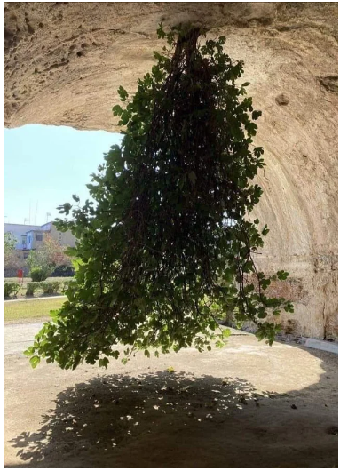




{{ titre_chapitre(num,niveau)}}

{{ citation("Trees sprout up just about everywhere in computer science","D. Knuth")}}

## Cours

{{ cours(num) }}

## Travaux dirigés

{{ td(num) }}


## Travaux pratiques

{{exo("Implémentation des arbres binaires en C",[],0)}}

On rappelle la structure de données vue en cours et permettant de représenter une arbre binaire en C :
```c
    --8<-- "C12/arbres_binaires.c:6:13"
```
On donne aussi, la fonction permettant de créer un arbre binaire en donnant ses deux sous arbres et son étiquette :
```c
    --8<-- "C12/arbres_binaires.c:17:24"
```

1. En utilisant cette représentation, créer une variable `t` de type arbre binaire représentant l'arbre suivant ;  


    ??? aide "Visualisation de l'arbre"
        On donne ci-dessous une fonction permettant de visualiser l'arbre. **Attention**, cette fonction utiliser une variable globale `#!c int ninv = 0` que vous devrez déclarer en début de programme.

        ```c
            --8<-- "C12/arbres_binaires.c:41:96"
        ```

2. Ecrire une fonction `est_vide` de signature `#!c bool est_vide(ab a)` permettant de tester si l'arbre donné en paramètre est vide.

2. Ecrire et tester la fonction `taille`  de signature `#!c int taille(ab a)` et qui renvoie le nombre de noeuds de l'arbre binaire donné en argument.

3. Ecrire et tester la fonction `hauteur`  de signature `#!c int hauteur(ab a)` et qui renvoie la hauteur de l'arbre binaire donné en argument.

4. Ecrire une fonction permettant `detruit` de signature `#!c void detruit(ab *a)` qui permet de détruire un arbre binaire en *libérant l'espace mémoire* occupé par ses noeuds. Après l'appel à cette fonction, `a` est le pointeur `NULL`.

5. Ecrire une fonction `arbre_aleatoire` de signature `#!c ab ab arbre_aleatoire(int n)` qui génère un arbre binaire aléatoire de `n` noeuds portant comme étiquette les entiers $0, \dots, n-1$. Cette fonction procédera en choisissant un entier $k$ au hasard entre $0$ et $n-1$ et en créant  deux sous arbres aléatoire, l'un de taille $k$ et l'autre de taille  $n-k-1$.

    !!! aide
        * On pourra utiliser une fonction auxilaire `#!c ab arbre_aleatoire(int n, int val)` qui génère un arbre aléatoire dont l'étiquette de la racine est  `val`.
        * On rappelle qu'en C, `rand()` génère un entier aléatoire entre 0 et le plus grand entier représentable
        * Une méthode possible d'initialisation du générateur aléatoire de nombre est d'utiliser le temps : `#!c srand(time(NULL));` disponible après `#!c #include <time.h>`


6. Ecrire une fonction `insere_noeud` de signature `#!c void insere_noeud(ab *t, int v)` qui insère à un emplacement aléatoire un noeud portant l'étiquette `v` dans l'abre `*t`. En déduire une nouvelle version de la fonction générant un arbre aléatoire.

    !!! aide
        Pour insérer un noeud de façon aléatoire, on pourra procéder de la façon suivante :

        * Si l'arbre est vide il devient l'arbre `(NULL,v,NULL)`
        * Sinon on descend aléatoirement à gauche ou à droit pour y faire l'insertion.


{{exo("Implémentation des arbres binaires en OCaml",[])}}

On rappelle l'implémentation des arbres binaires en OCaml vu en cours :
```OCaml
    --8<-- "C12/arbres_binaires_int.ml:2:2"
```

1. En utilisant cette représentation, créer une variable `t` de type `ab` représentant l'arbre suivant ;  


    ??? aide "Visualisation de l'arbre"
        On donne ci-dessous une fonction permettant de visualiser l'arbre. **Attention**, cette fonction utiliser une variable globale mutable `#!ocaml let ninv = ref 0;;` que vous devrez déclarer en début de programme.

        ```OCaml
            --8<-- "C12/arbres_binaires_int.ml:6:42"
        ```

2. Ecrire une fonction `est_vide` de signature `ab -> bool` permettant de tester si l'arbre donné en paramètre est vide.

2. Ecrire et tester la fonction `taille`  de signature `ab -> int` et qui renvoie le nombre de noeuds de l'arbre binaire donné en argument.

3. Ecrire et tester la fonction `hauteur`  de signature `ab -> int` et qui renvoie la hauteur de l'arbre binaire donné en argument.

4. En utilisant la méthode de votre choix (deux sont proposées dans l'exercice précédent), écrire en OCaml une fonction `arbre_alaetoire` de signature `int -> ab` et qui renvoie un arbre aléatoire de $n$ noeuds.

{{exo("Arbre complet représenté par un tableau",[])}}

Cet exercice concerne la représentation d'un arbre binaire complet de taille $n$ par un tableau de taille $n$ et  est à traiter *au choix* en OCaml ou en C.  Pour chaque question, le tableau `tab` da taille `n` est la représentation en machine d'un arbre binaire complet de taille `n`.

1. Ecrire une fonction qui pour le noeud situé à l'indice `i` renvoie l'indice du parent ($-1$ pour la racine)

2. Ecrire une fonction qui pour le noeud situé à l'indice `i` renvoie les indices des fils gauches et droit ($-1$ s'il n'existent pas)

3. Ecrire une fonction renvoyant la hauteur de l'arbre.


{{ exo("Parcours récursif en C",[])}}

1. Ecrire en langage C, une fonction qui affiche les noeuds dans l'ordre :

    a. d'un parcours prefixe  
    b. d'un parcours infixe  
    c. d'un parcours postfixe  

2. On souhaite à présent créer une liste chainée contenant les noeuds dans l'ordre du parcours préfixe  

    a. Implémenter une structure de liste chainée en C dans laquelle on conservera un pointeur sur la premier élément de la liste et aussi un pointeur sur le dernier élément de la liste. De cette façon, on peut concaténer deux listes en temps constant.

    b. En utilisant cette implémentation, écrire une fonction renvoyant une liste chainée contenant les noeuds de l'arbre dans l'ordre d'un parcours prefixe. 

{{ exo("Parcours récursif en OCaml",[])}}

1. Ecrire les parcours récursif en OCaml de façon à renvoyer une liste contenant les noeuds dans l'ordre de chacun des parcours. Dans un premier temps on utilisera l'opérateur `@` afin de concaténer deux listes sans se soucier des problèmes de complexité que cela implique.

2. Ecrire une version de ces parcours de complexité linéaire

    !!! aide
        Utiliser une fonction auxiliaire dotée d'un accumulateur (voir TD).

{{ exo("Parcours en largeur en C",[])}}

Ecrire une fonction de signature `#!c void largeur(ab a)` qui affiche les noeuds dans l'ordre d'un parcours en largeur. Comme expliqué en cours, on peut utiliser une *file* qu'on pourra implémenter par exemple par une liste chainée (avec un pointeur de tête et un pointeur de queue).


{{ exo("Parcours en largeur en OCaml",[])}}

Ecrire une fonction de signature `ab -> unit` qui affiche les noeuds dans l'ordre d'un parcours en largeur. Comme expliqué en cours, on peut utiliser une *file* qu'on pourra implémenter à l'aide du module `Queue` de Caml dont on rappelle ci-dessous quelques fonctions :

* `Queue.create` de signature `unit -> 'a t` qui crée une file d'attente vide, par exemple `#!ocaml let ma_file = Queue.create ()`
* `Queue.is_empty` de signature (`'a t -> bool`) qui teste si la file est vide ou non
* `Queue.push` de signature (`'a -> 'a t -> unit`) qui enfile un élément, par exemple `#!ocaml Queue.push ma_file 10`
* `Queue.pop` de signature (`'a t -> 'a`) qui défile un élément, par exemple `#!ocaml let elt = Queue.pop ma_file`

{{ exo("Arbre binaire de recherche en C",[])}}

Pour l'implémentation des arbres binaires de recherche en C, on reprend la structure utilisée pour les arbres binaires :
```c
    --8<-- "C12/abr.c:4:11"
```

1. Ecrire une fonction `insere` de signature `#!c void insere(abr *t, int v)` qui insère la valeur `v` dans l'arbre binaire `t`. 

2. Construire et visualiser l'arbre binaire obtenu en insérant successivement les valeurs $7, 5, 9, 2$ et $11$.

3. Ecrire une fonction `present` de signature `#!c bool present(abr t, int v)` qui teste l'appartenance de la valeur `v` à l'arbre `t`.

{{ exo("Arbre binaire de recherche en OCaml",[])}}

Pour l'implémentation des arbres binaires de recherche en OCaml, on reprend la structure utilisée pour les arbres binaires :
```OCaml
    --8<-- "C12/abr.ml:5:7"
```

1. Ecrire une fonction `insere` de signature `abr -> int -> abr` qui insère une valeur dans un  {{sc("abr")}} et renvoie l'{{sc("abr")}} obtenu. 

2. Construire et visualiser l'arbre binaire obtenu en insérant successivement les valeurs $7, 5, 9, 2$ et $11$.

3. Ecrire une fonction `present` de signature `abr -> int -> bool` qui teste si une valeur appartient ou non à un `abr`.

{{ exo("Hauteur moyenne d'un ABR aléatoire",[])}}

Le but de cet exercice est de faire des statistiques sur la hauteur de l'arbre binaire obtenu en insérant *aléatoirement* dans cet arbre les entiers $0, \dots, 1023$. Pour l'implémentation, on utilisera au choix le C ou OCaml.

1. Quelle est la hauteur maximale obtenue ? donner un ordre d'insertion permettant d'atteindre cette valeur
2. Quelle est la hauteur minimale ?
3. Ecrire une fonction permettant de générer une permutation aléatoire des entiers $0,\dots,1023$

    !!! Aide
        On pourra par exemple, générer le tableau des entiers de 0 à 1023 puis utiliser le [melagne de Knuth](https://fr.wikipedia.org/wiki/M%C3%A9lange_de_Fisher-Yates){target=_blank}

4. Créer une fonction prenant en argument un tableau d'entiers, qui insère ces entiers dans un {{sc("abr")}} puis renvoie la hauteur de l'arbre obtenu.

5. Donner la moyenne, le minimum, le maximum de la série statistique des hauteurs obtenues en utilisant 1000 fois la fonction précédente.


{{ exo("Sur les arbres rouge-noir",[])}}

Pour réprésenter un arbre rouge noir en OCaml, on définit un type somme `Rouge | Noir` pour la couleur puis on ajoute cette information de couleur dans les noeuds :

```OCaml
    --8<-- "C12/rougenoir.ml:1:3"
```

1. Généralités

    1. On rappelle (voir cours) que dans un arbre rouge-noir, le nombre de noeuds noirs le long d'un chemin menant de la racine à une feuille est toujours le même, cette quantité est  *la hauteur noire*. Ecrire une fonction `arn -> int` qui calcule la hauteur noire d'un arbre rouge noir.

    2. Tester votre fonction sur les deux arbres suivants :
    ```ocaml
    let t1 = Noeud(Noeud(Vide,(Noir,0),Vide),(Noir,1),Noeud(Noeud(Vide,(Noir,2),Vide),(Rouge,3),Noeud(Vide,(Noir,4),Noeud(Vide,(Rouge,5),Vide))))
    let t2 = Noeud(Noeud(Vide,(Noir,0),Vide),(Noir,1),Noeud(Noeud(Vide,(Noir,2),Vide),(Rouge,3),Noeud(Vide,(Noir,4),Noeud(Vide,(Rouge,5),Noeud(Vide,(Noir,6),Vide)))))
    ```
    Vous pouvez visualiser ces arbres grâce à la fonction de visualisation :

        ??? aide "Visualisation d'un arbre rouge noir en Caml"
            **Attention**, cette fonction utiliser une variable globale `#!c int ninv = 0` que vous devrez déclarer en début de programme.
            ```ocaml
                --8<-- "C12/rougenoir.ml:12:49"
            ```

    3. Ecrire une fonction `verifie_abr` de signature `arn -> bool` qui vérifie que l'arbre donné en argument est un arbre binaire de recherche.

    4. Ecrire une fonction `verifier_couleurs` de signature `arn->bool` qui vérifie que dans un `arn`, le père d'un noeud rouge est noir

    5. Déduire des questions précédentes une fonction permettant de vérifier qu'un arbre est bien un arbre rouge-noir.

2. Insertion dans un arbre rouge-noir  
On rappelle (voir TD), que pour insérer un nouveau noeud dans un arbre rouge-noir, on commence par insérer comme dans un {{sc("abr")}} en coloriant le nouveau noeud en rouge. Puis lorsqu'un conflit rouge-rouge intervient, on le résout en coloriant la racine en noire si le conflit se situe à la racine, sinon on effectue une des transformations vues en TD.

    1. Ecrire une fonction `noicir_racine` de signature `arn -> arn` qui colorie la racine en noire

    2. Ecrire une fonction `correction_rouge` qui permet de corriger un conflit rouge-rouge lorsque celui ci ne se trouve pas à la racine. On utilisera un filtrage par motif et on rappelle qu'on se trouve dans l'un des quatre cas ci-dessous :  
    {.imgcentre width=700px} 
    qui se ramène tous à :
    {.imgcentre width=350px}

    3. Ecrire une fonction qui insère une nouvelle valeur dans un arbre rouge-noir

    4. Créer un arbre rouge noir et y insérer tous les entiers compris entre 1 et $1\,000\,000$. Quelle est la hauteur de l'arbre obtenu ? {{check_reponse("25")}}

## Humour d'informaticien

{.imgcentre width=500px}
Finally after years of search I found a real tree ... 