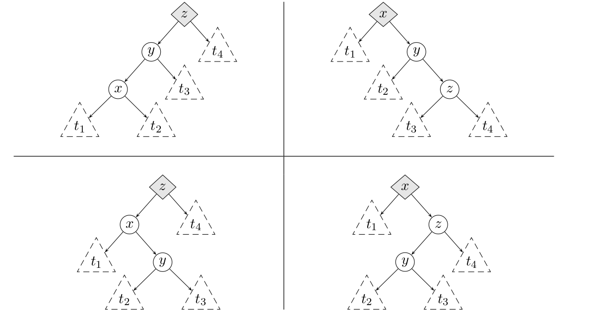




{{ titre_chapitre(num,niveau)}}

{{ citation("Trees sprout up just about everywhere in computer science","D. Knuth")}}

## Cours

{{ affiche_cours(num) }}

## Travaux dirigés

{{ td(num) }}


## Travaux pratiques
 
{{ exo("Sur les arbres rouge-noir",[], 0)}}

Pour réprésenter un arbre rouge noir en OCaml, on définit un type somme `Rouge | Noir` pour la couleur puis on ajoute cette information de couleur dans les noeuds :

```OCaml
    --8<-- "C12/rougenoir.ml:1:3"
```

1. Généralités

    1. On rappelle (voir cours) que dans un arbre rouge-noir, le nombre de noeuds noirs le long d'un chemin menant de la racine à une feuille est toujours le même, cette quantité est  *la hauteur noire*. Ecrire une fonction `arn -> int` qui calcule la hauteur noire d'un arbre rouge noir.

    2. Tester votre fonction sur les deux arbres suivants :
    ```ocaml
    let t1 = Noeud(Noeud(Vide,(Noir,0),Vide),(Noir,1),Noeud(Noeud(Vide,(Noir,2),Vide),(Rouge,3),Noeud(Vide,(Noir,4),Noeud(Vide,(Rouge,5),Vide))))
    let t2 = Noeud(Noeud(Vide,(Noir,0),Vide),(Noir,1),Noeud(Noeud(Vide,(Noir,2),Vide),(Rouge,3),Noeud(Vide,(Noir,4),Noeud(Vide,(Rouge,5),Noeud(Vide,(Noir,6),Vide)))))
    ```
    Vous pouvez visualiser ces arbres grâce à la fonction de visualisation :

        ??? aide "Visualisation d'un arbre rouge noir en Caml"
            **Attention**, cette fonction utiliser une variable globale `#!c int ninv = 0` que vous devrez déclarer en début de programme.
            ```ocaml
                --8<-- "C12/rougenoir.ml:12:49"
            ```

    3. Ecrire une fonction `verifie_abr` de signature `arn -> bool` qui vérifie que l'arbre donné en argument est un arbre binaire de recherche.

    4. Ecrire une fonction `verifier_couleurs` de signature `arn->bool` qui vérifie que dans un `arn`, le père d'un noeud rouge est noir

    5. Déduire des questions précédentes une fonction permettant de vérifier qu'un arbre est bien un arbre rouge-noir.

2. Insertion dans un arbre rouge-noir  
On rappelle (voir TD), que pour insérer un nouveau noeud dans un arbre rouge-noir, on commence par insérer comme dans un {{sc("abr")}} en coloriant le nouveau noeud en rouge. Puis lorsqu'un conflit rouge-rouge intervient, on le résout en coloriant la racine en noire si le conflit se situe à la racine, sinon on effectue une des transformations vues en TD.

    1. Ecrire une fonction `noicir_racine` de signature `arn -> arn` qui colorie la racine en noire

    2. Ecrire une fonction `correction_rouge` qui permet de corriger un conflit rouge-rouge lorsque celui ci ne se trouve pas à la racine. On utilisera un filtrage par motif et on rappelle qu'on se trouve dans l'un des quatre cas ci-dessous :  
    {.imgcentre width=700px} 
    qui se ramène tous à :
    {.imgcentre width=350px}

    3. Ecrire une fonction qui insère une nouvelle valeur dans un arbre rouge-noir

    4. Créer un arbre rouge noir et y insérer tous les entiers compris entre 1 et $1\,000\,000$. Quelle est la hauteur de l'arbre obtenu ? {{check_reponse("25")}}

## Humour d'informaticien

{.imgcentre width=500px}
Finally after years of search I found a real tree ... 