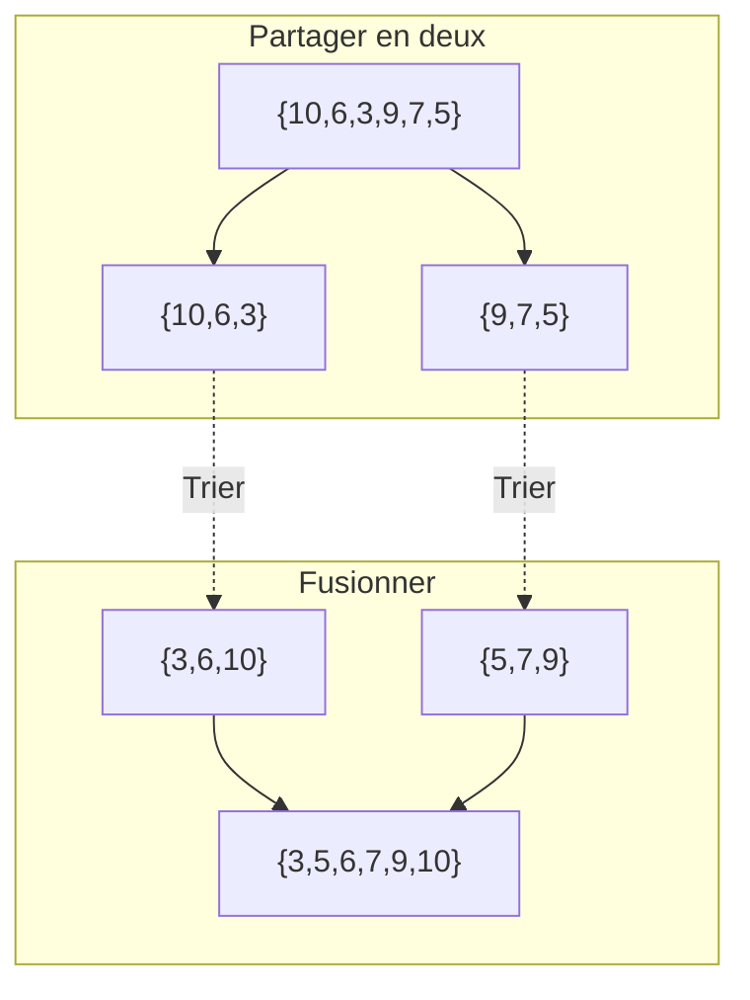
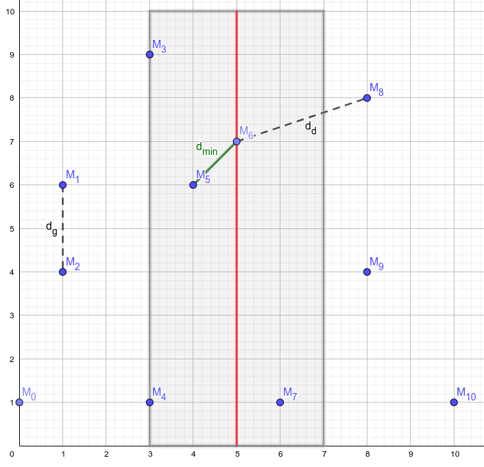
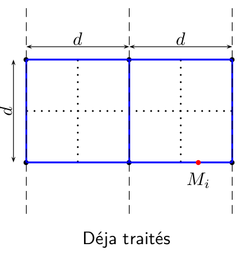




{{ titre_chapitre(num,niveau)}} 

{{ citation("Those who cannot remember the past are condemned to repeat it.","George Santayana","in The Life of Reason, 1905")}}


## Cours


{{ cours(num) }}

## Travaux dirigés

{{ td(num) }}

## Travaux pratiques


{{ exo("Exemple standard de DPR : le tri fusion",[],0)}}

L'algorithme du **tri fusion** consiste à :  

* *(diviser)* partager le tableau à trier en deux moitiés (à une unité près), 
* *(régner)* trier chacune des deux moitiés, 
* *(combiner)* les fusionner pour obtenir la liste triée. 

On a schématisé le tri du tableau `[| 10; 6; 3; 9; 7; 5 |]` suivant ce principe ci-dessous :


1. Ecrire en OCaml une fonction `separe int list -> int list * int list` qui sépare une liste en deux listes de même longueur (à une unité près).

2. Ecrire en OCaml une fonction   `fusion int list -> int list -> int list` qui effectue la fusion de deux listes triées.

3. Donner une implémentation du tri fusion en OCaml.


{{ exo("Le tri rapide",[])}}

Le [tri rapide *(quicksort)*](https://en.wikipedia.org/wiki/Quicksort){target=_blank} est un algorithme de tri développé par T. Hoare en 1959. Le tri rapide repose comme le tri fusion sur une méthode diviser pour régner. La séparation en deux sous tableaux s'effectue en choisissant (aléatoirement) un pivot, la séparation s'effectue alors en mettant d'un côté les nombres inférieurs au pivot et de l'autre les nombres supérieurs. Par conséquent, la longueur des sous listes  obtenue dépend du pivot choisi. Par contre on s'affranchit de la phase de fusion puisqu'elle consiste simplement à concaténer les deux sous listes. Bien qu'ayant une complexité quadratique dans le pire des cas, l'algorithme a d'excellentes performances dans le cas moyen (la fonction `quicksort` existe déjà en C).

Par exemple, sur le tableau $[10, 6, 3, 9, 7, 5]$ si on choisit comme pivot 5, alors la séparation en deux sous listes donnera d'un côté $[3, 5]$ (les valeurs inférieures ou égales au pivot) et de l'autre $[10, 6, 9, 7]$ (les valeurs supérieurs).

On propose ici d'implémenter cet algorithme en langage C en choisissant comme pivot le dernier élément du tableau. On effectue la séparation **en place** en renvoyant l'indice du pivot. C'est à dire qu'on veut écrire une fonction de signature `#!c int partitionne(int tab[], int debut, int fin)` qui partitionne les valeurs du tableaux comprises entre les indices `debut` (inclus) et `fin` (exclu) en choisissant comme pivot `tab[fin-1]` et qui renvoie l'indice $e$ auquel se trouvera le pivot après ce partitionnement.
On pourra procéder de la façon suivante : 

$$\underbrace{\boxed{\strut t_0 \quad \quad \quad t_{e-1}}}_{\leqslant \text{pivot}}\underbrace{\boxed{\strut t_e}  \boxed{t_{e+1} \strut \quad \quad \quad}}_{> \text{pivot}}\underbrace{\boxed{t_i\strut \quad \quad \quad \quad t_{n-1}}}_{\text{non triée}}$$

* La partie située après l'indice $i$ n'est pas encore triée
* Le dernier élément est le pivot
* La partie située avant l'indice $e$ contient les éléments plus petits que le pivot
* La partie située entre les indice $e$ et $i$ contient les éléments plus grand que le pivot

Donc on initialise $e$ à $0$, on parcourt le tableau avec l'indice $i$, si $t_i$ est plus grand que le pivot il n'y a rien à faire, sinon il faut l'échanger avec $t_e$ et incrémenter $e$. A la fin, on renvoie $e$.

1. Ecrire en C la fonction `#!c int partitionne(int tab[], int debut, int fin)`
2. Ecrire en C la fonction `#!c void mqsort(int tab[], int start, int end)` qui trie avec l'algorithme du tri rapide la portion de tableau comprise entre les indices  `start` et `end`.


{{ exo("Nombre d'inversion",[])}}

Dans une liste d'entiers de $n$ entiers $t = [t_0,\dots t_n]$, on dit que le couple d'indice $(i,j)$ ($0 \leq i <n, 0 \leq j <n$) est une inversion lorsque $i<j$ et $t_i>t_j$ c'est à dire que les éléments sont dans l'ordre inverse de leurs indices. Par exemple, dans la liste `[1; 5; 3; 7]` le couple d'indices `(1,2)` est une inversion car `5>3`. Par contre, le couple  `(1,3)` n'est pas une d'inversion car `5<7`.

1. Ecrire en OCaml, une fonction `nb_inversion int list -> int` qui  renvoie le nombre d'inversions de la liste donnée en argument en examinant chaque couple d'indice `(i,j)`. Quelle est la complexité de cette fonction ?

    !!! aide
        * On peut préférer une solution itérative, dans ce cas  on pourra convertir la liste en tableau en utilisant `#!ocaml Array.of_list` de façon à pouvoir accéder directement aux éléments par leur indice.
        * Une solution récursive sans conversion en tableau est aussi envisageable, dans ce cas on pourra soit écrire une fonction auxiliaire permettant de compter les éléments supérieurs à une valeur donnée dans une liste ou utiliser `#!ocaml List.filter`

2. Montrer que si `l1` et `l2` sont deux listes **triées** dans l'ordre croissant, alors on peut déterminer en temps linéaire le nombre d'inversion de `l1 @ l2`

    !!! aide
        Dans le cas où `l1 = h1::t1` et `l2 = h2::t2`, distinguer les cas `h1 <= h2` et `h1 > h2`.

3. On note `inv(l)` le nombre d'inversion d'une liste `l`. Montrer que si `l1` est la moitié gauche de `l` et `l2` la moitié droite alors `inv(l) = inv(l1) + inv(l2) + inv(l1' @ l2')` où `l1'` (resp. `l2'`) est la version triée de `l1` (resp. `l2`).

4. Ecrire une fonction comptant le nombre d'inversions d'une liste en utilisant une méthode diviser pour régner. On pourra utiliser `#!ocaml List.sort compare l` qui renvoie la liste d'entiers `l` triée dans l'ordre croissant en $O(n\log n)$.

5. Déterminer la complexité de la méthode diviser pour régner

{{ exo("Recherche des deux points les plus proches",[])}}

On considère un ensemble de $n$ points du plan et on souhaite déterminer la distance minimale $d_{\min}$ entre deux de ces points.

1. Résolution "naïve" (langage de votre choix)

    1. Définir un type structuré `point`  ayant deux coordonnées flottantes `x` et `y`.
    2. Ecrire une fonction `distance` qui prend en argument deux points et renvoie la distance euclidienne entre ces deux points.
    3. Ecrire une fonction `dmin` de complexité quadratique qui résout le problème.

2. Résolution avec la méthode diviser pour régner

    1. On commence par trier par abscisse croissante l'ensemble des points, on note $M_x$ le tableau obtenu. On coupe ce tableau en deux moitiés. Puisque le tableau est trié, la moitié gauche (resp. droite) contient les points d'abscisses inférieures (resp. supérieures) à $x_{\frac{n}{2}}$. On recherche la distance minimale entre deux points de la moitié gauche (notée $d_g$) et deux points de la moitié droite (notée $d_d$) et on pose $d = \min\{d_g, d_d\}$. Justifier que si $d_{min} < d$ alors deux points réalisant la distance minimale sont forcément de part et d'autre de la bande de largeur $d$ autour de la droite d'équation $x =  x_{\frac{n}{2}}$ (voir illustration ci-dessous).

        {.imgcentre width=400px}

    2. On suppose maintenant qu'on dispose des points de cette bande **triés par ordonnées croissantes**. Justifier qu'on peut se contenter de calculer la distance minimale entre chaque point de cette liste et les 7 points suivants. On pourra raisonner sur le schéma suivant :

        {.imgcentre width=300px}

    3. Montrer que cette méthode conduit à l'équation de complexité $T(n) = 2T(\frac{n}{2}) + K n \log(n)$. Et en déduire que $T(n) \in O(n \log^2(n))$

    4. En utilisant les questions précédentes, écrire une implémentation dans le langage de votre choix de la méthode diviser pour régner afin de déterminer la distance minimale entre deux points.

        !!! Aide
            Pour les tris, on pourra utiliser les fonctions déjà disponibles dans le langage utilisé :

            * En C, c'est la fonction `qsort` (attention, l'utilisation est prend en paramètre une fonction de comparaison qui sert de clé de tri)
            * En OCaml, c'est la fonction `sort` (disponibles sur les listes et les tableaux).

{{ exo("La montée des marches",[]) }}

Pour gravir un escalier on peut faire des enjambées d'une ou deux marches. Par exemple pour monter un escalier de 4 marches, on pourrait faire `1+2+1` ou encore `2+2`. On s'intéresse au nombre de façons de monter un escalier de $n$ marches qu'on note $f_n$. 

1. Donner $f_0$ et $f_1$.

2. Etablir une relation de récurrence liant $f_{n}$, $f_{n-1}$ et $f_{n-2}$ pour $n \geq 2$.

    !!! Aide
        on pourra différencier les cas où la dernière enjambée fait une ou deux marches.

3. En déduire une fonction `Ocaml`  de complexité linéaire permettant de répondre au problème

5. On s'intéresse maintenant à la construction effective de toutes les possibilités et on notera $p_n$ la liste des façons possibles de gravir un escalier de $n$ marches. Les possibilités sont données sous forme de chaine de caractères composées de 1 et de 2. Par exemple, $p_5$=`["11111"; "1112"; "1121"; "1211"; "122"; "2111"; "212"; "221"]`

    1. Donner $p_1$ et $p_2$.
    2. Etablir une relation de récurrence liant les éléments de $p_{n}$ à ceux de $p_{n-1}$ et $p_{n-2}$
    3. Ecrire une fonction OCaml permettant de répondre au problème.


{{ exo("Jamais deux consécutifs !",[] )}}

Vous disposez d'un tableau de valeurs de $n$ valeurs $[h_0,\dots,h_{n-1}]$, on doit sommer les valeurs présentes dans ce tableau mais *sans jamais utiliser deux éléments consécutifs*. Le but de l'exercice est d'écrire un programme permettant de trouver la somme maximale ainsi atteignable.

Par exemple si le tableau contient les valeurs $[7, 5, 3, 6]$ alors la somme maximale est atteinte en prenant $7$ et $6$ et vaut $13$.

1. Résoudre ce problème en utilisant la programmation dynamique

    !!! aide
        On pourra noter $S_i$ la somme maximale sans utiliser d'éléments consécutifs à partir de l'indice $i$ et déterminer la relation de recurrence liant les $S_i$ ($0 \leq i  < n$)

2. Proposer une solution pour reconstruire la liste des valeurs  utilisées dans la solution


{{ exo("Découpe de valeur maximale",[]) }}

Le problème de la recherche de la découpe de valeur maximale d'une barre a été résolu [en cours](#cours). On rappelle ci-dessous la fonction C itérative qui répond au problème :

!!! langageC "Découpe de valeur maximale en C"
    ```C
    --8<-- "C15/barre.c:43:52"
    ```

1. Faire fonctionner ce programme avec les données suivantes et donner la valeur de la découpe maximale.

    {{ table_data(["Longueur","Prix"],[[1,2,3,4,5,6,7,8,9,10,11,12,13,14,15,16],[3, 6, 8, 12, 13, 16, 19, 24, 28, 29, 32, 33, 37, 40, 42, 43]] )}} 

2. Utiliser le tableau `vmax` des valeurs maximales des découpes déjà construit afin de déterminer une découpe maximale.

    !!! Aide
        On pourra remarquer que puisque `vmax[16] = vmax[7] + prix[9]` cela signifie qu'une découpe maximale peut-être obtenue avec un morceau de taille 9 et la  découpe maximale d'une barre de taille 7. En répétant ce processus de proche en proche on peut déterminer la taille des morceaux d'une découpe de valeur maximale.

{{ exo("Tranche de somme maximale dans un tableau",[] )}}

Etant donné un tableau d'entiers (positif ou négatif) $[e_0,\dots,e_{n-1}]$ on cherche dans ce tableau la tranche de plus grande somme. Par exemple pour le tableau $[-2, 7, 1, -3, 5, -8, -2, 9]$ c'est la tranche $[7, 1, -3, 5]$ qui a la plus grande somme et cette somme est 10. On n'autorise pas de tranche de longueur nulle et donc par exemple pour le tableau $[-5, -2, -7]$ c'est la tranche $[-2]$ qui a la plus grande somme.

1. Implémenter  l'algorithme naïf qui calcule la somme de toutes les tranches possibles c'est à dire les $\displaystyle{S_{ij} = \sum_{k=i}^{j} e_k}$ et donne ensuite le maximum. Quel est la complexité de cet algorithme ?

    !!! aide
        On pourra d'abord écrire la fonction `somme_tranche` qui prend en argument deux entiers $i$ et $j$ et renvoie $S_{ij}$

2. Proposer une version permettant de se ramener à un algorithme ayant une complexité quadratique.

    !!! aide
        On pourra par exemple calculer les $S_{0i}$ pour $0 \leq i \leq n-1$ et exprimer les $S_{ij}$ à l'aide de ces sommes partielles.

3. Un algorithme très élégant et ayant une complexité en $\mathcal{O}(n)$ pour ce problème a été proposé par [Jay Kadane](https://en.wikipedia.org/wiki/Joseph_Born_Kadane){target=_blank}. L'algorithme consiste à parcourir le tableau en tenant à jour la valeur de $T_j$ qui est la tranche de somme maximale qui se termine à l'index $j$. La somme de la tranche maximale est alors obtenu en maintenant à jour une variable contenant le maximum des $T_j$ au fur et à mesure de leurs calculs.

    1. Etablir la relation de récurrence liant $T_{j+1}$ et $T_{j}$
    2. Implémenter et tester ce nouvel algorithme
    3. Proposer une version qui donne aussi les index de début et de fin de la tranche de somme maximale.


{{ exo("Problème du sac à dos",[]) }}
On dispose d’un sac à dos pouvant contenir un poids maximal $P$ et de $n$ objets ayant chacun un poids $(p_i)_{1\leq i \leq n}$ et une valeur $(v_i)_{1\leq i \leq n}$. Le problème du sac à dos consiste à remplir ce sac en maximisant la valeur des objets qu’il contient tout en respectant la contrainte de poids total du sac qui doit resté inférieur à $P$. Dans toute la suite, on considère que les poids et les valeurs sont des *entiers*. On veut résoudre ce problème par programmation dynamique.

1. Etablir une relation de récurrence entre différentes instances du problème.

    !!! Aide
        On pourra noter  $S(p,k)$ la valeur maximale atteignable pour un sac de poids maximal $p$ avec les objets $(p_i,v_i)_{1 \leq i \leq k}$ et chercher une relation de récurrence liant $S(P,k)$ à  d'autres instances du problèmes en distinguant deux cas :

        * $p_k \leq p$ et donc on peut (ou pas) prendre l'objet d'indice $k$
        * $p_k > p$ et donc l'objet d'indice $k$ ne rentre pas dans le sac

2. Ecrire une fonction  permettant de déterminer la valeur maximale du sac.
4. Résoudre le problème avec un sac de poids maximal **670** et la liste de 24 objets suivantes :

    ```
    78,3897
    38,1953
    79,3871
    91,4598
    14,602
    56,2730
    87,4283
    55,2668
    77,3895
    69,3512
    87,4318
    89,4355
    73,3660
    29,1574
    53,2548
    5,142
    8,430
    6,398
    38,1776
    82,4073
    88,4507
    57,2932
    10,599
    78,3802
    ```
    Tester votre réponse ici : {{check_reponse("34098")}}

3. Déterminer un remplissage du sac réalisant la valeur maximale.
Tester votre réponse ici en donnant par ordre croissant les numéros des objets utilisés séparé par des virgules. Par exemple si les objets à prendre portent les numéros 2, 7 et 20 vous devez taper `2,7,20` : {{check_reponse("1,2,8,9,10,13,14,17,18,20,21,22,23")}}   
attention** : les objets sont numérotés à partir de 1.)

{{ exo("Distance d'édition",[]) }}

La distance d'édition (ou [distance de Levenshtein](https://fr.m.wikipedia.org/wiki/Distance_de_Levenshtein){target=_blank}) entre deux chaines de caractères $M$ et $N$ est le nombre de caractères qu'il faut supprimer, insérer ou remplacer pour passer d'une chaine à l'autre, on la note $D(M,N)$.

Par exemple, la distance d'édition entre "TEST" et "VESTE" est de deux (une insertion et une substitution). On note $l_m$ la longueur de $M$ et $l_n$ celle de $M$, $M_i$ les $i$ ($0 \leq i < l_M$) premiers caractères  de la chaine $M$ et $N_j$ les $j$ ($0 \leq j < l_N$) premiers caractères de la chaine $N$ et $d(i,j) = D(M_i,N_j)$

1. Donner les cas de base suivantes :  $d(i,0)$ et $d(0,j)$
2. Exprimer $d(i,j)$ en fonction de $d(i,j-1)$, $d(i-1,j)$ et $d(i-1,j-1)$, en distinguant le cas où le $i$ème caractère de $M$ conïncide avec le $j$ième de $N$ ou non.
3. Ecrire une fonction permettant de répondre au problème
4. A l'aide de la matrice $d(i,j)$ ($0 \leq i < l_M$, ($0 \leq j < l_N$)) reconstruire les opérations permettant de passer de $M$ à $N$.


## Humour d'informaticien

{.imgcentre width=500px}