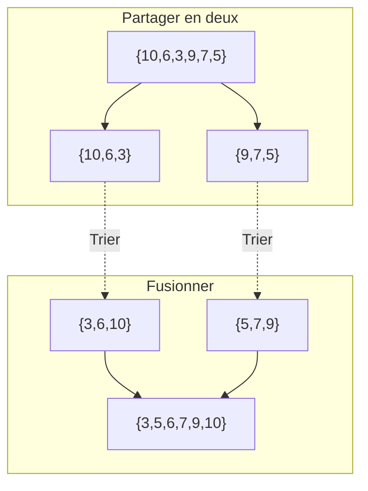




{{ titre_chapitre(num,niveau)}} 

{{ citation("Those who cannot remember the past are condemned to repeat it.","George Santayana","in The Life of Reason, 1905")}}

## Cours

{{ cours(num) }}

## Travaux dirigés

{{ td(num) }}

## Travaux pratiques

{{ exo("Exemple standard de DPR : le tri fusion",[],0)}}

L'algorithme du **tri fusion** consiste à :  

* *(diviser)* partager le tableau à trier en deux moitiés (à une unité près), 
* *(régner)* trier chacune des deux moitiés, 
* *(combiner)* les fusionner pour obtenir la liste triée. 

On a schématisé le tri du tableau `[| 10; 6; 3; 9; 7; 5 |]` suivant ce principe ci-dessous :

1. Ecrire en OCaml une fonction `separe int list -> int list * int list` qui sépare une liste en deux listes de même longueur (à une unité près).

2. Ecrire en OCaml une fonction   `fusion int list -> int list -> int list` qui effectue la fusion de deux listes triées.

3. Donner une implémentation du tri fusion en OCaml.

{{ exo("Nombre d'inversion",[])}}

Dans une liste d'entiers de $n$ entiers $t = [t_0,\dots t_n]$, on dit que le couple d'indice $(i,j)$ ($0 \leq i <n, 0 \leq j <n$) est une inversion lorsque $i<j$ et $t_i>t_j$ c'est à dire que les éléments sont dans l'ordre inverse de leurs indices. Par exemple, dans la liste `[1; 5; 3; 7]` le couple d'indices `(1,2)` est une inversion car `5>3`. Par contre, le couple  `(1,3)` n'est pas une d'inversion car `5<7`.

1. Ecrire en OCaml, une fonction `nb_inversion int list -> int` qui  renvoie le nombre d'inversions de la liste donnée en argument en examinant chaque couple d'indice `(i,j)`. Quelle est la complexité de cette fonction ?

    !!! aide
        * On peut préférer une solution itérative, dans ce cas  on pourra convertir la liste en tableau en utilisant `#!ocaml Array.of_list` de façon à pouvoir accéder directement aux élèves par leur indice.
        * Une solution récursive sans conversion en tableau est aussi envisageable, dans ce cas on pourra soit écrire une fonction auxiliaire permettant de compter les éléments supérieurs à une valeur donnée dans une liste ou utiliser `#!ocaml List.filter`

2. Montrer que si `l1` et `l2` sont deux listes **triées** dans l'ordre croissant, alors on peut déterminer en temps linéaire le nombre d'inversion de `l1 @ l2`

    !!! aide
        Dans le cas où `l1 = h1::t1` et `l2 = h2::t2`, distinguer les cas `h1 <= h2` et `h1 > h2`.

3. On note `inv(l)` le nombre d'inversion d'une liste `l`. Montrer que si `l1` est la moitié gauche de `l` et `l2` la moitié droite alors `inv(l) = inv(l1) + inv(l2) + inv(l1' @ l2')` où `l1'` (resp. `l2'`) est la version triée de `l1` (resp. `l2`).

4. Ecrire une fonction comptant le nombre d'inversions d'une liste en utilisant une méthode diviser pour régner. On pourra utiliser `#!ocaml List.sort compare l` qui renvoie la liste d'entiers `l` triée dans l'ordre croissant en complexité quadratique

5. Déterminer la complexité de la méthode diviser pour régner

{{ exo("Recherche des deux points les plus proches",[])}}

On considère un ensemble de $n$ points du plan et on souhaite déterminer la distance minimale entre deux de ces points.

1. Résolution "naïve"

    1. Définir un type structuré `point` en C ayant deux coordonnées flottantes `x` et `y`.
    2. Ecrire une fonction `distance` qui prend en argument deux points et renvoie la distance euclidienne entre ces deux points.
    3. Ecrire une fonction `dmin` de complexité quadratique qui résoud le problème

{{ exo("La montée des marches",[]) }}

Pour gravir un escalier on peut faire des enjambées d'une ou deux marches. Par exemple pour monter un escalier de 4 marches, on pourrait faire `1+2+1` ou encore `2+2`. On s'intéresse au nombre de façons de monter un escalier de $n$ marches qu'on note $f_n$. 

1. Donner $f_0$ et $f_1$.

2. Etablir une relation de récurrence liant $f_{n}$, $f_{n-1}$ et $f_{n-2}$ pour $n \geq 2$.

    !!! Aide
        on pourra différencier les cas où la dernière enjambée fait une ou deux marches.

3. En déduire une fonction `Ocaml`  de complexité linéaire permettant de répondre au problème

5. On s'intéresse maintenant à la construction effective de toutes les possibilités et on notera $p_n$ la liste des façons possibles de gravir un escalier de $n$ marches. Les possibilités sont données sous forme de chaine de caractères composées de 1 et de 2. Par exemple, $p_5$=`["11111"; "1112"; "1121"; "1211"; "122"; "2111"; "212"; "221"]`

    1. Donner $p_1$ et $p_2$.
    2. Etablir une relation de récurrence liant les éléments de $p_{n}$ à ceux de $p_{n-1}$ et $p_{n-2}$
    3. Ecrire une fonction OCaml permettant de répondre au problème.

{{ exo("Jamais deux consécutifs !",[] )}}

Vous disposez d'un tableau de valeurs de $n$ valeurs $[h_0,\dots,h_{n-1}]$, on doit sommer les valeurs présentes dans ce tableau mais *sans jamais utiliser deux éléments consécutifs*. Le but de l'exercice est d'écrire un programme permettant de trouver la somme maximale ainsi atteignable.

Par exemple si le tableau contient les valeurs $[7, 5, 3, 6]$ alors la somme maximale est atteinte en prenant $7$ et $6$ et vaut $13$.

1. Résoudre ce problème en utilisant la programmation dynamique

    !!! aide
        On pourra noter $S_i$ la somme maximale sans utiliser d'éléments consécutifs à partir de l'indice $i$ et déterminer la relation de recurrence liant les $S_i$ ($0 \leq i  < n$)

2. Proposer une solution pour reconstruire la liste des valeurs  utilisées dans la solution

{{ exo("Tranche de somme maximale dans un tableau",[] )}}

Etant donné un tableau d'entiers (positif ou négatif) $[e_0,\dots,e_{n-1}]$ on cherche dans ce tableau la tranche de plus grande somme. Par exemple pour le tableau $[-2, 7, 1, -3, 5, -8, -2, 9]$ c'est la tranche $[7, 1, -3, 5]$ qui a la plus grande somme et cette somme est 10. On n'autorise pas de tranche de longueur nulle et donc par exemple pour le tableau $[-5, -2, -7]$ c'est la tranche $[-2]$ qui a la plus grande somme.

1. Implémenter  l'algorithme naïf qui calcule la somme de toutes les tranches possibles c'est à dire les $\displaystyle{S_{ij} = \sum_{k=i}^{j} e_k}$ et donne ensuite le maximum. Quel est la complexité de cet algorithme ?

    !!! aide
        On pourra d'abord écrire la fonction `somme_tranche` qui prend en argument deux entiers $i$ et $j$ et renvoie $S_{ij}$

2. Proposer une version permettant de se ramener à un algorithme ayant une complexité quadratique.

    !!! aide
        On pourra par exemple calculer les $S_{0i}$ pour $0 \leq i \leq n-1$ et exprimer les $S_{ij}$ à l'aide de ces sommes partielles.

3. Un algorithme très élégant et ayant une complexité en $\mathcal{O}(n)$ pour ce problème a été proposé par [Jay Kadane](https://en.wikipedia.org/wiki/Joseph_Born_Kadane){target=_blank}. L'algorithme consiste à parcourir le tableau en tenant à jour la valeur de $T_j$ qui est la tranche de somme maximale qui se termine à l'index $j$. La somme de la tranche maximale est alors obtenu en maintenant à jour une variable contenant le maximum des $T_j$ au fur et à mesure de leurs calculs.

    1. Etablir la relation de récurrence liant $T_{j+1}$ et $T_{j}$
    2. Implémenter et tester ce nouvel algorithme
    3. Proposer une version qui donne aussi les index de début et de fin de la tranche de somme maximale.

## Humour d'informaticien

{.imgcentre width=500px}