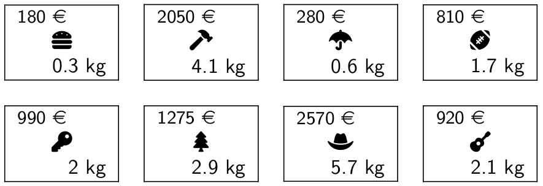
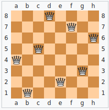
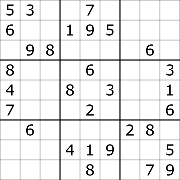




{{ titre_chapitre(num,niveau)}}

{{ citation("When in doubt, use brute force.","K. Thomson")}}

## Cours

{{ affiche_cours(num) }}


## Travaux pratiques

!!! note
    Dans ce chapitre, on peut résoudre les problèmes proposés dans le langage de son choix.

{{exo("Problème du sac à dos par force brute",[],0)}}

On dispose d’un sac à dos et d’une liste objet ayant chacun un poids et une valeur. Le problème du sac à dos consiste à remplir ce sac en maximisant la valeur des objets qu’il contient tout en respectant une contrainte sur le poids du sac.
Dans l'exemple représenté ci-dessus ([credit : wikipedia](https://en.wikipedia.org/wiki/Knapsack_problem){target=_blank})

{.imgcentre width=500px}

Le poids maximal du sac est de 15kg, la combinaison d'objet ne dépassant pas ce poids et de valeur maximale est celle constituée de tous les livres sauf le vert. 

Le but de l'exercice est de tester sur cet exemple :

* l'approche par *force brute*,
* la stratégie gloutonne

Nous utiliserons un sac de poids maximal **8kg** avec les objets suivants: 
{.imgcentre width=500px}

1. Créer un type adapté permettant de représenter un objet. Dans la suite, on suppose que les $n$ objets sont rangés dans un tableau de taille $n$.
2. On décide de représenter un choix d'objets par un tableau  $c$ de $n$ booléens, tel que $c_i$ vaut `true` si l'objet $i$ fait partie du choix et `false` dans le cas contraire. Par exemple si $n=5$ la combinaison `{false, false, true, false, true}` signifie qu'on a pris les objets 2 et 4. Ecrire une fonction `poids_valeur` qui prend en entrée un tableau d'objets et un tableau de booléens représentant un choix d'objets et qui renvoie le poids et la valeur de ce choix.
3. Avec $n$ objets, combien de combinaisons faudra-t-il tester ? Justifier
4. Ecrire une fonction qui résoud le problème par force brute, vérifier votre réponse {{check_reponse("3850")}}

    !!! aide
        Pour énumérer les choix possibles on peut  utiliser :

        * un compteur binaire
        * les [codes de gray](https://fr.wikipedia.org/wiki/Code_de_Gray){target=_blank}

5. Résoudre le problème avec un sac de poids maximal **67** et la liste de 24 objets suivantes :
```
7.8,3897
3.8,1953
7.9,3871
9.1,4598
1.4,602
5.6,2730
8.7,4283
5.5,2668
7.7,3895
6.9,3512
8.7,4318
8.9,4355
7.3,3660
2.9,1574
5.3,2548
0.5,142
0.8,430
0.6,398
3.8,1776
8.2,4073
8.8,4507
5.7,2932
1.0,599
7.8,3802
```

    Tester votre réponse : {{check_reponse("34098")}}

    !!! note
        Vous pouvez créer un fichier texte représentant la liste des objets et le faire lire par votre programme, c'est une excellente occasion de revoir la lecture de fichier !

6. Mesurer le temps d'exécution de votre programme avec la commande `time` des sytèmes Linux (ou directement avec le module `time.h` du C ou `Sys.time` en OCaml)

7. Prédire le temps d'exécution pour un problème avec 50 objets résolu par force brute.

8. Pour ce problème, la stratégie gloutonne consiste à classer les objets un utilisant un *critère pertinent*, par exemple le rapport `valeur/poids` de l'objet puis à parcourir la liste ordonnée des objets et à les prendre s'ils rentrent encore dans le sac. Mettre en oeuvre cette stratégie et comparer les résultats obtenus avec ceux de la force brute, que peut-on en conclure sur la stratégie gloutonne sur cet exemple ?


{{exo("Stratégie gloutonne pour le rendu de monnaie",[])}}

On dispose d'un *système monétaire* c'est-à-dire d'un ensemble de valeurs possibles pour les pièces et les billets. Le problème du rendu de monnaie consiste à déterminer le nombre minimal de pièces à utiliser pour former une somme donnée. Par exemples :

* Si on se place dans le système monétaire des euros c'est à dire $\{500, 200, 100, 50, 20, 10, 5, 2, 1\}$, alors
    * pour former 17 euros le nombre minimal de pièces et de billets est  $3$ ($10+5+2$)
    * pour 38 euros, c'est $5$ $(20+10+5+2+1)$
* Si on place dans le système monétaire $\{5, 4, 3, 1\}$ alors
    * pour former 19 le nombre minimal est de $4$ ($5+5+5+4$)
    * pour former 7 le nombre minimal est de $2$ ($4+3$)

Le but de l'exercice est d'implémenter et de tester une stratégie gloutonne sur ce problème.

1. Implémenter la stratégie gloutonne qui consiste à rendre la pièce de plus forte valeur possible à chaque étape

2. Tester sur les exemples donnés en introduction, que peut-on en déduire ?

!!! note
    
    * On montre que si le système monétaire possède certaines propriétés alors l'algorithme glouton est optimal (le système monétaire est alors dit *canonique*), c'est le cas des euros (voir [la page wikipedia](https://fr.wikipedia.org/wiki/Probl%C3%A8me_du_rendu_de_monnaie){target=_blank}) pour plus de détails.
    * De même que pour le problème du sac à dos, la programmation dynamique fournira une solution efficace à ce problème.

{{exo("Retour sur le problème des n reines",[])}}

On rappelle (voir cours) que le [problème des $n$ reines](https://en.wikipedia.org/wiki/Eight_queens_puzzle){target = _blank} consiste à placer $n$ reines sur un échiquier de taille $n \times n$ sans qu'aucune reine n'en menace une autre (c'est-à-dire que deux reines ne se trouvent pas sur la même ligne, colonne ou diagonale.)

Comme chaque reine est nécessairement sur une colonne différente, on représentera une position par un tableau `tab` de taille $n$ tel que `tab[i]` contient le numéro de colonne de la reine `i` (numéroté à partir de 0) ou `-1` si la reine n'est pas encore placée. Par exemple, pour $n=8$, l'échiquier ci-dessous (credit [wikipedia](http://wikipedia.fr){target=_blank}), correspond au tableau : `[3, 0, 4, 7, 2, 6, 2, 5]`

{width=250px .imgcentre}


1. Résolution par retour sur trace en OCaml  
Dans toute la suite on supposera définie une variable globale `size` contenant la taille $n$ de l'échiquier.

    a. Ecrire une fonction `menace` `int array -> int -> bool`, qui prend en argument un tableau de taille `size` et un indice `idx` et qui renvoie un boolén indiquant si la reine située en colonne `idx` est en prise avec une des reines situées aux colonnes `0 ... idx-1`. 

    b. Ecrire une fonction qui calcule le nombre de solutions au problèmes des `n` reines.

    !!! aide
        On pourra écrire une fonction qui renvoie `unit` et qui incrémente un compteur `nb_sol` défini en variable globale dans le programme `#!ocaml let nb_sol = ref 0;;`

    c. Déterminer le nombre de solutions dans le cas $n=14$  
    Vérifier votre réponse : {{check_reponse("365596")}}

2. Par force brute  
On peut aussi utiliser la force brute pour résoudre ce problème, au lieu de valider des solutions partielles de façon incrémentale comme dans le retour sur trace, on génère les solutions complètes puis on les teste une à une. Une solution est forcément une permutation de $0, \dots n-1$ car toutes les reines sont sur des lignes différentes et on peut se contenter de vérifier les diagonales pour valider une solution car par construction les reines sont déjà sur des lignes et colonnes différentes.

    a. Afin de générer les permutations possibles de $0, \dots n-1$, on propose d'utiliser l'[algorithme de Heap](https://en.wikipedia.org/wiki/Heap%27s_algorithm){target = _blank}. 

    b. En déduire une résolution par force brute.


{{exo("Résolution d'un sudoku par retour sur trace",[])}}

Le [sudoku](https://en.wikipedia.org/wiki/Sudoku){target=_blank} est un célèbre jeu de réflexion dans lequel on doit placer les chiffres de 1 à 9 dans une grille de façon à ce qu'une ligne, une colonne ou une sous grille de dimension 3x3 contienne un unique exemplaire de chacun des chiffres.

Voici un exemple de sudoku, ou les sous grilles (de taille 3x3) appelées *blocs* sont délimitées par des traits en gras (credits : [Wikipedia,Tim Stellmach](https://commons.wikimedia.org/w/index.php?curid=57831926){target=_blank}):
{width=300px .imgcentre}

La solution est :
{width=300px .imgcentre}


On représente une grille de sudoku en linéarisant la grille de 9x9 dans un tableau à une seule dimension de 81 cases. On rappelle que la case d'indice $(i,j)$ dans la grille 9x9 correspond à la case $9 \times i+j$ dans le tableau linéarisé. Et que la case d'indice $k$ dans le tableau linéarisé correspond à la case d'indice $(q,r)$ ou $q$ et $r$ sont le quotient et le reste dans la division euclidienne de $k$ par 9.

Le but de l'exercice est d'écrire un programme en C permettant de résoudre un sudoku par *backtracking*

1. Ecrire une fonction `meme_ligne` qui prend en argument un numéro de case `n` (entre 0 et 80) et renvoie un tableau contenant les numéros des 8 autres cases situés sur la même ligne que la case `n`. Par exemple, si `n=42` alors la fonction renvoie le tableau `[36, 37, 38, 39, 40, 41, 43, 44]`

2. Ecrire une fonction `meme_colonne` qui prend en argument un numéro de case `n` (entre 0 et 80) et renvoie un tableau contenant les numéros des 8 autres cases situés sur la même colonne que la case `n`. Par exemple, si `n=42` alors la fonction renvoie le tableau `[6; 15; 24; 33; 51; 60; 69; 78]`

3. Ecrire une fonction `meme_bloc` qui prend en argument un numéro de case `n` (entre 0 et 80) et renvoie un tableau contenant les numéros des 8 autres cases situés dans le même bloc que `n`. Par exemple, si `n=42` alors la fonction renvoie le tableau `[33; 34; 35; 43; 44; 51; 52; 53]`

4. Ecrire une fonction `verifie` qui prend un argument un numéro de case `n` *contenant un chiffre* `c` et qui renvoie `false` si `c` est aussi la valeur d'une case située sur la même ligne, colonne ou bloc que la case `n`. Cette fonction permet donc de valider une solution partielle.

5. Ecrire une fonction `resoud` qui par backtracking, permet de résoudre un sudoku.

6. Tester votre programme sur le sudoku donné en exemple

7. Le site de [kaggle](https:://www.kaggle.com){target=_blank} propose un [fichier](https://www.kaggle.com/datasets/bryanpark/sudoku){target=_blank} contenant un million de grilles de sudoku (le fichier fait 71 Mb) avec la solution. Sur chaque ligne du fichier, la grille est donnée sous la forme d'une chaine de caractères 81 caractères où `0` indique une case vide puis on trouve (séparé par une virgule) la solution de la grille. Un court extrait de ce fichier contenant seulement les 1000 premières grilles est disponible ci-dessous :

{{telecharger("1000 grilles","files/C13/grilles/kaggle1000.txt")}}

Ecrire un programme permettant de lire une grille de sudoku à ce format. Tester votre programme sur ces 1000 grilles.

{{ exo("Le problème du cavalier",[])}}

Le [problème du cavalier](https://fr.wikipedia.org/wiki/Probl%C3%A8me_du_cavalier){target=_blank} consiste à partir d'une position de départ donnée à faire parcourir toutes les cases de l'échiquier à un cavalier, sans jamais repasser deux fois par la même case.

Dans le cas $n=8$, voici un exemple de solution en démarrant du coin supérieure gauche (marqué 1) puis en se déplaçant vers la case marquée 2 puis 3, puis 4, ...
```
 1 12  9  6  3 14 17 20 
10  7  2 13 18 21  4 15 
31 28 11  8  5 16 19 22 
64 25 32 29 36 23 48 45 
33 30 27 24 49 46 37 58 
26 63 52 35 40 57 44 47 
53 34 61 50 55 42 59 38 
62 51 54 41 60 39 56 43
```

Résoudre ce problème par backtracking en langage C.

!!! aide
    En notant `SIZE` la taille de l'échiquier, on pourra représenter une solution comme celle ci-dessus par le type structuré 

    ```c
        struct solution
        {
            int lig_start;
            int col_start;
            int path[SIZE][SIZE];
            int pathlen;
        };
        typedef struct solution solution;
    ```

    La solution est partielle tant que `pathlen` est plus petit que `SIZE*SIZE` et on atteint une impossibilité lorsque toutes les destinations possibles du cavalier ont déjà été traversés ce qui peut-être vérifié en examinant le tableau `path` en effet, `path[i][j]` contient un entier $k >0$ si au $k$-ième mouvement le cavalier a atterit sur la case de coordonnées `(i,j)` sinon `path[i][j]=0` (la case n'a pas encore été visité).

{{ exo("Cryptarithme",[])}}

Un [cryptarithme](https://en.wikipedia.org/wiki/Verbal_arithmetic) est un casse-tête mathématique dans lequel on doit attribuer un chiffre à chaque lettre de façon à rendre correcte une opération arithmétique, l'un des plus connus  (Strand magazine 2024) est :

$$\begin{matrix}
     &   & \text{S} & \text{E} & \text{N} & \text{D} \\
   + &   & \text{M} & \text{O} & \text{R} & \text{E} \\
 \hline
   = & \text{M} & \text{O} & \text{N} & \text{E} & \text{Y} \\
\end{matrix}$$

Dans cette exercice afin de simplifier, on considère que l'opération est une **addition** de deux termes et on donnera un cryptarithme sous la forme de trois chaines de caractères : le premier terme, le second terme et le résultat. Le cryptarithme ci-dessus est donc `"SEND","MORE","MONEY"`. D'autres exemples plus compliqués peuvent faire intervenir plusieurs additions ou d'autres opérations.

Ecrire un programme permettant de résoudre un cryptarithme par retour sur trace.

!!! aide
    Comme toujours pour une résolution par *backtracking* on devra commencer par écrire une fonction permettant de valider une solution partielle. c'est-à-dire une solution dans laquelle certaines lettres ont déjà des valeurs. On prendra garde à traiter le cas d'une retenue éventuelle. Ainsi pour chaque "colonne" de l'addition **lorsque les lettres présentes sur la colonne ont déjà une valeur** en notant $c_1$ le chiffre de la première opérande, $c_2$ le chiffre de la seconde opérante, $c_r$ la retenue éventuelle (initialisée à 0) et $r$ le chiffre du résultat on doit vérifier que $(c_1 + c_2 + c_r) \mod 10 = r$


{{exo("Somme maximale dans une matrice carrée",[])}}

On considère une matrice carrée de taille $n\times n$, $M_{i,j}$ ($0 \leqslant i \leqslant n-1$ et $0 \leqslant j \leqslant n-1$) à coefficients entiers et on s'intéresse aux chemins depuis la première valeur en haut à gauche ($M_{0,0}$) jusqu'à la dernière en bas et à droite ($M_{n-1,n-1}$) qui n'utilisent que les déplacements vers la droite ($\rightarrow$) ou vers le bas ($\downarrow$). Et on cherche à déterminer la somme obtenue si on se déplace avec  une stratégie gloutonne. Par exemple,
dans la matrice suivante :

$\left(\begin{matrix}
1 & 3 & 2 & 4 \\
5 & 6 & 1 & 2 \\
7 & 8 & 9 & 1 \\
4 & 2 & 3 & 5
\end{matrix}\right)$

La stratégie gloutonne donnera le chemin suivant en rouge et une somme de **38**.

$\left(\begin{matrix}
\textcolor{red}{1} & 3 & 2 & 4 \\
\textcolor{red}{5} & 6 & 1 & 2 \\
\textcolor{red}{7} & \textcolor{red}{8} & \textcolor{red}{9} & 1 \\
4 & 2 & \textcolor{red}{3} & \textcolor{red}{5}
\end{matrix}\right)$

1. En donnant un exemple montrer que la stratégie gloutonne ne donne pas toujours la somme optimale.

2. Ecrire en OCaml, une fonction `glouton` qui renvoie la somme obtenue la stratégie gloutonne

3. Tester votre fonction sur l'exemple suivant et vérifier votre résultat : {{check_reponse("261")}}
    ```OCaml
     exemple = [|
        [|11; 19; 12;  2; 18; 18;  2;  9; 12; 17|];
        [|17; 14; 12; 10;  7; 18; 12;  5; 11;  7|];
        [| 4;  8;  2; 12;  2; 17; 16; 13;  1;  6|];
        [|13;  8; 20; 10;  3; 12; 17; 12; 12;  9|];
        [| 8;  3; 14; 17; 16; 10; 13; 10;  5; 20|];
        [| 9; 13; 17;  9; 10;  1; 11; 19; 20; 19|];
        [| 1;  6; 18; 15; 10;  2;  7;  9;  4; 20|];
        [| 3;  8; 17; 18; 20; 19; 16;  8;  2; 14|];
        [|19; 17; 18;  9; 20; 15;  6;  5; 16;  3|];
        [|13; 14; 14;  9; 16;  8; 17; 15;  9; 11|];
            |]
    ```

4. Un chemin valide dans une matrice de taille $n\times n$ est de longueur $2n-2$ et est nécessairement constitué de $n-1$ directions bas et de $n-1$ directions droite. Donc, choisir un chemin c'est choisir l'emplacement des directions droites, par conséquent, énumérer les chemins revient à énumérer les combinaisons possibles de $n-1$ éléments choisis parmi les entiers de $0$ à $2n-3$. Ecrire une fonction `#!ocaml combinaisons : int -> int -> int list list` qui prend en argument deux entiers `k` et `n` et renvoie les combinaisons de `k` entiers choisis parmis les entiers de `0` à `n-1`.

    !!! aide
        * on pourra commencer par écrire une fonction `#!ocaml entiers n` qui renvoie la liste des entiers de `0` à `n-1`
        * pour générer les combinaisons, on pourra penser récursivement et considérer que choisir `k` éléments parmi `n` revient soit à prendre `n` et donc ensuite à en choisir `k-1` éléments parmi `n-1` soit à ne pas prendre `n` et donc à choisir `k` éléments parmi `n-1`.

5. Ecrire une fonction qui prend en argument un chemin (donné sous la forme des indices des emplacements de l'une des deux directions) et renvoie la valeur de ce chemin

6. Résoudre le problème par force brute et donner la valeur maximale de la somme dans l'exemple ci-dessus. Vérifier votre résultat : {{check_reponse("280")}}.


## Humour d'informaticien

{.imgcentre width=500px}
