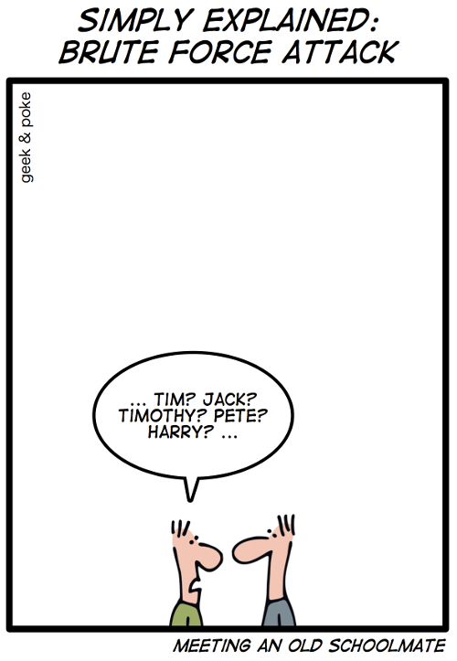




{{ titre_chapitre(num,niveau)}}

{{ citation("When in doubt, use brute force.","K. Thomson")}}

## Cours

{{ cours(num) }}

## Travaux dirigés

{{ td(num) }}

## Travaux pratiques

## Humour d'informaticien

{.imgcentre width=500px}
