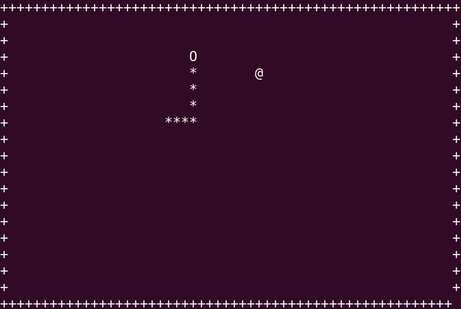




{{ titre_chapitre(num,niveau)}}

{{ citation("**Warning** a hash table is only as good as the hash function. A bad hash function will turn the table into a degenerate association list, with linear time lookup instead of constant time lookup.","ocaml.org","[Module Hashtbl](https://v2.ocaml.org/api/Hashtbl.html)")}}

## Cours

{{ affiche_cours(num) }}

## Travaux dirigés

{{ td(num) }}


## Travaux pratiques

{{ exo("Révision : un serpent dans le terminal !",[],0)}}

{.imgcentre width=400px}

Vous avez peut-être reconnu sur la capture d'écran ci-dessus une version minimaliste d'un célèbre jeu vidéo : [*snake*](https://fr.wikipedia.org/wiki/Snake_(genre_de_jeu_vid%C3%A9o)){target=_blank}, dans lequel le joueur dirige un serpent qui doit, sans entrer en collision contre lui-même ou contre les bords de l'écran, atteindre le plus possible de nourriture (`@` dans l'image ci-dessus). Chaque nourriture consommée accroît la taille du serpent ainsi que sa vitesse. Une version jouable en ligne est disponible [ici](https://playsnake.org){target=_blank}. 

Le but du TP est d'écrire en langage C, une version de ce jeu. L'interface graphique sera simplement le terminal et nous nous limiterons à l'affichage des caractères {{sc("ascii")}} standards. On pourra définir les caractères utilisés dans le jeu à l'aide de directives de précompilations en début de programme, par exemple dans la capture d'écran ci-dessous :
```c
#define HEAD 'O'
#define BODY '*'
#define EMPTY ' '
#define FOOD '@'
#define BORDER '+'
```

1. A propos de l'interface graphique  
Nous allons utiliser le module [ncurses](https://tldp.org/HOWTO/NCURSES-Programming-HOWTO/){target=_blank} qui permet d'afficher des caractères dans le terminal en donnant simplement leur coordonnées. Afin d'utiliser ce module, on écrira en début de programme `#!c #include <ncurses.h>` et on rajoutera l'option `-lncurses` à la ligne habituelle de compilation. On fournit ci-dessous une fonction d'initialisation du terminal afin de le transformer en interface graphique utilisable :
    ```c
    --8<-- "C10/mysnake.c:init_term"
    ```
Une fois cette initialisation effectuée, on peut afficher n'importe quel caractère {{sc("ascii")}} dans le terminal en utilisant la fonction `mvaddch` qui prend en argument la ligne, la colonne et enfin le caractère affiché. Par exemple `#!c mvaddch(5, 7, 'X')` affiche un `X` à la ligne 5 et à la colonne 7. Le coin supérieur gauche du terminal est l'origine (ligne 0, colonne 0). D'autre part, la fonction d'initialisation précédente met à jour `maxl` et  `maxc` afin qu'ils contiennent les numéro des dernières lignes et colonnes visibles dans le terminal. Enfin, les modifications apportées au terminal sont *bufferisées* (mises en attente), la fonction `refresh()` permet de mettre à jour un terminal en executant toutes les modifications en attente. 
        

    1. Ecrire la fonction de signature  `#!c void make_border(int maxl, int maxc)` qui crée une bordure autour du terminal (dans la capture d'écran donnée en exemple au début du TP cette bordure est constituée de caractères `+`).

        !!! aide
            On notera bien que la fonction `mvaddch` :

            * prends comme premier argument la *ligne* et comme second la *colonne*
            * que le coin supérieur gauche est le point de coordonnées $(0,0)$.
            * on doit uiliser `refresh()` pour visualiser les modifications apportées au terminal.

    2. Afin de tester le programme (qui pour le moment ne crée que les bordures), écrire la fonction `main` qui appelle les fonctions `init_term` et `make_border` puis utiliser la fonction `usleep` du module `<unistd.h>` qui met en pause un programme pendant le nombre de *microsecondes* donné en argument. afin d'attendre une seconde avant de quitter le programme. Vous devriez obtenir une image similaire à celle ci-dessous :
    {.imgcentre width=400px}

    3. Ajouter la fonction `endwin()` à la fin du `main`, cela garantit de rendre un terminal "propre" en annulant les modifications apportées par la fonction d'initialisation du terminal.

3. Une structure de données pour le serpent  
Afin de représenter les positions occupées par le serpent on propose d'utiliser une liste chainée de position à l'aide du type structuré suivant :
    ```c
    --8<-- "C10/mysnake.c:lpos"
    ```
Afin d'agrandir le serpent, il suffira de rajouter un maillon à la liste chainée des positions occupées. Pour  simuler un déplacement du serpent on ne déplace en fait que **deux caractères** et pas la totalité du serpent. En effet, il suffit de déplacer la tête et de supprimer la queue ! Par exemple sur l'illustration suivante :
{.imgcentre width=400px}
Dans la position suivante, seule la tête se sera déplacée et le dernier emplacement occupé par le queue sera vide. On a donc besoin d'une structure de donnée dans laquelle on peut ajouter en $\mathcal{O}(1)$ en tête de la liste et supprimer en $\mathcal{O}(1)$ en queue de la liste. On adopte donc le type structuré suivant :
    ```c
    --8<-- "C10/mysnake.c:snake"
    ```
    On fera bien attention qu'il faut :

    * ajouter à la tête du serpent
    * retirer à la queue du serpent

    Par conséquent, la liste est chainée  de la *queue* vers la tête comme illustré ci-dessous :
    {.imgcentre width=700px}
    Ici, si le serpent se déplace vers la droite, il suffira en accédant par le pointeur de queue de supprimer le dernier maillon puis de rajouter la position $(3,6)$ au pointeur de tête pour obtenir les nouvelles positions occupées par le serpent à savoir $(3,2) (3,3) (3,4) (3,5)$ et $(3,6)$.

    1. Ecrire la fonction de signature `#!c void add_head(snake *ms, int l, int c)` qui rajoute une position à la tête du serpent. On fera attention à traiter le cas particulier où la liste des positions est initialement vide.

    2. Ecrire la fonction de signature `#!c void remove_tail(snake *ms, int *l, int *c)` qui supprime le dernier maillon à la queue du serpent. Comme la taille du serpent n'est jamais inférieure à sa taille initiale, on pourra ignorer le cas limite où on supprime le dernier maillon.

    3. Ecrire en utilisant `add_head` une fonction de signature `#!c snake init_snake(int size, int maxl, int maxc)` qui renvoie un serpent centré dans le terminal, se dirigeant vers la droite et de longueur `size`. On mettra en parallèle le terminal à jour  avec `mvaddch`.

    4. Mettre à jour votre `main` de façon à afficher ce serpent.

3. Génération aléatoire de nourriture  
On rappelle que la fonction `rand()` permet de générer en entier aléatoire et qu'on peut initialiser le générateur avec par exemple `#!c srand(time(NULL));`. Lorsqu'on génère une position pour la nourriture elle ne doit pas être dans le serpent. On doit donc disposer d'une fonction qui teste si un couple de coordonnées `(l,c)` fait partie ou non des positions occupées par le serpent.

    1. Ecrire une fonction de signature `#!c bool in_snake(snake ms, int l, int c)` qui renvoie un booléen indiquant si `(l,c)` fait partie des positions occupées par le serpent.

    2. En utilisant `in_snake`, écrire une fonction de signature `#!c void make_food(snake ms, int *pl, int *pc, int maxl, int maxc)` qui modifie `*pl` et `*pc` afin qu'ils contiennent l'emplacement de la prochaine nourriture. Cette fonction mettra aussi à jour le terminal à l'aide de `mvaddch`.

    2. Tester votre fonction en appelant la fonction de génération de nourriture depuis le `main`.

3. Déplacement du serpent  

    1. Un déplacement du serpent peut générer une collision (avec lui-même ou les bordures), ou un augmentation de sa taille (s'il atteint la nourriture). Ecrire une fonction `!#c int move_snake(snake *ms, int pl, int pc, int maxl, int maxc)` qui déplace le serpent et renvoie un entier indiquant si le serpent est entré en collision ou s'il doit grandir. On pourra définir ces entiers par des directives de précompilation :

        ```c
        #define GROW 1
        #define COLLISION 2
        ```

    2. Tester votre fonction en modifiant le `main` et en effectuant quelques déplacements.

4. Boucle principal du jeu  

    On pourra partir du squelette suivant afin d'écrire dans le main la boucle principal du jeu:

    ```c
    bool running = true;
    int kpress;
    while (running)
    {
        usleep(delay); 
        kpress = getch(); //Récupère la touche tapée au clavier
        if (kpress==KEY_UP)
            {
                .....
            }
        ....
        event = move_snake(&ms, plig, pcol, maxlig, maxcol);
        if (event == COLLISION)
        {
            running = false;
        }
        if (event == GROW)
        {
            .....
        }
    }
    ```

5. Améliorations possibles

    * Faire afficher un score
    * Enregistrer dans une fichier les meilleures performances
    * Utiliser de la couleur
    * Introduire des caractères spéciaux ou des emojis comme :apple: pour la nourriture
    * Modifier le jeu en introduisant des bonus ou des malus, ...

!!! lien "Pour aller plus loin"
    Pour une interface graphique plus aboutie, on pourra consulter ce [projet de jeu Snake de V. Picard](https://vincent-picard.github.io/snake/){target=_blank}    


{{ exo("Quelques fonctions de hachage sur les chaines de caractères",[])}}

On propose de tester dans cet exercice trois fonctions de hachage sur les chaines de caractères, on pourra les coder au choix en C ou en OCaml. On testera ces fonctions sur un ensemble de 5000 chaines de caractères toutes de longueurs 6 et qui ont été générés aléatoirement et contiennent toutes des caractères {{sc("ascii")}} imprimables (ceux de codes 32 à 126) et téléchargeables ci-dessous :
    {{telecharger("Chaines aléatoires","./files/C10/test5000.txt")}}
Dans tous les cas, on utilisera une table de hachage de taille 10000.

1. Coder les trois fonctions suivantes :

    1. Somme des codes des caractères {{sc("ascii")}}  
    Cette fonction fait simplement la somme des codes {{sc("ascii")}} des caractères qui la compose, par exemple, le hash de `"MP2I"` est : `77 + 80 + 50 + 73 = 280` car les codes {{sc("ascii")}} de `M,P,2` et `I` sont respectivement `77, 80, 50` et `73`. La table de hachage ayant une taille de 10000, aucun modulo n'est nécessaire, le plus grand hash possible étant 6*126 = 756.

    2. Produit des codes des caractères  
    On calcule le produit des codes {{sc("ascii")}} des caractères modulo 10000. Pour `MP2I` on obtient : `77*80*50*73 = 22484000` qui donne `4000` modulo 10000.

    3. Hachage polynomial  
    On fixe une valeur arbitraire `x=31` puis on calcule la somme modulo 10000 des $c_ix^i$ où les $c_i$ sont les codes {{sc("ascii")}} des caractères de la chaine. Par exemple, pour `MP2I` on obtient : $77 + 80\times31 + 50\times31^2 + 73\times31^3 = 2225350$ qui donne 5350 modulo 10000.

        !!! aide
            On pourra utiliser dans un premier temps le calcul de puissance puis remarquer que l'expression précédente peut aussi se calculer (plus efficacement) avec : $((((73 \times 31) + 50)\times 31) + 80)\times31 + 77$

2. Sur les 5000 chaines de test données ci-dessus, faire une évaluation empirique de ces fonctions de hachage, par exemple en calculant pour chacune d'elle le nombre maximal de collision et le nombre total de collision. Pour cela on pourra créer un tableau de 10000 cases (les 10000 valeurs possibles de *hash*) initialisé à `0` puis calculer successivement les *hash* des 5000 chaines et incrémenter la case correspondante du tableau.

!!! lien "Pour aller plus loin"
    Pour des exemples de "bonnes" fonction de hachage (code donné en C) sur les chaines de caractères, on pourra consulter [cette page](http://www.cse.yorku.ca/~oz/hash.html){target=_blank}.


{{ exo("Implémentation en C d'une table de hachage",[])}}

On reprend ici l'exemple vu en cours du calcul du nombre d'occurrence des mots dans un texte. On rappelle que les maillons des listes chainées utilisées sont définies par :
```c
    --8<-- "C10/count.c:9:16"
```
Et qu'une table de hachage est alors représenté par un tableau de listes chainées. Une proposition de correction pour les fonctions de manipulations de ces listes est fournie.

1. Ecrire la fonction de prototype `#!c bool is_in_list(list l, char w[26])` qui renvoie `true` ou `false` selon que la chaine de caractère `w` figure ou non dans la liste `l`.

    !!! aide
        La fonction `strcmp` disponible après avoir inclus `string.h` compare deux chaines de caractères et renvoie `0` lorsqu'elles sont égales.

    ??? Question "Corrigé"
        ```c
            -8<-- "C10/count.c:31:40"
        ```

2. Ecrire les autres fonctions nécessaires :

    1. Ajouter une nouvelle clé de prototype `#!c void insert_in_list(list *l, char w[26])`. Lorsqu'on ajoute une nouvelle chaine, on la rencontre pour la première fois, par conséquent son nombre d'occurrence est 1.

        ??? Question "Corrigé"
            ```c
                -8<-- "C10/count.c:55:62"
            ```

    2. Récupérer la valeur associée à une clé : `#!c int get_value_list(list l, char w[26])`

        ??? Question "Corrigé"
            ```c
                -8<-- "C10/count.c:42:53"
            ```

    3. Modifier la valeur associée à une clé présente : `#!c void update_list(list *l, char w[26], int v)`

        ??? Question "Corrigé"
            ```c
                -8<-- "C10/count.c:64:72"
            ```

3. La table de hachage est alors définie comme un tableau de liste chainées de taille `SIZE` (fixée en début de programme). On prend comme fonction de hachage la fonction ci-dessous similaire au hachage polynomial vu dans l'exercice 1 :
```c
    --8<-- "C10/count.c:18:29"
```
Pour tester si une clé est présente dans la table de hachage il suffit alors de tester si elle est présente dans le seau correpondant à son *hash* :
```c
    --8<-- "C10/count.c:128:132"
```
Ecrire les autres fonctions nécessaires :

    a. `#!c void insert_in_hashtable(list ht[SIZE], char w[26])` pour insérer une nouvelle clé.

    b. `#!c update_hashtable(list ht[SIZE], char w[26], int n)` pour mettre à jour la valeur associée à une clé.
    
    c. `#!c int get_value_hashtable(list ht[SIZE], char w[26])` pour récupérer la valeur associée à une clé.

4. On donne ci-dessous une fonction permettant de lire une ligne d'un fichier sur un canal de lecture `FILE *` déjà ouvert:
```c
    --8<-- "C10/count.c:197:209"
```
Utiliser cette fonction pour lire le fichier de mots extraits de l'oeuvre de J. Verne *20000 lieues sous les mers* disponible ci-dessous :
{{telecharger("Mots extraits","./files/C10/mots.txt")}}
Combien de fois le mot "*nautilus*" apparaît-il dans le livre ?  
Tester votre réponse : {{ check_reponse("644")}}

5. Calculer le nombre total de collision dans la table de hachage.

{{ exo("Implémentation en OCaml avec le type array",[])}}

La table de hachage est un tableau de liste de couples  `#!ocaml string*int` :
```ocaml
    --8<-- "C10/count2.ml:1:3"
```

C'est la traduction en OCaml de l'implémentation en C vue dans l'exercice précédent.
Reprendre les mêmes questions que ci-dessus.

{{ exo("Implémentation en OCaml avec le module Hashtbl",[])}}
On doit utiliser le module `Hashtbl` et créer la table de hachage en lui donnant un taille de départ (elle sera automatiquement redimensionnée si nécessaire) 
```ocaml
    --8<-- "C10/count.ml:1:2"
```
La fonction de hachage est `#!ocaml Hashtbl.hash` est fonctionne sur des données de n'importe quel type.
Utiliser cette nouvelle implémentation dans le problème du calcul du nombre d'occurrence des mots d'un texte.

!!! aide
    * `#!ocaml Hashtbl.mem` permet de tester l'appartenance
    * `#!ocaml Hashtbl.add` permet d'ajouter un nouveau couple (clé, valeur)
    * `#!ocaml Hashtbl.find` permet de récupérer la valeur associée à une clé
    * `#!ocaml Hashtbl.replace` permet de modifier la valeur associée à une clé


{{ exo("Somme de deux éléments d'un tableau",[])}}

Etant donné un tableau d'entiers  `T` et un entier `s`, le problème est de déterminer s'ils existent  deux éléments de ce tableau dont la somme est `s`. Par exemple, si `T = [5, 6, 1, -4, 3]` et `s=9` alors  la solution est `(6,3)`.

1. Ecrire une version naïve de complexité quadratique permettant de résoudre le problème à l'aide d'une double boucle.

2. En utilisant une table de hachage (et dans le langage de votre choix) écrire une solution plus efficace.

3. Tester ces deux implémentations en mesurant leur performance sur les nombres téléchargeables ci-dessous en recherchant deux nombres de somme 42
{{telecharger("Liste de nombres","./files/C10/numbers.txt")}} 
Vous pouvez tester votre réponse : (donner le plus grand des deux nombres) {{check_reponse("1663789")}}

{{ exo("Résolution des collisions par sondage linéaire",[])}}

On s'intéresse dans cet exercice à une méthode de résolution des collisions dite *par sondage linéaire*, elle consiste lorsqu'une collision se produit à rechercher un emplacement vide séquentiellement. Prenons un exemple pour comprendre, on considère que la table de hachage a 10 alvéoles et on veut insérer les valeurs `907, 202, 117, 318` en utilisant  la fonction de hachage modulo 10.

* Insertion de `907` : 

{{make_tab(["x","x","x","x","x","x","x",907,"x","x"])}}

* Insertion de  `202` :

{{make_tab(["x","x","202","x","x","x","x",907,"x","x"])}}

* Insertion de `117` : 
{{make_tab(["x","x","202","x","x","x","x",907,"117","x"])}}

* Insertion de `318` : 
{{make_tab(["x","x","202","x","x","x","x",907,"117","318"])}}

La recherche d'un élément s'effectue donc à partir de son alvéole en avançant tant que l'alvéole est pleine. Par exemple ci-dessus, si on recherche `318`, il faudrait commencer à l'indice 8 et avancer à l'indice 9 car l'indice 8 était occupé. De la même façon en recherchant `617` on commencerait à l'indice 7 et on devrait attendre d'atteindre l'indice vide 0 pour affirmer que ce nombre n'est pas dans la table.


La suppression d'un élément pose problème car par exemple en enlevant `117` de la table précédente, la recherche de 318 pourtant présent échouerait. Afin de résoudre ce problème, on peut attribuer à chaque case du tableau un statut : libre, occupé ou effacé. On continue la recherche après les cases ayant un statut occupé ou effacé. Par contre on insère dans une case ayant le statut libre ou effacé.

On peut donc proposer le type structuré suivant en supposant que les clés et les valeurs sont des `#!c int`:
```c
struct slot_s
{
    int key;
    int value;
    int status;
};
typedef struct slot_s slot;

struct hashtable_s
{
    slot *data;
    int free;
};
typedef struct hashtable_s hashtable;
```

En utilisant cette structure de données, écrire et tester les fonctions usuelles sur les table de hachage : création, ajout d'un élément, test de présence d'une clé, modification de la valeur associée à une clé, suppression d'une clé, $\dots$

{{ exo("Filtre de Bloom",[])}}

Un [Filtre de Bloom](https://fr.wikipedia.org/wiki/Filtre_de_Bloom){target=_blank} est une structure de données probabilistes pour laquelle le test d'appartenance :

* renvoie toujours vraie si l'élément se trouve dans la structure,
* renvoie *parfois* vraie si l'élément ne se trouve pas dans la structure.

Un élément $x$, tel que le test d'appartenance renvoie vraie alors que $x$ n'est pas dans la structure s'appelle un *faux positif*. 

Un filtre  de Bloom de taille $m$ sur $k$ fonctions de hachage se compose :

* d'un tableau de booléens $B$ de taille $m$ (ce tableau est initialisé à false)
* de $k$ fonction de hachage $h_0,\dots, h_{k-1}$ toutes à valeurs dans $[0;m-1]$

Pour insérer un élément $x$, on calcule les $k$ valeurs de hachage de x : $(h_0(x),\dots,h_{k-1}(x))$ et pour tout $i \in 0,\dots k-1$ on affecte $B(h_i(x))$ à vraie. Pour tester si un élément est ou pas dans la structure on teste si tous les $B(h_i(x))$ sont à vraies (on rappelle que ce teste peut produire un faux négatif).

Par exemple, supposons que le filtre soit composé d'un tableau de 8 booléens et de deux fonctions de hachage $h_0$ et $h_1$ sur les chaines de caractères.

* On insère le mot "chat" et on suppose $h_0($"chat"$)=1$ et $h_1($"chat"$)=7$ le filtre devient $[0,1,0,0,0,0,0,1]$
* On insère le mot "dent" et on suppose $h_0($"dent"$)=2$ et $h_1($"dent"$)=7$ le filtre devient $[0,1,1,0,0,0,0,1]$
* On teste l'appartenance de "chien" et on suppose $h_0($"chien"$)=1$ et $h_1($"dent"$)=3$ alors le test renvoie faux puisque le bit 3 est à 0.
* On teste l'appartenance de "poil" et on suppose $h_0($"poil"$)=7$ et $h_1($"poil"$)=2$ le test renvoie 1 puisque ces deux bits sont à 1, c'est donc un *faux positif*.

Le but de l'exercice est d'implémenter un filtre de Bloom sur les chaines de caractères (dans le langage de son choix), puis de le tester sur les mots du dictionnaire français et d'obtenir le taux de faux positifs en fonction de $m$ (le nombre de bits) et de $k$ (le nombre de fonction de hachage).

1. Ecrire une fonction de hachage sur les chaines de caractères prenant en argument un entier `x` et un entier `m`et  renvoyant la somme modulo `m` des $c_ix^i$ où les $c_i$ sont les codes {{sc("ascii")}} des caractères de la chaine. Un filtre de Bloom sera alors un ensemble de $k$ valeur pour le paramètre `x` associé à un tableau de booléens de taille `m`.

2. Ecrire une fonction `ajoute` qui prend en argument une chaine de caractère, ainsi qu'un filtre de bloom et modifie ce filtre afin d'y ajouter la chaine. 

3. Ecrire une fonction `appartient` qui prend en argument une chaine de caractère, ainsi qu'un filtre de bloom et renvoie un booléens indiquant si cette chaine appartient au filtre.

4. Le fichier `"/usr/share/dict/french"` est un dictionnaire français, contenant $346\,200$ mots (un par ligne). Insérer la majorité de ces mots dans un filtre de bloom et en garder une petite partie afin de tester le nombre de faux positifs. Par exemple, on pourra garder $1\,200$ mots en en insérer $345\,000$.

5. Déterminer le pourcentage de faux positifs sur les mots non insérés en faisant varier les paramètres $m$ et $k$.

    !!! note
        Vous devriez retrouver approximativement les mêmes résultats que sur [cette page](https://hur.st/bloomfilter/){target=_blank} en indiquant pour la valeur $n$ le nombre de mots présents dans le dictionnaire c'est à dire  $345\,000$ (si vous avez conservé $1\,200$ mots pour déterminer le pourcentage de faux négatif).


{{ exo("Recherche de cycle dans un jeu de la vie à une dimension",[])}}

On considère une variante du [jeu de la vie](https://fr.wikipedia.org/wiki/Jeu_de_la_vie){target = _blank} se déroulant dans un tableau à une dimension. L'évolution de la case d'indice $i$ de ce tableau ne dépend que de l'état de la case d'indice $i$ et de ses voisins immédiats (donc les cases d'indices $i-1$ et $i+1$.). On donne ci-dessous l'évolution de la case centrale en fonction de l'état de ces 3 cases en notant "`#`" une case vivante et "`.`" une case morte 

* `...` $\rightarrow$ `.` (si les 3 cases sont vides, la case centrale reste vide)
* `..#` $\rightarrow$ `#`
* `.#.` $\rightarrow$ `.`
* `.##` $\rightarrow$ `#`
* `#..` $\rightarrow$ `#`
* `#.#` $\rightarrow$ `.`
* `##.` $\rightarrow$ `#`
* `###` $\rightarrow$ `.`

!!! note
    Ces évolutions correspondent à la [rule90](https://en.wikipedia.org/wiki/Rule_90){target=_blank}

D'autre part on considère ici un tableau *fini* de $N$ cases et on considère que la voisine de gauche de la case d'indice 0 ainsi que la voisine de droite de la case d'indice $N-1$ sont toujours des cellules mortes.
On donne ci-dessous un exemple d'évolution avec $N=10$
{{make_jeuvie(["...##.####"],[])}} evolue en {{make_jeuvie(["..###.#..#"],[])}}

1. Ecrire une implémentation (dans le langage de votre choix) d'une fonction prenant en entrée un tableau de $N$ cases et renvoyant le tableau représentant l'évolution du tableau après une itération des règles de transformation.

2. Pour $N=30$ et pour le tableau initial représenté par "...............#.............." (toutes les cases sont mortes sauf la case d'indice 15) faire afficher les 100 premières évolutions successives.

    !!! aide
        Les premières lignes sont :
        ```
        ...............#..............
        ..............#.#.............
        .............#...#............
        ............#.#.#.#...........
        ...........#.......#..........
        ..........#.#.....#.#.........
        .........#...#...#...#........
        ........#.#.#.#.#.#.#.#.......
        .......#...............#......
        ......#.#.............#.#.....
        .....#...#...........#...#....
        ....#.#.#.#.........#.#.#.#...
        ```

3. Justifier rapidement que les évolutions successives contiennent un cycle, c'est-à-dire qu'on retombe sur un contenu de tableau déjà obtenu lors d'une évolution précédente.

4. Proposer une solution utilisant une table de hachage et permettant de déterminer le nombre d'itérations nécessaires avant de rencontrer un motif déjà parcouru.  
Testez votre réponse (pour le motif de départ de la question 2) {{check_reponse("32766")}} 

5. L'algorithme du [lièvre et de la tortue de Floyd](https://en.wikipedia.org/wiki/Cycle_detection#Floyd's_tortoise_and_hare){target=_blank} est un algorithme de détection de cycle. Le principe est de parcourir la liste des états avec une tortue (qui avance de 1 en 1) et un lièvre (qui avance par pas de 2). Si la tortue et le lièvre se rencontrent cela signifie qu'un cycle existe. Proposer une implémentation de ce nouvel algorithme.


## Humour d'informaticien

{.imgcentre width=500px}