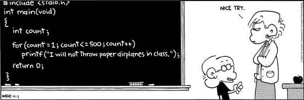




{{ titre_chapitre(num,niveau)}} 

{{ citation("The only way to learn a new programming language is by writing programs in it","B. Kernighan & D. Ritchie","[in the C programming language 1978](https://en.wikipedia.org/wiki/The_C_Programming_Language)")}}


## Cours


{{ affiche_cours(num) }}

### Exemples du cours

* ??? langageC "Hello world"
    ```C title=""
    --8<-- "C1/cours_ex1.c"
    ```

* ??? langageC "Somme des entiers de 1 à 100"
    ```c title=""
    --8<-- "C1/cours_ex2.c"
    ```

* ??? langageC "Fonction Syracuse"
    ```c title=""
    --8<-- "C1/cours_ex3.c"
    ```

## Travaux dirigés

{{ td(num) }}

## Travaux pratiques

{{ exo("Premières compilations",[],0) }}

1. Lancer VS Code et dans le menu `Fichier >  Ouvrir le dossier` (raccourci ++ctrl+k++, ++ctrl+o++) ouvrir un répertoire de travail pour ce premier TP (par exemple `~/LangageC/TP1`). 

    !!! note
        Une bonne habitude de Travail avec VS Code est d'ouvrir directement un répertoire de travail (celui à partir duquel les compilations seront faites).

2. Dans l'onglet extension (accessible via le raccourci clavier ++ctrl+shift+x++), chercher "C" et installer "*C/C++ IntelliSense, debugging, and code browsing.*". Cette extension permet de bénéficier de la coloration syntaxique et de la détection des erreurs dans VS Code.

3. Pour chacun des trois programmes vus en cours et disponibles [ci-dessus](#exemples-du-cours)
    1. Le copier dans VS code et l'enregistrer (la coloration syntaxique devrait être visible)
    2. Dans le terminal de VS Code le compiler avec `gcc`

        !!! warning "Attention"
            On rappelle qu'il est **très fortement recommandé** de toujours compiler avec les options `-Wall` et `-Wextra` et que l'option `-o` permet de spécifier un nom pour l'exécutable produit lors de la compilation

    3. Lancer l'exécution

        !!! aide 
            Il faut spécifier le chemin vers l'exécutable, ici `./`

{{ exo("Premiers programmes",[])}}

1. Ecrire un programme qui affiche à l'écran `"Mon tout premier programme en C"`

2. Ajouter dans votre programme les déclaration des variables  entières `a` valant 2024 et  `b` valant 42. 

3. Faire afficher à l'écran la valeur de $2024 \times 42$.

4. Ecrire une instruction conditionnelle qui affiche dans le terminal `divisible` si 2024 est divisible par 42 et `non divisible` sinon.

5. Déclarer une variable entière `s` valant 0. Ecrire une boucle qui permet de calculer la somme des entiers *divisibles par 7 et par 13* de 1 à 2024.  
Vérifier votre réponse : {{check_reponse("23023")}}


{{ exo("Quelques fonctions pour démarrer",[]) }}

!!! note
    Pour chaque question, écrire  le code de la fonction puis la tester dans le `main` en saisissant éventuellement les arguments au clavier à l'aide de `scanf`.

1. Ecrire une fonction `aire_disque` qui prend en argument un flottant `r` et renvoie l'aire du disque de rayon `r`, on définira une constante flottante `pi` de valeur `3.14159` qui sera utilisé dans le calcul.

2. Ecrire une fonction `valeur_absolue` qui prend en argument un flottant `x` et renvoie sa valeur absolue.

    !!! aide
        On rappelle que :  
        $|x| = \left\{ \begin{array}{rl} -x & \mathrm{\ si\ } x<0 \\ x & \mathrm{\ sinon} \end{array}\right.$

3. Ecrire une fonction `est_triangle` qui prend en argument trois entiers `a`,`b` et `c` et qui renvoie `true` si ces trois entiers peuvent être les longueurs des trois côtés d'un triangle. 

    !!! aide
        Cela revient à vérifier que les trois entiers vérifient l'inégalité triangulaire ou encore que le plus grand des trois est inférieur à la somme des deux autres.

4. On considère le programme de calcul suivant :

    * choisir un nombre entier
    * ajouter 3 à ce nombre
    * multiplier par le nombre choisi au départ
    * soustraire 9

    Ecrire une fonction `calcul` qui prend en entrée le nombre choisi au départ et renvoie le résultat du programme de calcul.

5. On appelle *factorielle* d'un entier $n$ et on note $n!$ le produit de cet entier par tous ceux qui le précèdent à l'exception de zéro. Et on convient d'autre part que $0!=1$. Par exemple $5! = 5 \times 4 \times \times 3 \times 2 \times 1 = 120$. Ecrire une fonction `factorielle` qui prend en argument un entier `n` et renvoie sa factorielle.

6. Ecrire une fonction `bissextile` qui prend en argument un entier `annee` et renvoie `true` si cette année est bissextile et `false` sinon.

    !!! aide
        Une année est bissextile si elle est divisible par 4 mais pas par 100 ou s'il est divisible par 400.

7. Ecrire une fonction `maxint` qui prend en argument deux entiers `a` et `b` et renvoie le maximum de ces deux entiers.

8. Ecrire une fonction `xor` qui prend en argument deux booléens `x` et `y` et renvoie vraie si `x` ou `y` vaut vraie mais pas les deux à la fois.

9. Ecrire une fonction qui prend en argument un entier et renvoie `true` si cet entier est divisible par 7 et qu'il se termine par 9.

{{ exo("Ecrire quelques boucles",[]) }}

1. Ecrire une fonction prenant en entrée un entier `n` et qui affiche la table de multiplication de cet entier.
2. La coupe du monde de football se déroule tout les quatre ans et sa première édition date de 1930. D'autre part, à cause de la seconde guerre mondiale, la compétition n'a pas eu lieu en 1942 et en 1946. Ecrire un programme  qui liste toutes les années où la coupe du monde s'est déroulée de 1930 à nos jours. Compléter ce programme de façon à afficher le numéro de l'édition pour chaque année.
3. Ecrire une fonction prenant en entrée un entier $n$ et renvoyant le plus petit entier $k$ tel que $2^k \geq n$.
4. Ecrire un programme permettant de calculer la somme suivante :  
 $\displaystyle{\sum_{k=1}^{100} k^2}$.

{{ exo("Un peu de dessin",[]) }}

1. Ecrire une fonction `carre_plein` prenant comme paramètre un entier `cote` et un caractère `car` et permettant d'afficher un carré de côté `cote` rempli de caractères `car`. Par exemple, `carre(5,'C')` produit l'affichage suivant :
``` title=""
CCCCC
CCCCC
CCCCC
CCCCC
CCCCC
```

2. Ecrire une fonction `rectangle_creux`  prenant trois paramètres : deux entiers `largeur` et `longueur` et un caractère `car` permettant d'afficher un rectangle creux de dimensions `largeur` sur `longueur` dont la bordure est constitué de caractères `car`. Par exemple `rectangle_creux(3,7,'~')` devrait produire l'affichage suivant :
```title=""
~~~~~~~
~     ~
~~~~~~~
```

3. De la même façon écrire une fonction `triangle` prenant comme paramètre un entier `hauteur` et un caractère `car` telle que `triangle(6,'*')` produise l'affichage suivant :
```title=""
     *
    ***
   *****
  *******
 *********
***********
```

{{ exo("Puissance",[])}}

1. En supposant `n` entier et positif, écrire, une fonction `puissance_positif` qui prend en entrée un nombre `x` et `n`  et renvoie $x^n$.
2. Ecrire une nouvelle fonction `puissance` qui prend en argument un nombre `x` et un entier `n` et renvoie $x^n$.

    !!! aide
        Attention à bien traiter tous les cas possibles.


{{ exo("Nombres premiers",[])}}

1. Ecrire une fonction `racine` qui prend en entrée un entier `n` positif et renvoie le plus grand entier `k` tel que `k * k <= n`.
    Par exemple, `racine(9)` renvoie 3 et `racine(18)` renvoie 4.

2. Ecrire une fonction qui prend en argument un nombre et renvoie `true` lorsque ce nombre est premier et `false` sinon.

    !!! aide
        On rappelle qu'un nombre est premier s'il possède exactement deux diviseurs : 1 et lui-même. On peut donc se contenter de tester si les entiers $k$ compris entre 2 et la partie entière de $\sqrt{n}$ inclus divisent $n$ et utiliser la question 1.

3. Ecrire une fonction `somme_premiers` qui prend en entrée un entier `n` et calcule la somme des nombres premiers inférieurs ou égaux à `n`. Par exemple `somme_premiers(10)` vaut `2 + 3 + 5 + 7 = 17`

4. Tester votre fonction en calculant `somme_premiers(10000)` :  {{check_reponse("5736396")}}


{{ exo("Conjecture de syracuse",[])}}

La [conjecture de syracuse](https://fr.wikipedia.org/wiki/Conjecture_de_Syracuse){target=_blank} est l'hypothèse selon laquelle la suite définie $(u_n)_{n \in \mathbb{N}}$ définie par son premier terme $u_0$ et la relation de récurrence :  
$u_{n+1} = \left\{ \begin{array}{ll} \dfrac{u_n}{2} & \mathrm{\ si\ } u_n \mathrm{\ est \ paire} \\ 3u_n+1 & \mathrm{\ sinon} \\ \end{array} \right.$  
atteint 1. Dans la suite de cette exercice on supposera cette conjecture vérifiée (bien qu'elle n'ait pas été mathématiquement prouvée, la conjecture a été vérifiée numériquement pour tous les entiers jusqu'à $2^{58}$).

1. Ecrire la fonction `terme_suivant` qui prend en argument un entier $n$ et renvoie $\dfrac{n}{2}$ si $n$ est paire et $3n+1$ sinon.
2. Ecrire une fonction `duree_vol` qui prend en argument un entier $u_0$ et renvoie le plus petit entier $n$ appelé *durée de vol* tel que $u_n=1$. Par exemple `duree_vol(7)` doit renvoyer 16, en effet les termes successif de la suite sont `7, 22, 11, 34, 17, 52, 26, 13, 40, 20, 10, 5, 16, 8, 4 ,2, 1`.  
Tester votre fonction en calculant la durée de vol de 123456789 :   
Vérifier votre réponse : {{check_reponse("177")}}

3. Quelle est la plus grande durée de vol lorsque $1 \leq u_0 \leq 10000$ ?  
Vérifier votre réponse : {{check_reponse("261")}}

4. Vérifier que cette durée de vol maximale est atteinte pour une seule valeur de $u_0$, quelle est cette valeur ?  
Vérifier votre réponse : {{check_reponse("6171")}}

5. L'altitude maximale est la valeur maximale atteinte par la suite de Syracuse. Ecrire une fonction prenant $u_0$ et renvoyant l'altitude maximale atteinte. Par exemple l'altitude maximal de $u_0 = 7$ est $52$ (voir les termes de cette suite à la question 2.).

6. Quelle est l'altitude maximale de $9331$ ?  
Vérifier votre réponse : {{check_reponse("345544")}}


{{ exo("Simulation d'un lancer de dé",[])}}

Au jeu des ["petits chevaux"](https://fr.wikipedia.org/wiki/Jeu\_des\_petits\_chevaux){target=_blank}, le joueur doit lancer un dé à six faces  et obtenir 6 pour "sortir un de ses chevaux de l'écurie". On se demande, en moyenne combien de coups  il faut pour obtenir un 6 sur un lancer de dé.

1. Ecrire une fonction `lancer_de` qui ne prend aucun argument et renvoie un nombre choisi au hasard entre 1 et 6.

    !!! aide
        * La fonction `rand()` du langage C renvoie un entier aléatoire, entre 0 et le plus grand entier représentable. On peut ensuite utiliser un modulo pour se ramener dans un intervalle de longueur 6.
        * Une méthode possible d'initialisation du générateur aléatoire de nombre est d'utiliser le temps : `#!c srand(time(NULL));` disponible après `#!c #include <time.h>`

2. Ecrire une fonction, `obtenir6` qui ne prend aucun argument et qui renvoie le nombre lancer effectué pour obtenir une première fois 6.

3. Calculer la moyenne du nombre de coups nécessaire pour obtenir un six pour un grand nombre de parties (par exemple 10000). Pouvez-vous retrouver ce résultat en utilisant vos connaissances en probabilités ?


{{ exo("Somme des éléments d'un tableau",[]) }}

1. Ecrire une fonction `somme` qui prend en argument un tableau ainsi que sa taille et renvoie la somme des éléments de ce tableau.

2. Créer un tableau de  `carres` de taille 100 et grâce à une boucle l'initialiser de façon à ce que `carres[i]=i*i`.

3. Calculer la somme des carres des entiers de 1 à 100.

{{ exo("Appartient à un tableau",[]) }}

1. Ecrire une fonction `appartient` qui prend en argument un tableau `tab` (et sa taille `t`) ainsi qu'un entier `n` et qui renvoie `true` si `n` est dans le tableau `tab` et `false` sinon.

2. En utilisant cette fonction et le tableau `carres` de la fonction précédente, vérifier que 5041 est un carré parfait mais pas  6726.

{{ exo("Longueur d'une chaine de caractères",[])}}

Ecrire une fonction `my_strlen` qui prend en argument une chaine de caractères et renvoie sa longueur

!!! aide
    On rapelle qu'une chaine de caractères en C se termine par le caractère nul `'\0'`


{{ exo("Manipulation des chaines de caractères",[])}}

1. Ecrire une fonction `retourne` qui prend en argument une chaine de caractères et affiche cette chaine écrite à l'envers. Par exemple `retourne("Bonjour")` affiche `"ruojnoB"`.

2. Ecrire une fonction `palindrome` qui prend en argument une chaine de caractères et renvoie `true` si cette chaine est un palindrome (c'est-à-dire qu'elle se lit indifféremment de gauche à droite ou de droite à gauche) et `false` sinon. Par exemple `palindrome("radar")` renvoie `true`.

{{ exo("Nombre parfait",[] )}}
Un nombre parfait est un entier positif égal à la  la somme de ses diviseurs stricts (c'est-à-dire autres que lui-même). Par exemple, 6 est un nombre parfait car $6 = 3 + 2 + 1$. 

1. Écrire une fonction `parfait` qui renvoie `true` si l'entier positif donné en argument est parfait et `false` sinon.
2. Utiliser cette fonction pour vérifier que $8128$ est un nombre parfait mais pas $2023$.


{{ exo("Triangle de Pascal",[]) }}

Ecrire un programme qui prend en argument un entier $1 \leq n \leq 10$ et affiche les $n$ premières lignes du [triangle de Pascal](https://fr.wikipedia.org/wiki/Triangle_de_Pascal){target=_blank}. Par exemple `pascal(4)` affiche :
```title=""
1
1 1
1 2 1
1 3 3 1
1 4 6 4 1
```

!!! aide
    * On rappelle que le coefficient situé ligne $n$ et colonne $k$ noté $\displaystyle{\binom{n}{k}}$ se déduit de ceux de la ligne précédente grâce à la formule de Pascal : $\displaystyle{\binom{n}{k} = \binom{n-1}{k-1} + \binom{n-1}{k}}$
    * On pourra utiliser deux tableaux, l'un représentant la ligne précédente et un second la ligne en cours de construction.

{{ exo("Tableau trié",[])}}

Ecrire une fonction `est_trie` qui prend en argument un tableau d'entiers (et sa taille) et renvoie `true` si ce tableau est trié (dans l'ordre croissant ou décroissant) et `false` sinon. 

!!! aide
    On pourra dans un premier temps s'aider de deux fonctions `est_trie_croissant` et `est_trie_decroissant`.

{{ exo("Nombre d'occurences",[])}}

1. Ecrire une fonction `nb_occurrences` qui prend en argument un tableau d'entiers `tab` (et sa taille) ainsi qu'un entier `n` et renvoie le nombre d'apparitions de `n` dans le tableau `tab`. Par exemple si `tab` est le tableau `{2, 18, 7, 2, 11, 7, 4, 7, -1, 3}` (de taille `10`) alors `nb_occurrences(tab,10,7)` renvoie 3 et  `nb_occurrences(tab,10,13)` renvoie 0.

2. Ecrire une fonction similaire `compte_caractere` qui prend en argument une chaine de caractères `chaine` et un caractère `car`
et compte le nombre d'apparitions de `car` dans `chaine`. A-t-on besoin cette fois de passer en argument la taille de la chaine ? Pourquoi ?

{{exo("Affichage en zigzag",[])}}

Ecrire en C une fonction de signature  `#!c void zigzag(char s[], int n)` qui prend en argument une chaine de caractères `s` et un entier `n` et affiche en *zigzag* et sur *n* lignes la chaine de caractères `s` par exemple l'affichage de la `BONNE RENTREE AUX MP2I !"` sur 4 lignes doit produire l'affichage suivant dans le terminal :
```
B     R     E     M     
 O     E   E       P   !
  N E   N R   A X   2   
   N     T     U     I 
```

!!! aide
    On pourra définir dans la fonction une matrice de caractères qu'on remplira correctement avec les lettres de la chaine de caractères avant de l'afficher.


{{ exo("Tri par insertion",[]) }}

L'algorithme du *tri par insertion* permet de trier en place un tableau de taille $n$. Le principe est de considérer qu'à l'étape $i$,  la partie du tableau située avant l'indice $i$ est **déjà triée** et on insère l'élément situé à la position d'indice $i$ à la bonne position dans cette partie. Pour réaliser cette insertion, on échange l'élément d'indice $i$ avec son voisin de gauche tant qu'il lui est supérieur et que le début de liste n'est pas atteint.  
Par exemple sur la tableau $\{12, 10, 18, 11, 14\}$ et en délimitant la partie triée par le symbole $\color{red}{|}$:

* Etape 0 : la partie situé avant l'indice 0 est vide (donc déjà triée), on y insère le 12 : $\{\textcolor{green}{12}, \textcolor{red}{|} 10, 18, 11, 14\}$ 
* Etape 1 : on insère l'élément d'indice 1 dans la partie trié, pour cela on l'échange avec son voisin tant qu'il lui est inférieur (et que le début de la liste n'est pas atteint) :
    * $\{12,  \textcolor{green}{10} \textcolor{red}{|} , 18, 11, 14\}$ échange car $10<12$
    * $\{\textcolor{green}{10},  12 \textcolor{red}{|} , 18, 11, 14\}$ on s'arrête car le début de liste est atteint
* Etape 2 : on répète le processus avec l'élément d'indice 2 :
    * $\{10,  12  , \textcolor{green}{18} \textcolor{red}{|}, 11, 14\}$ aucun échange à réaliser car $12<18$
* Etape 3 : on répète le processus avec l'élément d'indice 3 :
    * $\{10,  12  , 18,  \textcolor{green}{11}\textcolor{red}{|}, 14\}$  échange  car $11<18$
    * $\{10,  12  , \textcolor{green}{11}, 18  \textcolor{red}{|}, 14\}$  échange  car $11<12$
    * $\{10,  \textcolor{green}{11}, 12  ,  18  \textcolor{red}{|}, 14\}$  arrêt   car $11>10$
* Etape 4 : on répète le processus avec l'élément d'indice 4 :
    * $\{10,  11, 12  ,  18  , \textcolor{green}{14}\textcolor{red}{|}\}$  echange   car $14<18$
    * $\{10,  11, 12  ,  \textcolor{green}{14}, 18   \textcolor{red}{|}\}$  arrêt   car $14>12$

Le but de l'exercice est de programmer cet algorithme de tri en C.

1. Ecrire une fonction `echange` qui prend en argument un tableau `tab`, deux entiers `i` et `j` et qui échange les éléments d'indice `i` et `j` de ce tableau. On pourra dans un second temps passer aussi en argument la taille du tableau et vérifier que `i` et `j` sont bien inférieurs à cette taille avant de procéder à l'échange.

2. Ecrire une fonction `insere` qui prend en argument un tableau `tab` et un indice `i` et qui insère l'élément d'indice `i` à la bonne place dans la partie du tableau situé avant l'indice `i` *en suposant que cette partie est triée*. On rappelle que cette insertion s'effectue en echangeant l'élément avec son voisin de gauche tant qu'il lui est inférieur et que le début du tableau n'est pas atteint.  
Par exemple si `tab={5,7,11,6,19,7}` alors après `insere(tab,3)` `tab{5,6,7,11,19,7}`.

3. Ecrire une fonction `tri_insertion` qui prend en argument un tableau et sa taille et le trie à l'aide de l'algorithme du tri par insertion.

{{ exo("Crible d'Erastothène",[]) }}

On rappelle qu'un nombre premier est un entier naturel ayant exactement deux diviseurs 1 et lui-même, ainsi 13 est premier mais pas 15. Le [crible d'Erastothène](https://fr.wikipedia.org/wiki/Crible_d%27%C3%89ratosth%C3%A8ne) est un algorithme permettant de trouver tous les nombres premiers inférieurs ou égaux à un entier `n` donné. 

!!! abstract "Algorithme"
    * on crée un tableau de booléens `premiers` de taille `n+1`
    * on initialise le tableau à `true` sauf `premiers[0]` et `premiers[1]` qui sont à `false` puisque  $0$ et 1 ne sont pas premiers.
    * on parcourt ce tableau si `premiers[i]` est à `true` alors on met tous ses multiples (sauf lui-même) à `false`
    * le parcours s'arrête dès que l'entier `i` est supérieur à $\sqrt{n}$.  

1. Ecrire en C une fonction `crible` qui prend en paramètre un entier `n` et implémente cet algorithme. L'utiliser pour afficher les nombres premiers inférieurs à 100.

    !!! aide
        Vous devriez obtenir : `2 3 5 7 11 13 17 19 23 29 31 37 41 43 47 53 59 61 67 71 73 79 83 89 97`

2. Ecrire en C une fonction `somme_premiers` qui prend en argument un entier `seuil` et renvoie la somme de tous les nombres premiers inférieurs ou égaux à `seuil`. Par exemple `somme_premiers(100)` renvoie `1060`

??? lien "Pour aller plus loin"
    Les élèves ayant fait la spécialité {{sc("nsi")}} ou connaissant un minimum le langage Python peuvent coder ce même algorithme en Python et comparer les temps de calcul dans les deux langages sur par exemple `somme_premiers(5000000)`. 


## Humour d'informaticien

{.imgcentre width=500px}