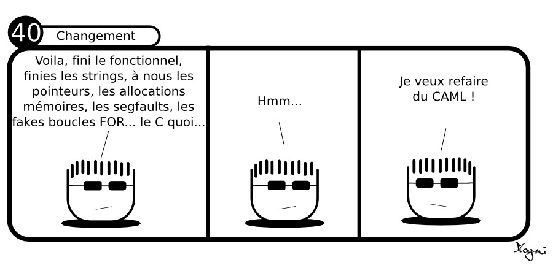




{{ titre_chapitre(num,niveau)}}

{{ citation("An industrial-strength functional programming language with an emphasis on expressiveness and safety","ocaml.org","[Site officiel d'OCaml](https://ocaml.org/)")}}

## Cours

{{ cours(num) }}

## Travaux dirigés

## Travaux pratiques

{{ exo("Un notebook pour démarrer",[],0)}}


!!! Note "A propos des notebooks"
    Dans cette activité, on utilise pour la première fois les **jupyter notebook**, c'est à dire des documents contenant à la fois :

    * des zones de texte explicatives, 
    * des zones de code Ocaml, executables directement à la façon de ce qui se passe lorsqu'on utilise l'environnement `utop` de OCaml.

    A chaque fois, que nous utilisons cet outil, deux choix s'offrent à vous :

    1. l'utiliser localement sur votre ordinateur à condition d'y avoir installé jupyter notebook (c'est le cas sur les ordinateurs de la salle). Pour cela, créer un dossier nommé par exemple `Notebook` et depuis un terminal lancer jupyter dans ce dossier en écrivant simplement :
    ```bash
    jupyter notebook
    ```
    L'application se lance dans votre navigateur, télécharger le notebook et utiliser le bouton <span class="encadre">Téléverser</span> en haut à droit pour le télécharger dans votre dossier et l'ouvrir.

    2. Utiliser l'application **Capytale** de votre environnement numérique de travail metice. Dans ce cas, utiliser le lien de partage fourni dans l'activité. Cette option vous permet notamment de travailler depuis la maison car aucune installation (ni de OCaml, ni de Jupyter) n'est nécessaire.

    Les activités utilisant un notebook proposerons donc toujours les deux options décrites ci-dessus.

{{notebook("c985-1905797","Notebook : Premiers pas en OCaml","./Notebook/TP - Premiers pas en OCaml.ipynb")}}

!!! note
    Pour les exercices suivants, on pourra au choix continuer à travailler dans `utop` soit faire les premières compilations.

{{ exo("Dessiner (sans boucles)",[] )}}

1. Ecrire une fonction `repete` qui prend en argument un caractère `car` et un entier `n` et affiche `n` fois ce caractère à l'écran puis passe à la ligne

2. En utilisant la fonction précédente écrire la fonction `triangle` qui prend en argument un caractère `car` et un entier `n` et dessine un triangle de ce caractère. Par exemple :
```ocaml
utop # triangle '*' 5;;
*****
****
***
**
*
```

3. Même question mais en affichant le triangle "pointe vers le haut" :
```ocaml
utop # triangle2 '*' 5;;
*
**
***
****
*****
```
{{ exo("Logarithme discret",[])}}

{{ exo("Type nombre",[]) }}

1. Créer le type union `nombre` pouvant être un entier ou un flottant
2. A l'aide d'un filtrage par motif, écrire une fonction `addition` qui prend en argument deux variables de type `nombre` et renvoie leur somme.

{{ exo("Type couleur",[]) }}

1. Créer le type produit `couleur` sous la forme d'un triplet de trois entiers.
2. Le négatif d'une couleur $(x,y,z)$ est la couleur $(255-x, 255-y, 255-z)$. Ecrire une fonction prenant une couleur comme paramètre et renvoyant son négatif.
3. A l'aide d'un filtrage par motif écrire une fonction qui affiche :

    * `Rouge pur` si la composante rouge est strictement positive et les  deux autres composantes sont nulles, `Vert pur` si les deux autres,
    * `Vert pur` si la composante verte est strictement positive et les  deux autres composantes sont nulles,
    * `Bleu pur` si la composante bleue est strictement positive et les  deux autres composantes sont nulles,
    * `Mélange` dans les autres cas.
    

{{ exo("Exercices en ligne",[]) }}

Le site officiel de [la fondation Ocaml](https://ocaml.org/){target=_blank}, propose des [exercices progressifs](https://ocaml-sf.org/learn-ocaml-public/#){target=_blank} à faire en ligne directement dans le navigateur.


## Humour d'informaticien
{.imgcentre width=500px}
<span class="source">
Credit : [Hmm-la-bd](https://hmm-la-bd.eu/40/){target=_blank} {{sc ("cc by-nc")}}</span>