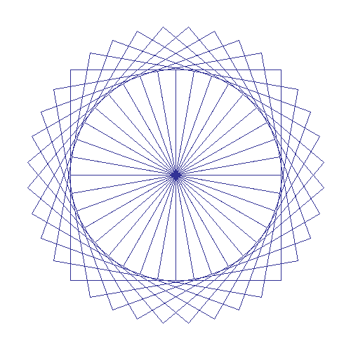




{{ titre_chapitre(num,niveau)}}


{{ citation("Pointers have been lumped with the `goto`  statement as a marvelous way to create impossible-to-understand programs. This is certainly true when they are used carelessly, and it is easy to create pointers that point somewhere unexpected. With discipline, however, pointers can also be used to achieve clarity and simplicity","B. Kernighan & D. Ritchie","[in the C programming language 1978](https://en.wikipedia.org/wiki/The_C_Programming_Language)")}}

## Cours

{{ affiche_cours(num) }}


## Travaux dirigés

{{ td(num) }}

## Travaux pratiques


{{ exo("Visualisation avec Python Tutor",[],0)}}
Le site [Python Tutor](https://pythontutor.com/c.html#mode=edit){target=_blank}, permet de visualiser l'execution de programmes C. 

1. Aller sur [Python Tutor](https://pythontutor.com/c.html#mode=edit){target=_blank}, recopier et visualiser l'exécution du programme suivant :

```C
#include <stdlib.h>

int main() {
  int n_local;
  int *p_local = &n_local;
  int *p_tas = malloc(sizeof(int));
  return 0;
}
```

2. En citant le cours, justifier brièvement que `p_local` pointe sur la pile alors que `p_tas` pointe sur le tas.

3. Compléter ce programme en définissant une variable globale `n_globale` de type `int` non initialisée. Que remarquez-vous ?

4. En utilisant le pointeur `p_local`, donner la valeur 42 à `n_local`

5. Quelle instruction, pourtant très importante, est manquante dans ce programme ? La rajouter et indiquer quelle option de compilation permettrait de faire apparaître le problème.

{{ exo("Pour démarrer en douceur",[])}}

1. Ecrire en C un programme qui définit (dans `main`) une variable locale `n_local` de type `int` et affiche son adresse mémoire.

    !!! aide
        * L'opérateur `&` permet de récupérer l'adresse d'une variable
        * Le spécificateur de format pour les pointeurs dans `printf` est `%p`

2. Ecrire en C un programme qui alloue dans le tas une variable de type `int` et affiche son adresse mémoire.

3. Les résultats sont-ils conformes au modèle mémoire du C vu en cours ? Justifier.

{{ exo("Manipulation de pointeurs",[])}}

Ecrire un programme effectuant les opérations suivantes :

1. Déclarer un entier `n` initialisé à $42$.
2. Déclarer un pointeur sur un entier `p` initialisé à `NULL`
3. Faire pointer `p` sur `n`.
4. Modifier la valeur de `n` de deux façon différentes : en utilisant `n` et en utilisant `p`.
5. Après chacune des modification, afficher la valeur de `n` pour vérifier qu'elle a changé.
6. Afficher l'adresse de `n`.

{{ exo("Warning",[])}}

On souhaite écrire en C, un programme qui affiche l'adresse et le contenu d'une variable locale à une fonction. 

1. Recopier, compiler (en ignorant le *warning*) et exécuter la proposition de solution suivante qui effectue un affichage depuis le `main` :

    ```C linenums="1"
    #include <stdio.h>
    #include <stdlib.h>

    int* get_adr_local()
    {
        int n_local = 15;
        return &n_local;
    }

    int main()
    {
        int *p = get_adr_local();
        printf("Adresse de la variable locale = %p",p);
        printf("Contenu = %d",*p);
    }
    ```

2. Expliquer le résultat obtenu 

    !!! aide
        Le *warning* obtenu à la compilation devrait vous mettre sur la voie

4. Est-il possible d'afficher l'adresse d'une variable locale à une fonction depuis le `main` ? Et depuis la fonction ?

3. Effectuer une allocation sur le tas à la ligne 6 (et changer le nom de la variable en `n_tas`). Expliquer pourquoi le programme fonctionne maintenant sans erreur

{{ exo("Renvoyer un tableau",[])}}

1. Recopier et compléter la fonction `get_tab` suivante qui prend en argument un entier `size` et une valeur  entière `val` et renvoie un tableau de taille `size` dont toutes les cases sont initialisées à `val` :
```C
int* get_tab(int size, int val)
{
    // Allouer sur le tas la place pour size entiers
    int* tab = .........;
    for (int i=0;.....;.....) 
    {
        tab[i] = ....;
    }
    return tab;
}
```

2. Ecrire un programme permettant de tester cette fonction

3. La mémoire allouée  dans la fonction, n'a pas été libéré, est-ce une erreur ?

3. En vous inspirant de cette fonction écrire :

    * une fonction renvoyant un tableau contenant les entiers de 1 à `size`

    * une fonction  renvoyant un tableau contenant `size` entiers aléatoires tous compris entre deux valeurs `vmin` et `vmax`

        !!! aide
            Pour générer un entier aléatoire entre `vmin` et `vmax` on utilisera la fonction `rand()` qui renvoie un entier entre 0 et une constante `RAND_MAX` puis on utilisera un modulo. 


{{ exo("Suite de Fibonnaci",[])}}

La suite de Fibonnaci est définie par :  
$\left\{ \begin{array}{lll}
						f_0   & = & 0,                                                  \\
						f_1   & = & 1,                                                  \\
						f_{n} & = & f_{n-1}+f_{n-2} \mathrm{\ \ pour\ tout\ \ } n\geq2.\end{array} \right.$

1. Ecrire une fonction `termes_fibo(n)` qui renvoie un tableau contenant les termes de la suite de Fibonnaci jusqu'au rang `n`(exclus). Par exemple `fibo(5)` doit renvoyer le tableau `{0,1,1,2,3}`.

2. Ecrire une fonction `somme_pair` qui prend en argument un tableau (et donc sa taille) et renvoie la somme des termes pairs de ce tableau. Par exemple si `tab = {0,1,1,2,3}` alors `somme_pair(tab,5)` doit renvoyer `2`.

3. A l'aide des deux fonctions précédentes, calculer la somme des termes pairs de la suite de Fibonnaci pour $n<42$. Vous pouvez tester le résultat de votre programme dans le formulaire ci-dessous :  
{{ check_reponse("82790070")}}


{{ exo("Minimum et maximum",[])}}

On souhaite écrire une fonction `min_max` qui prend en argument un tableau contenant au moins un entier et permet d'obtenir le minimum et le maximum de ce tableau. 

1. Une première solution consiste à passer en paramètre deux pointeurs et à les faire pointer vers le minimum et le maximum du tableau. Dans ce cas la signature de la fonction sera donc :
    ```C
    void min_max(int tab[], int size, int *min, int *max)
    ```
Ecrire et tester cette fonction.

2. Une seconde solution consiste à définir un type structuré `couple` contenant deux champs de type `int` et de d'écrire une fonction renvoyant un `couple` dont le premier champ sera le minimum et le second le maximum. Dans ce cas, la signature de la fonction sera donc :
    ```C
    couple min_max(int tab[], int size)
    ```
Ecrire et tester cette fonction

    !!! aide
        La définition du type structuré couple s'écrit (en nommant les champs `first` et `second`):
        ```C
        struct couple {
            int first;
            int second;
        };
        typedef struct couple couple;
        ```

{{ exo("Sur les caractères",[]) }}

On souhaite écrire une fonction `inverse_casse` en C qui ne renvoie rien et change la casse de la lettre passée en argument (si c'est une majuscule alors elle devient minuscule et inversement). Si l'argument n'est pas une lettre, la fonction ne fait rien. 

!!! aide
    * Les caractères {{sc("ascii")}} des majuscules vont de 65 (pour le `A`) à 90 (pour le `Z`)
    * Les caractères {{sc("ascii")}} des minuscules vont de 92 (pour le `a`) à 122 (pour le `z`)

1. La proposition de solution ci-dessous ne compile pas, corriger les erreurs qui s'y trouvent puis exécuter le programme (les lignes problématiques sont surlignées).

    ```C hl_lines="5 7 11 13 15"
    #include <stdio.h>

    void inverse_casse(char lettre)
    {
        if (65<=lettre & lettre<=90)
        {lettre = lettre + 32;}
        if (92<=lettre & lettre<=122)
        {lettre = lettre - 32;}
    }

    int main 
    {
        lettre = 'c';
        inverse_casse(lettre);
        print("Résultat : %c",lettre)
        return 0;
    }
    ```

1. Expliquer pourquoi le programme affiche `c` (et que donc la fonction est inopérante)

2. Quelle devrait être la signature de cette fonction ?

3. Corriger la proposition ci-dessus

4. Compléter le programme en ajoutant une fonction `inverse_casse_chaine` qui ne renvoie rien et inverse la casse de toutes les lettres présentes dans la chaine donnée en paramètre    .


{{ exo("Tri par sélection",[] )}}

!!! abstract "Algorithme"
    Pour trier les éléments d'un tableau par ordre croissant, l'algorithme du *tri par sélection* consiste à :  

    * rechercher le plus petit élement du tableau à partir de l'indice **0**
    * échanger cet élément avec celui situé à l'indice **0**
    * rechercher le plus petit élement du tableau à partir de l'indice **1**
    * échanger cet élément avec celui situé à l'indice **1**
    * et ainsi de suite jusqu'à atteindre la fin du tableau

2. Ecrire une fonction `echange` qui prend en argument un tableau et deux indices $i$ et $j$ et échange les éléments d'indice $i$ et $j$ de ce tableau.
3. Ecrire une fonction `indice_min_depuis` qui prend en argument une liste et un indice $i$ et renvoie l'indice du minimum des éléments de ce tableau depuis l'indice $i$.
4. Programmer et tester l'algorithme du tri par sélection.

{{ exo("Somme des entiers dans un fichier",[])}}

Le fichier `entiers.txt` téléchargeable ci-dessous contient sur chaque ligne un entier. Ecrire un programme  qui lit ce fichier et calcule la somme de ces entiers.
{{telecharger("entiers.txt","../mp2i/files/C3/entiers.txt")}}
Vous pouvez vérifier le résultat de votre programme dans le formulaire ci-dessous
{{ check_reponse("-1113") }}


{{ exo("Type structuré point",[]) }}

On donne le code suivant permettant de définir le type structuré `Point` :
```c
struct Point_struct 
{
    char nom;
	float abs;
	float abs;
};
typedef struct Point_struct Point;
```

1. Créer les points $A(3;-2)$ et $B(-1;6)$.
2. Ecrire une fonction `affiche` qui prend en argument un objet `Point` et l'écrit dans le terminal.
3. Ecrire une fonction `milieu` qui prend en argument deux objets de type `Point` et un caractère et renvoie un objet de type `Point` ayant pour nom ce caractère et pour coordonnées celles du milieu du segment formé par les deux points.


    !!! Aide
        On rappelle que pour deux points $A(x_A,y_A)$ et $B(x_B,y_B)$  les coordonnes $x_I$ et $y_I$ du milieu $I$ du segment $[AB]$ sont :  
        $x_I = \dfrac{x_A+x_B}{2}$ et $y_I = \dfrac{y_A+y_B}{2}$

4. Créer le point $I$, milieu de $A$ et de $B$ et l'afficher.
5. Créer la fonction `renomme` qui prend en argument un objet de type `Point` et un caractère `C` et change le nom du point en `C`.


{{ exo("Modélisation d'un compte en banque",[] )}}

En C, On modélise un compte bancaire par un objet de type `struct` possédant les champs suivants :

* un numéro de compte de type `uint32_t`
* un nom de titulaire de type `char[50]`
* un solde de type `float`

On répondra aux questions suivantes en écrivant au fur et à mesure le programme correspondant

1. Créer le type `CompteBancaire`
2. Dans le `main`, créer la variable `untel` représentant le compte de M. Untel de numéro 421 ayant un solde de $-318,53$ € 
3. Ecrire et tester la fonction  `affiche` qui ne renvoie rien, prend en argument un objet de type `CompteBancaire` et affiche les informations de ce compte. Par exemple sur la variable `untel`, la fonction `affiche` doit écrire dans le terminale  : `N°421 - M. Untel : -318,53 euros`
4. Ecrire et tester les  méthodes `depot` et `retrait` permettant respectivement d'ajouter ou de retirer une somme d'argent d'une variable de type CompteBancaire en modifiant le champ `solde`.

{{ exo("Date",[] )}}

1. Créer un type structuré permettant de représenter une date au format `JJ/MM/AAAA`
2. Ecrire une fonction prenant en argument une date et permettant de l'afficher au format `JJ/MM/AAAA`
3. Ecrire une fonction `lendemain` qui prend en argument une date et renvoie un objet de type `date` correspondant au lendemain de cette date.

{{ exo("Boîte de plus grand volume",[])}}

Le fichier `boites.txt` téléchargeable ci-dessous fait 1000 lignes, chaque ligne contient la référence d'un modèle de boîte sous la forme d'un code à 4 lettres suivi de trois entiers représentant les dimensions de la boîte. A titre d'exemple, les trois premières lignes du fichier sont :
```
NWLR 283 75 46 
QBHC 117 70 79 
ZOWK 262 66 31
```
Donc, la boite de référence `NWLR` a comme dimension `283x75x46`.
{{telecharger("boites.txt","../mp2i/files/C3/boites.txt")}}

Le but de l'exercice est d'écrire un programme en C permettant de trouver la référence de la boîte de plus grand volume.

1. Définir le type structuré `boite` ayant un champ `reference` de type chaine de caractères de longueur 4, et 3 champs entiers `longueur`, `largeur`, `hauteur`.

1. Ecrire une fonction `volume` qui prend en argument un objet de type `boite` et renvoie le volume de cette boîte.

3. Dans votre programme principal, déclarer  un tableau de 1000 élements de type `boite`, lire le fichier `boites.txt` en stockant chaque ligne lue dans le tableau `boite`.

4. Trouver la référence de la boite de plus grand volume, et vérifier votre résultat dans le formulaire suivant :   {{ check_reponse("ZSDW") }}


{{ exo("Fractions",[] )}}

1. Créer un type structuré permettant de représenter une fraction, ce type aura deux champs de type `int`, qu'on appelera `numerateur` et `denominateur`
2. Ecrire une fonction permettant d'afficher "proprement" une fraction dans le terminal (on pourra par exemple envisager les cas où le dénominateur vaut 1 ou celui ou le numérateur vaut 0).
3. Créer une fonction `simplifie` qui modifie la fraction passée en paramètre pour la rendre irreductible.

    !!! aide
        On rappelle que le {{sc("pgcd")}} de deux entiers peut se calculer avec l'algorithme d'Euclide :

        * Si $b=0$ alors l'algorithme se termine et le {{sc("pgcd")}} est $a$
        * Sinon faire la division euclidienne de $a$ par $b$, et en notant $r$ le reste, revenir à l'étape précédente en remplaçant $a$ par $b$ et $b$ par $a$.

4. Ecrire la fonction `addition` qui prend en argument deux fractions et renvoie leur somme.
5. Faire de même pour les autres opérations de base.

{{ exo("Compilation séparée",[] )}}

On trouvera sur [cette page](https://w3.cs.jmu.edu/lam2mo/cs240_2015_08/turtle.html){target=_blank}, les fichiers `turtle.c` et `turtle.h` qui définissent une implémentation simple du dessin à l'aide d'une tortue graphique comme dans le [langage logo](https://fr.wikipedia.org/wiki/Logo_(langage)){target=_blank}. c'est-à-dire qu'on peut dessiner en bougeant à l'aide d'une "tortue" qui se déplace, avance, tourne, ... 

!!! warning "Attention"
    Le module `turtle` utilise le module `<math.h>`, avec gcc il faudra donc utiliser l'option `-lm` pour lier le module math lors de la compilation finale.

1. En utilisant la méthode de compilation séparée vue en cours, compiler le programme suivant qui utilise la librairie `turtle.h`. Puis visualiser l'image produite (`carre.bmp`) pour vérifier que tout s'est bien passé.
    
    !!! langageC "Dessin avec turtle"
        ```C
        --8<-- "C3/test_turtle.c"
        ```

2. En vous inspirant de l'exemple précédent, réaliser le dessin ci-dessous, sachant que  l'image est de dimension 500x500 et que les carrés sont tous de côté 150 et qu'il sont tracés depuis l'origine en inclinant de multiples de 10° par rapport à l'horizontale.

{.imgcentre width=500px}

{{ exo("Module complexe",[])}}

1. Ecrire le fichier d'entête d'un module `complexe` dans lequel on définit ;
    * le type `struct complexe` qui représente un complexe sous forme algébrique composé de deux champs de type double (`reel` et `imaginaire`)
    * les opérations usuelles addition, soustraction, multiplication et division sur ce type
    * la fonction `module` qui renvoie le module d'un complexe sous la forme d'un `double`

2. Ecrire l'implémentation de ces fonctions dans le module `complexe.c` et compiler sous la forme d'un fichier objet.

3. Dans un fichier `test_complexe.c`, inclure le fichier d'en-tête et tester votre module.
    

## Humour d'informaticien

{{ citation("1972 - Dennis Ritchie invents a powerful gun that shoots both forward and backward simultaneously. Not satisfied with the number of deaths and permanent maimings from that invention he invents C and Unix.","James Iry","[blog](http://james-iry.blogspot.com/2009/05/brief-incomplete-and-mostly-wrong.html?m=1)")}}

