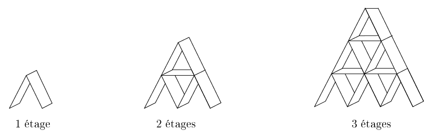
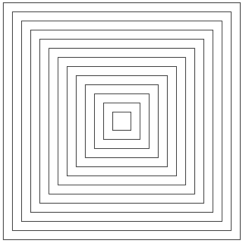
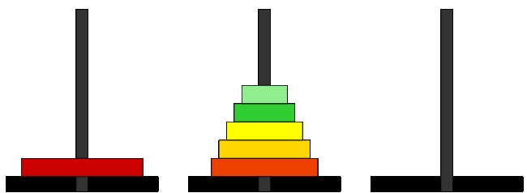




{{ titre_chapitre(num,niveau)}}

{{ citation("In order to understand recursion, one must first understand recursion.
","Anonyme")}}

## Cours

{{ affiche_cours(num) }}

## Travaux pratiques

!!! note
    Pour les exercices qui suivent, lorsque cela est possible (donc lorsqu'on ne traite pas de tableaux), on pourra proposer une implémentation en OCaml en s'inspirant des exemples vus en cours.

{{ exo("Somme des éléments d'un tableau",[],0)}}

1. Ecrire une fonction itérative `somme_iter` qui prend en argument un tableau d'entiers et sa taille  entier $n$ et renvoie la somme des élements de ce tableau.

2. On note $S(n)$ la somme des éléments du tableau jusqu'à l'indice $n$. Ecrire une relation de récurrence entre $S(n)$ et $S(n-1)$.

3. Donner une version récursive de la fonction `somme`.

4. Ecrire une fonction récursive terminale.

!!! aide
    Pour cet exercice, on pourra s'inspirer de la fonction `factorielle` vue en cours et dont on donne les différentes versions ci-dessous :
        ```C
        --8<-- "C5/fact.c:3:17"
        ```

{{ exo("Chateau de cartes",[]) }}

Un [château de cartes](https://fr.wikipedia.org/wiki/Ch%C3%A2teau_de_cartes){target=_blank} est un échafaudage de cartes à jouer. On a représenté ci-dessous des chateaux de cartes à 1, 2 et 3 étages (crédit : [DREAMaths](https://math.univ-lyon1.fr/dream/?page_id=2523){target=_blank}):



1. On note $c_n$ le nombre de cartes nécessaires pour construire un chateau de cartes à $n$ étages. Etablir une relation de récurrence entre $c_n$ et $c_{n-1}$.

2. Ecrire (dans le lange de votre choix) une fonction récurrente qui renvoie $c_n$ pour la valeur $n$ fournie en argument .

3. Calculer $c_{100}$ à l'aide de votre programme. Vous pouvez vérifier le résultat fourni par votre programme ci-dessous :  {{ check_reponse("15050") }}

4. Retrouver ce résultat par le calcul

{{ exo("Additions et soustractions",[]) }}
On suppose qu'on ne dispose que de deux opérations : ajouter 1 ou retrancher 1.

1. Écrire à l'aide de ces deux opérations, une version itérative de l'addition de deux entiers.
2. Même question avec une version récursive.

{{ exo("Maximum récursif",[]) }}

1. Ecrire une fonction `max2` qui prend en argument deux entiers et renvoie le maximum de ces deux entiers.

2. Ecrire une fonction récursive  `maximum` qui prend en argument un tableau d'entiers (et sa taille) et renvoie le maximum des éléments de ce tableau. 

{{ exo("Retourner une chaine de caractères",[])}}

1. Ecrire une fonction `retourne` qui prend en argument une chaine de caractère `s` et renvoie une chaine de caractères contenant `s` écrite à l'envers. Par exemple si `char test[]="Bonjour"`, alors `retourne(s)` renvoie la chaine `ruojnoB`.

2. On décompose une `chaine` en `chaine = debut + dernier caractère`, compléter la définition récursive suivante :
    `envers(chaine) = .......... + envers(.......)`

3. En déduire une version récursive de la fonction `envers`

    !!! Aide
        On pourra écrire au préalable une fonction `debut(chaine)` qui renvoie la chaine privée de son dernier caractère. 

{{ exo("Algorithme d'Euclide de calcul du pgcd",[]) }}
1. Revoir si besoin [l'algorithme d'Euclide](https://fr.wikipedia.org/wiki/Algorithme_d%27Euclide){target=_blank} permettant de calculer le {{sc("pgcd")}} de deux entiers.
3. Donner une implémentation itérative de cet algorithme
4. Donner une implémentation récursive de cet algorithme

{{ exo("Pair et impair",[]) }}

On définit les fonctions `pair` et `impair` de façon mutuellement récursive de la façon suivante :

* l'appel `pair(0)` renvoie `true` et l'appel `pair(n)` renvoie `impair(n-1)` pour `n > 0`
* l'appel `impair(0)` renvoie `false` et l'appel `impair(n)` renvoie `pair(n-1)` pour `n>0`

1. Donner une implémentation en C de ces deux fonctions.

1. Donner une implémentation en OCaml de ces deux fonctions.

{{ exo("Mélange de Fisher-Yates",[])}}

Le [mélange de Fisher-Yates](https://fr.wikipedia.org/wiki/M%C3%A9lange_de_Fisher-Yates){target=_blank} est un algorithme permettant de générer une permutation aléatoire d'un tableau à $n$ éléments. Il consiste à parcourir le tableau de la fin vers le début, en échangeant l'élément aléatoirement avec un de ceux qui le précède. C'est à dire que pour l'indice $i$ variant de $n-1$ à 1 on échange `tab[i]` avec `tab[j]` où $j$ est choisi aléatoirement entre $0$ et $i$.

1. Proposer une version itérative de cet algorithme

2. Proposer une version récursive de cet algorithme

    !!! aide
        On pourra passer en argument en plus du tableau l'indice $i$.

{{ exo("Dessin récursif",[]) }}

!!! warning "Attention"
    L'exercice suivant utilise le module `turtle` déjà rencontré [dans cet exercice](http://fabricenativel.github.io/cpge-info/mp2i/pointeurs/#exercice-14-compilation-separee) du chapitre pointeurs et type structuré.

1. Dessiner une suite de carrés imbriqués tel que représenté ci-dessous (l'image est de dimension 400x400, le carré initial mesure 300 pixels de côté et la taille diminue ensuite de 30 pixels à chaque carré)  
{.imgcentre width=400px}

2. Si vous aviez donné une version itérative de ce dessin, en faire une version récursive et inversement.

{{ exo("Comparaison de deux chaines de caractères",[]) }}

1. Ecrire de façon itérative, une fonction `compare(chaine1,chaine2)` qui renvoie le nombre de fois où `chaine1`  et `chaine2` ont le même caractère au même emplacement. A titre d'exemples : 

    * `compare("recursif","iteratif")` renvoie 2, 
    * `compare("Python","Javascript")` renvoie 0. 

2. Écrire cette même fonction de façon récursive.

{{ exo("Retour sur l'exponentiation rapide",[])}}

1. Rappeler l'algorithme d'exponentiation rapide vue en cours

2. En proposer une implémentation (récursive) dans le langage de votre choix

3. On s'intéresse maintenant à une implémentation itérative de cet algorithme

    1. Soit $n \in \mathbb{n}$, on note $\overline{a_p\dots a_1a_0}^{2}$ son écriture en base 2. Pour tout réel $x$, donner l'expression de $x^n$ en fonction des $(a_k)_{0 \leq k \leq p}$

    2. Déduire de l'écriture précédente une implémentation itérative de l'exponentiation rapide.

{{ exo("Dessin du flocon de Von Koch",[]) }}

!!! warning "Attention"
    L'exercice suivant utilise le module `turtle` déjà rencontré [dans cet exercice](http://fabricenativel.github.io/cpge-info/mp2i/pointeurs/#exercice-14-compilation-separee) du chapitre pointeurs et type structuré.

La [courbe de Koch](https://fr.wikipedia.org/wiki/Flocon_de_Koch){target=_blank} est une figure qui se construit de manière récursive. Le cas de base d'ordre 0 et de longueur $l$ s'obtient en traçant un segment de longueur $l$ . Le cas récursif d'ordre $n>0$ s'obtient en traçant successivement quatre courbes d'ordre $n-1$ et de longueur $l/3$ de la façon suivante :

{.imgcentre width=400px}

1. A l'aide du module `turtle`, produire une image tel que ci-dessous qui représente la courbe de Koch d'ordre 5. Le résultat produit ci-dessus a été obtenu grâce à l'appel `koch(600,5)` (la largeur de l'image est de 500px et sa hauteur 300)
{.imgcentre width=500px}

2. En utilisant cette fonction construire le flocon de Koch, c'est à dire la figure obtenu en construisant les courbe de Koch sur les trois côtés d'un triangle équilatéral.

{{ exo("Tours de Hanoi",[])}}

Inventé par le mathématicien français [Edouard Lucas](https://fr.wikipedia.org/wiki/%C3%89douard_Lucas){target=_blank},  [les tours de Hanoï](https://fr.wikipedia.org/wiki/Tours_de_Hano%C3%AF){target=_blank} sont un jeu de réflexion dans lequel on doit déplacer des disques de tailles croissantes d'une tour de départ à une tour d'arrivée en respectant les contraintes suivantes : 

* on ne peut déplacer qu'un disque à la fois, celui situé en haut de la tour
* on ne peut jamais déplacer un disque sur un disque plus petit.

Le but de l'exercice est de résoudre par récursivité le problème des déplacements des $n$ disques de la tour de départ à la tour d'arrivée.

1. Faire quelques parties en ligne à [cette adresse](http://championmath.free.fr/tourhanoi.htm){target=_blank} pour comprendre le jeu.

2. Résolution automatique par récursivité
    1. Compléter la description de chacune des étapes de la résolution du problème pour 6 disques illustrées ci-dessous :

    |Etape | Illustration | Descriptions |
    |------|--------------|--------------|
    |:zero:|| 6 disques empilés sur la tour 1|
    |:one:|| Déplacement de ... disques de la tour 1 vers la tour ....|
    |:two:|| Déplacement du disque de la tour ... vers la tour ...|
    |:three:|| Déplacement de ... disques de la tour 1 vers la tour ....|

    2. Exprimer les étapes :one: et :three: sous la forme de la résolution d'un problème de tours de Hanoi dont on précisera la tour d'arrivée, la tour de départ ainsi que le nombre de disque.
    3. Compléter :

        > Pour résoudre `hanoi` à 6 disques :<br>
        :octicons-triangle-right-16: Résoudre hanoi à ... disques <br>
        :octicons-triangle-right-16: Déplacer le disque de taille 6<br>
        :octicons-triangle-right-16: Résoudre hanoi à ... disques <br>


    3. En déduire un algorithme récursif pour résoudre le problème des tours de Hanoï.
    4. Coder et faire fonctionner cet algorithme, on affichera les déplacements sous la forme de `printf` dans le terminal en précisant les tours d'arrivée et de départ.

{{ exo("Tri fusion",[] )}}
L'algorithme du **tri fusion** consiste à :  

* partager le tableau à trier en deux moitiés (à une unité près), 
* trier chacune des deux moitiés, 
* les fusionner pour obtenir la liste triée. 

On a schématisé le tri du tableau `{10,6,3,9,7,5}` suivant ce principe ci-dessous :


Le tri des deux moitiés est lui-même effectué par tri fusion, cet algorithme est donc récursif. Le but de l'exercice est d'implémenter cet algorithme en C.

1. Ecrire une affiche `affiche` qui prend en argument un tableau d'entiers et sa taille, ne renvoie rien et affiche les éléments de ce tableau dans le terminal.

2. Ecrire une fonction `partage` qui prend en argument un tableau d'entiers `tab`, deux entiers `size1` et `size2`, et deux tableaux d'entiers `moitie1`, `moitie2` et qui modifie `moitie1` et `moitie2` afin que `moitie1` contienne les éléments de `tab` d'indice `0..size1` et `moitie2` ceux d'indice `size1+1...size1+size2`. Par exemple si `tab` contient `{10,6,3,9,7,5}` alors après l'appel `partage(tab,moitie1,3,moitie2,3)`, `moitie1` contiendra `{10,6,3}` et `moitie2` contiendra `{9,7,5}`.

3. Ecrire une fonction `fusion` qui prend en argument deux tableaux supposés triés (et leur taille) et renvoie le tableau trié issu de leur fusion. Par exemple si `tab1 ={3,6,10}` et `tab2={5,7,9}` alors `fusion(tab1,3,tab2,3)` renvoie le tableau `{3,5,6,7,9,10}`.

4. Programmer l'algorithme du tri fusion.

    !!! warning "Attention"
        Penser à vérifier l'absence de fuites mémoires.

## Humour d'informaticien
Le moteur de recherche [Google](https://www.google.com/){target=_blank} est connu pour abriter de nombreux *easter eggs*. Si vous taper comme recherche le mot **recursion**, on vous enverra vers la recherche de **recursion** ...

{.imgcentre width=500px}