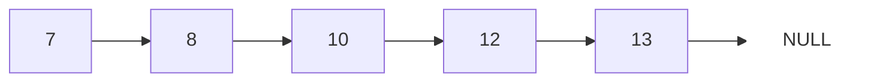




{{ titre_chapitre(num,niveau)}}

{{ citation("Smart data structures and dumb code works a lot better than the other way around.","Eric Raymond","[in The Cathedral and the Bazaar, 1999](https://en.wikipedia.org/wiki/The_Cathedral_and_the_Bazaar){target=_blank}")}}

## Cours

{{ affiche_cours(num) }}

## Travaux dirigés

{{ td(num) }}

## Travaux pratiques


{{ exo("Listes chainées en C",[],0)}}

On reprend l'implémentation vue en cours pour les listes simplement chaînées en C :
```c
        --8<-- "C8/liste_chainee.c:7:13"
```
On définit donc ici une liste comme un pointeur vers le maillon de tête, ainsi une liste vide correspond au pointeur `NULL`.

1. Ecrire les fonctions suivante :

    1. `cree_liste` de signature `#!c liste cree_liste()` qui renvoie la liste vide.
    2. `affiche` de signature `#!c affiche(liste l)` qui affiche les éléments de la liste `l`.
    3. `ajoute` de signature `#!c void ajoute(liste *l, int val)` qui ajoute en tête de liste la valeur `val`.
        
        !!! aide
            * On notera bien que cela modifie la liste passée en paramètre et que donc on utilise un pointeur vers cette liste.
            * Comme souvent, lorsqu'on programme en utilisant les listes chainées, le crayon et le papier sont ici des alliés de poids. On recommande vivement de schématiser rapidement les opérations effectuées par `ajoute` (voir cours).
            

    4. `supprime` de signature `#!c supprime(list *l)` qui supprime l'élément situé en tête de la liste.
    5. `detruit` qui libère entièrement l'espace mémoire alloué aux maillons d'une liste.

2. Tester vos fonctions en créant puis en affichant la liste des 10 premiers entiers

3. Implémenter d'autres fonctions sur votre structure de données (taille, accès au n-ième élément, somme des éléments, $\dots$).

4. Vérifier l'absence de fuites mémoires.

5. Reprendre cette exercice en créant un type de liste **doublement** chaînées (vers le suivant et vers le précédent) appelé  *deque* (pour *d*ouble *e*nded *que*ue) dans lequel on conserve un accès vers la tête de la liste (afin de pouvoir ajouter ou retirer un élément "à gauche" comme dans une liste chainée "traditionnelle") mais aussi un accès vers le dernier élément de la liste afin de pouvoir ajouter ou retirer un élément "à droite" de la liste en temps constant.

{{exo("Implémentation avec maillon fantôme",[])}}

Une implémentation alternative des listes chainées consiste à utiliser un maillon de tête *toujours vide*, on parle alors de *maillon fantôme* ou *maillon sentinelle* (*dummy head* en anglais). Par rapport à l'implémentation vue en cours (et traité dans l'exercice précédent), on n'a plus besoin de traiter le cas particulier de la liste vide dans les fonctions (une liste n'est jamais `NULL`, elle possède au moins le *maillon fantôme*). Le passage d'un pointeur sur un pointeur de maillon (même si cela a été masqué avec le type `list` dans l'implémentation précédente) n'est plus utilisé, cette implémentation est donc parfois considérée comme plus facile.

On a représenté ci-dessous la liste contenant les valeurs `5, 7, 4` avec cette implémentation, la valeur du maillon fantôme n'étant pas utilisée, on l'a représenté avec `@`.

<div class="centre">

</div>

Pour mettre en oeuvre cette implémentation, on propose le type structuré suivant :
```c
--8<-- "C8/fantome.c:struct"
```

!!! note
    Remarquez bien la différence avec l'implémentation précédente, une liste est maintenant *un maillon* et non plus *un pointeur vers un maillon*.

1. Ecrire la fonction de signature `list make_list()` qui renvoie une liste vide.

2. Ecrire la fonction de signature `void add(list *l, int v)` qui ajoute une valeur `v` en tête de liste (donc *après* le maillon fantome)

3. Ecrire la fonction de signature `void view(list l)` permettant d'afficher une liste puis tester votre implémentation.

4. Ecrire la fonction de signature `int del(list *l)` qui supprime le maillon suivant le maillon fantome et renvoie sa valeur.

5. On propose maintenant d'utiliser le maillon de tête afin d'y stocker la taille de la liste. Modifier en conséquence les fonctions précédentes et écrire la fonction de signature `int size(list l)` qui renvoie le nombre d'éléments de la liste.


{{exo("Des listes d'entiers en OCaml",[])}}

En OCaml, on considère le type somme suivant afin de représenter  des listes d'entiers :

```ocaml
    --8<-- "C8/intlist.ml:1:3"
```
C'est à dire qu'une liste d'entier est soit vide, soit formé d'un couple `(tete, queue)` où `tete` est un entier et `queue` une liste d'entiers.

1. Ecrire une fonction `ajoute : int -> intlist -> intlist` qui ajoute un entier en tête d'une `intlist`.

2. Ecrire une fonction `aleatoire : int -> int -> int -> intlist` qui prend en argument trois entiers `n`, `vmin` et `vmax` et renvoie une `intlist` de `n` entiers compris entre `vmin` et `vmax`.

3. Ecrire une fonction `affiche : intlist -> unit` qui affiche les éléments d'une `intlist` 

4. Ecrire une fonction `longueur : intlist -> int` qui renvoie le nombre d'élements d'une `intlist`

5. Ecrire une fonction `enleve : intlist -> intlist` qui supprime le premier élément d'une `intlist`, on traitera le cas de la liste vide avec un `failwith`

6. Ecrire une fonction `partitionne : intlist -> (int -> bool) -> int list * intlist` qui partitionne une `intlist` suivant le prédicat fourni en argument.

{{exo("Une implémentation des listes de Python en C",[])}}

Le but de l'exercice est d'écrire une implémentation en C des *list* de Python et des fonctions associés (*append* et *pop*), on utilisera pour cela le type structuré suivant :

```c
    --8<-- "C8/list.c:3:10"
```

où le champ `current_size` contient la taille actuelle de la liste et le champ `array` est un tableau de longueur `max_size` (supérieur ou égal à `current_size`) contenant les éléments de la liste.

1. Ecrire la fonction de création d'une liste en donnant sa taille et une valeur d'initialisation. La signature de cette fonction est donnée ci-dessous :

    ```c
        --8<-- "C8/list.c:13:13"
    ```

    On initialisera la valeur de la taille maximale à la taille courante.

2. Ecrire une fonction d'affichage pour une liste, on pourra prévoir d'afficher en même temps la taille courante et la taille maximale du tableau. La signature de cette fonction est :

    ```c
        --8<-- "C8/list.c:31:31"
    ```

    Un exemple d'affichage est donné ci-dessous :
    ```
    Contenu = [10, 10, 10, 10, 10, 11 ]
    Taille actuelle : 7
    Taille maxi : 10
    ```

3. Ecrire une fonction *append* d'ajout d'un élément à une liste de signature :

    ```c
        --8<-- "C8/list.c:44:44"
    ```

    On remarquera que comme en Python, notre fonction ne renvoie rien mais modifie la liste passé en argument (et que donc on doit passer un pointeur vers elle)

    !!! aide
        On devra distinguer deux cas :

        * si  `current_size < max_size` : on peut ajouter au tableau sans le redimensionner
        * sinon, on doit **doubler** la taille du tableau et recopier les éléments présents dans l'ancien tableau

4. Ecrire une fonction *pop* qui supprime l'élément en fin de liste et le renvoie. La signature sera :

     ```c
        --8<-- "C8/list.c:66:66"
    ```

    Là aussi, puisque la liste est modifiée (sa taille diminue), on doit passer un pointeur.

5. On pourra poursuivre cet exercice en implémentant d'autres [fonctions](https://docs.python.org/3/tutorial/datastructures.html){target=_blank} du type *list* de Python.

{{ exo("Tableaux dynamiques en C",[])}}

Le but est de l'exercice est d'implémenter un type *Vector* de tableaux redimensionnables en C. On utilise le type structuré suivant :
    ```c
        --8<-- "C8/vector.c:4:9"
    ```

1. Ecrire les fonctions suivantes :

    1. Une fonction `create` de signature `#!c vector create(int size, int value)` qui renvoie un objet de type `vector` dont les `size` éléments du tableau sont initialisés à `value`  et dont le champ `max_size` vaut aussi `size` et le champ `default_value` à `value`.

    2. Ecrire une fonction `display` de signature `#!c void display(vector v)` qui affiche les éléments d'un objet de type `vector`. Cette affichage pourra aussi indiquer les tailles actuelles (`current_size`) et maximales (`max_size`).

    3. Ecrire une fonction `get_element` de signature `#!c int get_element(vector v, int index)` qui renvoie l'élément du tableau situé à l'indice `index` dans le tableau. On vérifiera à l'aide d'un `assert` que `index` $\leq$ `current_size`.

    4. Ecrire une fonction `set_element` de signature `#!c void set_element(vector v, int index, int value)` qui affecte à l'élément situé à l'indice `index` dans le tableau la valeur `value`.

    5. Ecrire une fonction `resize` de signature `#!c void resize(vector *v, int new_size)` qui redimensionne le `v`. Dans le cas où la nouvelle taille est supérieure à l'ancienne, les nouveaux éléments seront initialisés à `default_value`.

    6. Ecrire une fonction `destroy` permettant de libérer l'espace mémoire occupée par l'objet `vector` donné en argument.

2. En revoyant si besoin le [cours sur la compilation séparée](https://fabricenativel.github.io/cpge-info/mp2i/pointeurs/#cours) écrire les fichiers `vector.h` et `vector.c` permettant de compiler séparément les fonctions ci-dessus afin de les utiliser dans un autre programme.


{{ exo("Implémentations de piles",[])}}
 
 1. En C (mutable), implémenter la structure de données pile au choix à l'aide d'une liste chaînée ou d'un tableau (voir cours). On écrira les fichiers `pile.h` et `pile.c` de façon à disposer de cette structure de donnée pour la suite.

 2. En Ocaml (non mutable) : implémenter la structure de données pile à l'aide du type `list` de OCaml, on rappelle que ce type étant non mutable,  `empiler` doit renvoyer une nouvelle pile et `depiler` doit renvoyer un couple (le sommet de la pile et la nouvelle pile)

{{ exo("Implémentations de files en C",[])}}

1. Réaliser en C l'implémentation d'une file à l'aide d'une liste chaînée en utilisant deux pointeurs l'un vers le premier maillon de la liste et le second vers le dernier maillon

    !!! aide
        On fera bien attention aux cas particuliers des files contenant moins de deux éléments dans lesquels les deux pointeurs sont identiques

2. Réaliser en C l'implémentation d'une file de taille maximale connue $n$ à l'aide d'un tableau circulaire de taille $n$ (voir cours)


{{exo("File de priorité",[])}}

Une file de priorité est une structure de données dans laquelle chaque élément est enfilé *avec une priorité*, lorsqu'on veut défiler un élément c'est celui ayant la plus faible priorité qui est extrait. Une implémentation efficace de cette structure de données sera vu plus loin dans le cours, on propose ici de réaliser une implémentation utilisant une liste chainée d'entiers (représentant les priorités) que l'on garde *triée* ainsi le prochain élément à défiler se trouve toujours en tête de la liste. L'insertion doit maintenir la liste triée. 

Par exemple, après insertion des valeurs `12, 7, 13, 8 , 10`, la liste sera :

<div class="centre">

</div>
Si on défile un élément c'est celui figurant en tête de liste (donc `7` dans l'exemple) qui sera extrait.

On utilisera le type structuré déjà rencontré en cours :
```c
    --8<-- "C8/fprio.c:struct"
```

1. Quelle sera la complexité des opérations enfiler et défiler ?

2. Ecrire la fonction de signature `enfiler(list* l, int p)` qui enfile l'élément de priorité `p` dans la liste `l`.

    !!! aide
        On rappelle que cette se fait *en supposant la liste triée* et qu'elle doit la maintenir triée. Comme toujours lorsqu'on utilise une liste chainée, on recommande vivement de schématiser avant de passer à la programmation. Pour l'opération `enfiler` on pourra distinguer les deux cas suivants :

        * l'insertion s'effectue en tête de liste, cela se produit dans les deux cas suivants : la liste est vide ou alors la priorité du maillon de tête est supéreure à celle de l'élément à inséser,
        * l'insertion s'effectue après le maillon de tête.

3. Ecrire la fonction permettant de défiler un élément et tester votre implémentation.

4. Ecrire la fonction de signature `void detruit(fprio *f)` qui supprime une file de priorité en libérant l'espace mémoire allouée lors de sa construction.

5. On donne ci-dessous un fichier simulant l'arrivée et la prise en charge de patients dans un hopital, chaque patient a une priorité de traitement unique permettant de l'identifier. L'arrivée du patient de priorité `x` est indiqué dans le fichier par la ligne `+ x`. La prise en charge d'un patient est indiqué par une ligne `-`. Par exemple les lignes :
```
+ 42
+ 12
-
+ 7
```
Signifient que les patients 42, 12 et 7 sont arrivés dans cet ordre, une seule prise en charge à eu lieu : celle du patient de priorité 12 (il était au moment de la prise en charge le plus prioritaire). On précise que ce fichier contient un total de **1000** opérations (arrivées et prise en charge).
{{telecharger("Patients","./files/C8/patients.txt")}}
En utilisant la file de priorité implémentée aux questions précédentes, déterminer au terme des 1000 opérations indiquées dans le fichier la liste des patients qui a été prise en charge. Vérifier votre réponse en entrant la liste des priorités des patients (dans leur ordre de prise en charge et séparé par des virgules) dans le cadre suivant : {{check_reponse("2,5,8,0,3,7,9,10,11,1")}}


{{ exo("Implémentation d'une file avec deux piles",[]) }}
On considère la file suivante  :
{: .imgcentre}
On peut aussi la schématiser  sous la forme de deux piles :
{: .imgcentre}
Pour comprendre ce fonctionnement, on part d'une file vide et on montre par quelques exemples l'état de la file et des deux piles qui la représente : 

| Etape | Opération | Etat de la file | Pile d'entrée | Pile de sortie |
|-------|-----------|-----------------|---------------|----------------|
|:one:  | Enfiler `a` |  `>a>` |  `|a>` | `|>`  
:two: | Enfiler `b` | `>b,a>` |`|a,b>` |`|>`  
:three: |Enfiler `c` | `>c,b,a>` |`|a,b,c>` |`|>`  
:four: |Défiler (`a`) |`>c,b>`  |`|>` |`|c,b>` 
:five: |Défiler (`b`) |`>c>`  |`|>` |`|c>` 
:six: |Enfiler `d` |`>d,c>` |`|d>` | `|c>` 


!!! Aide
    Observer attentivement ce qui se passe à l'étape :four: : la pile de sortie étant vide, la *totalité* de la pile d'entrée est dépilé dans la pile de sortie.


1. Compléter le tableau ci-dessous avec les étapes suivantes :

    1.  Défiler 
    2.  Enfiler `e`
    3.  Défiler
    
2. Mettre par écrit le principe de l'implémentation d'une file avec deux piles (une pile d'entrée et une pile de sortie), on indiquera précisément :
    * l'effet d'enfiler un élément sur chacune des deux piles
    * l'effet de défiler sur chacune des deux piles (en distinguant les deux cas)

3. Ecrire en OCaml une implémentation d'une file sous la forme de deux piles (structure non mutable).

4. Tester votre implémentation (reprendre éventuellement les opérations :one: à :six: en faisant afficher l'état de la file et des deux piles à chaque étape). 

    !!! Lien "Pour aller plus loin"
        Rechercher la complexité des opérations de cette implémentation.

{{ exo("Expression bien parenthésée",[]) }}
On considère dans cet exercice un parenthésage avec les couples $(\;), [\;]$ et $\{\;\}$. On dit qu'une expression est bien parenthésée lorsque chaque symbole ouvrant est associé à un unique symbole fermant et si l'expression contenue à l'intérieur est elle-même bien parenthésée. Par exemple, on a souligné dans l'expression suivante le problème de parenthésage : 
$(3+2)\textcolor{red}{\underline{]}}-(4+1)$

1. Les expressions suivantes sont-elles bien parenthésées ? Sinon, indiquer l'emplacement dans la chaîne de caractères où l'erreur est détectée.
    1. $3+\left.\left[5-4\div(3+2)\right]\right]+10$
    2. $\left\{(3+2)\times 5\right.$ 
    3. $5)-4\times2($ 
    4. $\left\{(3+2)\times(5-3)\right\}$

2. Ecrire une fonction `bien_parenthesee` qui prend en argument une expression (sous la forme d'une chaine de caractères) et qui renvoie $-1$ lorsque l'expression est bien parenthésée et sinon un entier indiquant l'emplacement dans l'expression où l'erreur de parenthésage est détectée.

    !!! Aide
        On pourra, parcourir l'expression et utiliser une pile qui stocke les indices de chaque parenthèses ouvrante. On dépile, lorsqu'on rencontre une parenthèse fermante.

3. Tester votre fonction sur les expressions de la question **1.**
4. Utiliser cette fonction afin de produire un affichage de l'erreur  avec un caractère `^` en dessous de l'erreur. Par exemple  : $(2+3)\underset{\textcolor{red}{\wedge}}{)}-5$

{{ exo("Evaluation d'une expression en notation polonaise inverse",[])}}

La *notation polonaise inverse* ({{sc("npi")}}) est une méthode d'écriture des expressions mathématiques qui n'utilise pas de parenthèses et qui de plus se calcule sans règles de priorité. Prenons un exemple, l'expression $(3+7)\times5$, s'écrit en notation polonaise inversée : $3\ 7\ + 5 \times$. c'est-à-dire qu'on donne d'abord les deux opérandes puis l'opération. Pour d'autres exemples on pourra consulter : [la page wikipedia dédiée](https://fr.wikipedia.org/wiki/Notation\_polonaise\_inverse){target=_blank} 

Le but de l'exercice est d'écrire une fonction  évaluant une expression en {{sc("npi")}} passée en paramètre à l'aide d'une pile :

* Parcourir l'expression de gauche à droite
* Si on rencontre un nombre l'empiler
* Si on rencontre une opération effectuer cette opération entre les deux valeurs situés au dessus de la pile et empiler le résultat

On représente ci-dessous l'état de la pile pour l'évaluation de $3\ 7\ + 5\ \times$ :
<table><tr>
<td style="vertical-align:bottom">{{pile([3])}}</td> 
<td style="vertical-align:bottom">{{pile([3,7])}}</td>
<td style="vertical-align:bottom">{{pile([10])}}</td>
<td style="vertical-align:bottom">{{pile([10,5])}}</td>
<td style="vertical-align:bottom">{{pile([50])}}</td>
</tr></table>

Mettre en oeuvre cette méthode et la tester.

{{ exo("Mot mystère",[]) }}

Vous pouvez télécharger ci-dessous un fichier contenant $10\,000$ caractères. Le but de l'exercice est de trouver une stratégie efficace afin de découvrir le mot caché qui s'y trouve. Pour cela, à chaque fois que deux lettres identiques se suivent, on doit les supprimer. Cela peut entrainer l'apparition de nouveau caractères identiques qui se suivent et donc offrir de nouvelles possibilités de suppression. Par exemple, avec la chaine de départ "ASSAMPOZZOPPI" on peut supprimer les deux S au début ce qui donne "AAMPOZZOPPI", puis "MPOZZOPPI", puis, "MPOOPPI" et enfin "MPI".


{{telecharger("Mot mystère","./files/C8/mystere.txt")}}

Vous pouvez tester votre réponse (en lettres majuscules) dans le formulaire suivant : {{ check_reponse("CONCOURS")}}

!!! aide
    Il faut choisir une structure de données adaptée !

{{ exo("Problème de Joseph",[]) }}


<div class="centre"><iframe width="560" height="315" src="https://www.youtube.com/embed/uCsD3ZGzMgE" title="YouTube video player" frameborder="0" allow="accelerometer; autoplay; clipboard-write; encrypted-media; gyroscope; picture-in-picture" allowfullscreen></iframe></div>

Le but de l'exercice est d'écrire un programme permettant de résoudre le [problème de Joseph](https://fr.wikipedia.org/wiki/Probl%C3%A8me_de_Jos%C3%A8phe){target=_blank} en *simulant* le déroulement des éliminations successives.

On représente un cercle de $n$ soldats par la suite de valeurs `1,2,..,n` et on décide que le soldat situé en premier dans la liste est celui qui tient l'épée. Ainsi en utilisant cette façon de représenter le problème, dans un cercle de 5 soldats le procédé décrit donne :

*  `1, 2, 3, 4, 5` : position initiale
*  `3, 4, 5, 1` (1 a éliminé 2 et transmis l'épée à 3)
*  `5, 1, 3` 
*  `3, 5`
*  `3`

---

1. Proposer une structure de données adaptée à la résolution de ce problème (on veut que les opérations à effectuer sur cette structure de donnée soient en $O(1)$).

2. En donner une implémentation en C et l'utiliser afin de résoudre ce problème.

3. Quel est le soldat survivant dans un cercle d'un million de soldats ?
   Vous pouvez tester votre réponse ci-dessous {{check_reponse("951425")}} (où alors avec la réponse mathématique au problème).

{{ exo("Un étrange clavier",[]) }}

Un ordinateur est doté d'un étrange clavier sur lequel ne figure que les lettres (majuscules ou minuscules) et le `0`. Lorsqu'on tape une lettre elle apparaît sur la ligne du terminal à l'écran, mais cette ligne est limité à 10 caractères et donc continuer à taper des lettres alors  qu'il y a en déjà  10 affichées est sans effet. Enfin, le `0` permet d'effacer la première lettre à gauche.

Par exemple, supposons qu'on tape dans l'ordre la suite de caractères suivantes : `ZUP0M0P0I` alors on obtient successivement à l'écran `Z`, `ZU`, `ZUP`, `UP`, `UPM`, `PM`, `PMP`, `MP` et enfin `MPI`.

Prenons un autre exemple : si on tape la suite de caractères `ABCDEFGHIJKLMNOPQRSTUVWXYZ` alors seuls les 10 premiers apparaitront à l'écran et on obtiendra `ABCDEFGHIJ`

Quel sera donc le mot affiché à l'écran si on tape la suite de caractères donnée dans le fichier ci-dessous :
{{ telecharger("Touches tapées","./files/C8/touches.txt")}}

!!! aide
    On fera bien évidemment attention à utiliser une structure de donnée **adaptée** pour résoudre ce problème.

Tester votre réponse  : {{ check_reponse("Magnifique") }}

## Humour d'informaticien
{.imgcentre width=500px}