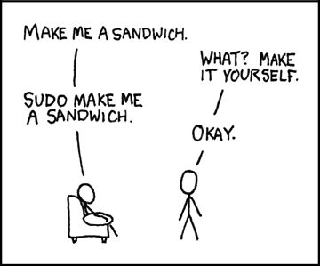




{{ titre_chapitre(num,niveau)}}

{{ citation("I'm doing a (free) operating system (just a hobby, won't be big and
  professional like gnu) (...)","Linus Torvalds","[comp.os.minix newsgroup 1991](https://groups.google.com/group/comp.os.minix/msg/b813d52cbc5a044b)")}}
## Cours

{{ affiche_cours(num) }}

## Travaux dirigés

{{ td(num) }}

## Travaux pratiques

{{ exo("Les bases de la ligne de commande",[],0) }}
1. En utilisant uniquement la ligne de commande, créer l'arborescence suivante dans votre répertoire personnel :
        ```mermaid
            graph TD
            A[MP2I] --> B[C1-Systèmes]
            A[MP2I] --> G[C2-OCaml]
            A[MP2I] --> F[C3-Arithmétique]
            B --> C[Cours]
            B --> D[TD]
            B --> E[TP]
        ```
2. Renommer le dossier `C2-OCaml` en `C2-LangageC`
3. Aller dans le dossier `MP2I`
4. Taper la commande `tree`, quel est l'effet de cette commande ?
5. Quelle option de la commande `tree` permet de limiter le niveau d’arborescence souhaité ?

{{exo("Calendrier",[])}}

1. Ouvrir un terminal et y tester la commande `cal`
2. Lire la documentation de cette commande
3. Quel était le jour de la semaine le 26 juin 1815 ?
4. Quelle commande faut-il écrire pour afficher le calendrier du mois de mai 1970 ?

{{ exo("Chercher des fichiers",[] )}}

1. Lire les premières lignes de la documentation de la commande `find`. A quoi sert cette commande ?
2. Tester la commande `find ~ -name ".*"`. Expliquer le résultat obtenu et l'effet de la commande.

    !!! Aide 
        On rappelle que `~` désigne votre répertoire personnel.
         

3. Sachant que les commandes du système se trouvent dans le répertoire `/usr/bin`, lister toutes les commandes dont le nom se termine par `dir` (`rmdir` et `mkdir` devraient donc apparaître).

4. Alice est certaine d'avoir un fichier nommé `bob.txt` dans son répertoire personnel mais elle n'arrive plus à le retrouver. Quelle commande devrait-elle taper ?

5. Expliquer le but de la commande `find ~ -mtime 5 -name "*.txt"`

{{ exo("Droits d'accès et permissions", []) }}

1. Créer un fichier nommé `bonjour.sh` dans votre répertoire personnel et y écrire la ligne `echo "Bonjour MP2I !"` à l'aide de la redirection `>`.
2. Tenter d'exécuter ce script en tapant `./bonjour.sh`. Quel message d'erreur s'affiche ? Pourquoi ?
3. Afficher les droits actuels du fichier à l'aide de la commande `ls -l bonjour.sh`.
4. À l'aide de la commande `chmod`, ajouter le droit d'exécution pour l'utilisateur propriétaire sur ce fichier.
5. Réexécuter `./bonjour.sh`. Que constate-t-on ?
6. Retirer maintenant le droit de lecture sur ce fichier (`chmod u-r bonjour.sh`), puis tenter d'afficher son contenu avec `cat bonjour.sh`. Quel message obtient-on ? Rétablir ensuite les droits normaux (tous les droits pour l'utilisateur et lecture et exécution pour le groupe et les autres) en utilisant la notation octale.

{{ exo("Flux standards, redirections et tubes", []) }}

1. **Redirection vers un fichier :**
    * Taper la commande `ls /usr/bin > commandes.txt`. Quel est l'effet de cette commande ?
    * Vérifier le contenu du fichier créé avec `head commandes.txt` puis `tail commandes.txt`.
    * Combien de commandes sont installées dans `/usr/bin` ? *(Indice : utiliser la commande `wc`)*.

2. **Filtrage et composition (*pipe*) :**
    * Sans créer de fichier intermédiaire, écrire une seule ligne de commande utilisant un tube `|` pour compter directement le nombre de commandes dans `/usr/bin`.
    * Lister toutes les commandes de `/usr/bin` contenant le mot `zip` et les trier par ordre alphabétique (utiliser la commande `sort`).

3. **Séparation des erreurs :**
    * Exécuter la commande `ls /home /dossier_fantome > sortie.txt 2> erreurs.log`.
    * Examiner le contenu respectif de `sortie.txt` et `erreurs.log` à l'aide de la commande `cat`. Que remarque-t-on ?

{{ exo("Liens physiques vs Liens symboliques", []) }}

1. Créer un fichier `original.txt` contenant le texte `Données initiales`.
2. Créer un lien physique nommé `lien_dur.txt` pointant vers `original.txt`.
3. Créer un lien symbolique nommé `lien_symb.txt` pointant vers `original.txt`.
4. Taper `ls -l -i lien* original.txt` et observer attentivement la sortie :
    * Comparer les numéros d'inodes (première colonne) de `original.txt` et `lien_dur.txt`.
    * Que vaut le compteur de liens (colonne entre les droits et l'utilisateur) pour `original.txt` ?
5. Modifier le contenu de `original.txt` en y ajoutant une ligne (`echo "Nouvelle ligne" >> original.txt`). Afficher ensuite le contenu de `lien_dur.txt` et `lien_symb.txt`.
6. Supprimer le fichier d'origine avec `rm original.txt` :
    * Que renvoie `cat lien_dur.txt` ?
    * Que renvoie `cat lien_symb.txt` ? Expliquer la différence observée.

{{exo("Un fichier contenant des entiers",[])}}

Télécharger et sauvegarder dans le répertoire de votre choix le fichier ci-dessous qui contient une liste d'entiers (un entier figure sur chaque ligne).
{{telecharger("Fichier d'entiers","./files/C0/entiers.txt")}}, puis en utilisant *uniquement la ligne de commande*, répondre aux questions suivantes :

1. Combien d'entiers ce fichier contient-il ? {{check_reponse("12487")}}
2. Quel entier figure à la 1942e position ? {{check_reponse("7856")}}
3. Dans ce fichier, combien de fois apparait l'entier 2129 ? {{check_reponse("3")}}
4. Quel est le plus grand entier présent dans le fichier ? {{check_reponse("9998")}}
    
    ??? aide "Indice"
        On pourra penser à utiliser la commande `sort`

5. Combien d'entiers dans ce fichiers s'écrivent avec exactement trois chiffres ? {{check_reponse("1133")}}

{{ exo("Gameshell",[]) }}

[Gameshell](https://github.com/phyver/GameShell){target=_blank} est un mini-jeu d'aventure dans le terminal dans lequel les commandes servent à accomplir des missions. Il a été développé par [Pierre Hyvernat](http://www.lama.univ-smb.fr/~hyvernat){target=_blank} et [Rodolphe Lepigre](https://lepigre.fr/){target=_blank}.

0. Lancer un terminal (le raccourci clavier est ++ctrl+alt+t++)
1. Créer un dossier `gameshell` dans votre répertoire personnel
2. Aller dans le répertoire `gameshell`
3. Y copier le fichier `gameshell.sh` téléchargeable ci-dessous :
    [Télécharger gameshell :fontawesome-solid-download:](./files/C0/gameshell.sh){.md-button}

    !!! note
        Depuis la ligne de commande, en l'absence de proxy (ce qui n'est pas le cas au lycée), on peut aussi taper :
        ```shell
        wget https://github.com/phyver/GameShell/releases/download/latest/gameshell.sh
        ```

4. Ajouter le droit d'exécution pour l'utilisateur sur le fichier `gameshell.sh`.
5. Dans le terminal taper `./gameshell.sh` 

    !!! retenir "A retenir"
        On retiendra que pour lancer un exécutable depuis le terminal, on donne son chemin. Ici puisqu'il se trouve dans le répertoire courant (c'est-à-dire <code><mark>.</mark></code>) on tape donc <code><mark>./</mark>gameshell.sh</code>


    !!! aide "Aide"
        Voici les principales commandes du jeu :

        * `gsh goal` : affiche l'objectif de la mission
        * `gsh check` : vérifie que l'objectif est atteint et le cas échéant passe à la mission suivante
        * `gsh reset` : réinitialise la mission en cours 
        * `gsh exit` : quitter le jeu

        Pour relancer le jeu à partir de la dernière sauvegarde taper `./gameshell-save.sh`

{{exo("The command line murders",[])}}

Dans ce [mini-jeu](https://github.com/veltman/clmystery){target=_blank} (créé par [Noah Veltman](http://noahveltman.com/){target=_blank}), vous devez résoudre une enquête policière en utilisant uniquement la ligne de commande. Pour jouer :

1. Commencer par [télécharger l'archive zip du jeu](./files/C0/clmystery-master.zip) 
2. Décompresser cette archive dans le répertoire de votre choix, et aller dans le répertoire `clmystery-master`
3. Taper `cat instructions` pour démarrer

!!! aide
    Toutes les commandes utiles pour résoudre l'enquête sont expliquées dans le fichier `cheatsheet.pdf` 


!!! lien
    En ligne (donc sans aucune installation sur son ordinateur personnel), on peut aussi jouer à [Terminus](http://luffah.xyz/bidules/Terminus/){target=_blank} pour découvrir la ligne de commande

## Humour d'informaticien

{.imgcentre width=500px}