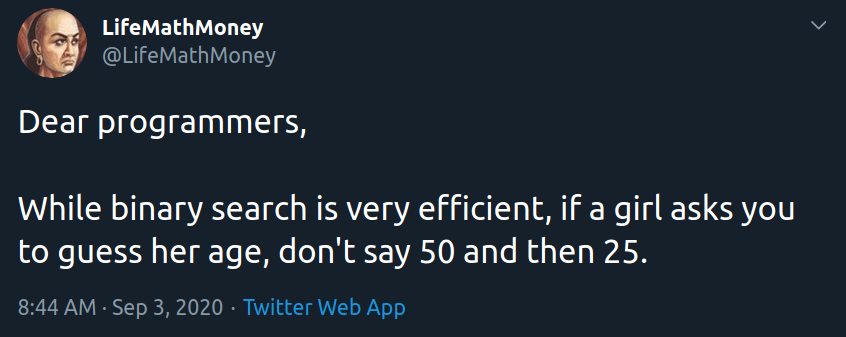




{{ titre_chapitre(num,niveau)}}

{{ citation("Beware of bugs in the above code; I have only proved it correct, not tried it.","Donald Knuth","[Correspondance avec van Emde Boas](https://cs.stanford.edu/~knuth/faq.html)")}}

## Cours
{{ affiche_cours(num) }}

## Travaux dirigés
{{ td(num) }}

## Travaux pratiques

!!! danger
    En cas de difficultés sur les exercices de programmation proposés dans ce chapitre, revenir sur ceux du chapitre précédent d'introduction à OCaml.

{{ exo("Compilation en OCaml",[],0)}}

1. Ecrire dans  `utop` une fonction récursive `somme_carres : int -> int` qui prend en entrée un entier `n` positif et renvoie la somme des carrés des entiers de 0 à `n` (on calculera récursivement sans utiliser la formule donnant le résultat général). Utiliser cette fonction afin de calculer la somme des carrés entiers de 1 à 2024.

2. On veut maintenant, écrire une version *compilée* de ce programme, recopier dans `VS Code` le code de la fonction `somme_carres`.
Le compilateur OCaml, est `ocamlopt`, comme avec `gcc`, on peut préciser le nom de l'exécutable crée avec l'option `-o`. 

    !!! aide
        Par exemple, pour compiler le programme `hello.ml` et produire l'exécutable `hello.exe`, on écrira simplement `ocamlopt hello.ml -o hello.exe`. 

    Afin que le programme compilé affiche la somme des carrés entiers de 1 à 2024, on ajoute en fin de programme `#!ocaml let () = print_int (somme_carres 2024); print_newline () ;;`. En effet, la dernière expression ne doit être qu'un simple affichage, écrire `let () = ...` permet de vérifier que l'évaluation de l'expression (un affichage) renvoie bien `()`.

{{ exo("Fonctions anonymes",[])}}

On peut définir en OCaml des fonction anonymes, à l'aide de la syntaxe `#!ocaml fun arg1 .. argn -> expr` par exemple l'expression `#!ocaml let c = (fun n -> n*n) 10;;` s'évalue à `100` car on applique la fonction (anonyme) $n \mapsto n^2$ à 10.

1. Ecrire une fonction `entiers` qui prend en argument un entier `n` et renvoie la liste des entiers de `n` à `1`. 

2. En utilisant une fonction anonyme et `List.map` transformer cette liste en celle des inverses des entiers

3. Calculer la somme des éléments de cette liste à l'aide d'un `List.fold`

{{ exo("Creation et affichage",[])}} 

1. Ecrire en OCaml une fonction `aleatoire` qui prend en argument un entier `n` et un entier  `vmin` et `vmax` et renvoie une liste de `n` valeurs entières comprises entres 0 et `vmax`

    !!! aide
        En OCaml la fonction `Random.int` renvoie un entier au hasard entre 0 (inclus) et la valeur entière donnée en argument (exclus).

2. Ecrire en OCaml une fonction `affiche` qui prend en argument une liste d'entiers et l'affiche à la façon de `utop`. Par exemple `affiche [2; 6; 7 ]` doit afficher dans le terminal `[2; 6; 7 ]`

{{ exo("Manipulations de listes",[])}}

1. Ecrire une fonction `pair_impair : int list -> int list * int list` qui prend en argument une liste d'entiers et renvoie la liste des éléments pairs et celle des éléments impairs. Par exemple `pair_impair [2; 7; 5; 4; 11; 8];;` renvoie `([2; 4; 8], [7; 5; 11])`

2. Ecrire une fonction `entrelace : 'a list -> 'a list -> 'a list` qui "entrelace" les deux listes données en argument en piochant alternativement un élément dans chacune des deux listes (jusqu'à ce que l'une des deux soit vide), par exemple `entrelace [1; 2; 3] [2; 6; 5];;` renvoie `[1; 2; 2; 6; 3; 5]`

3. Ecrire une fonction `compression : int list -> int list` qui prend en argument une liste et renvoie cette liste dans laquelle les éléments consécutifs égaux ont été supprimés. Par exemple `compression [2; 2; 2; 1; 1; 2; 2; 2; 2]` renvoie `[2, 1, 2]`.

    

{{ exo("Tri par insertion en OCaml",[])}}

1. Ecrire en OCaml une fonction `insertion` qui prend en argument un entier `n` et une liste *triée* d'entiers `entiers` et renvoie la liste dans laquelle `n` a été inséré à la bonne position dans `entiers`. Par exemple `insertion 3 [2; 7; 8 ]` doit renvoyer `|2; 3; 7; 8]`

2. En déduire une fonction `tri_insertion` qui prend en argument une liste d'entiers et renvoie cette liste triée en utilisant l'algorithme du tri par insertion.

3. Tester en utilisant les fonctions de l'exercice **1**.

{{ exo("Tri par sélection en OCaml",[])}}

1. Ecrire en OCaml une fonction `min_reste` qui prend en argument une liste `entiers` et renvoie un couple composé du minimum de la liste `entiers` et de la liste `entiers` privé d'*une* seule occurrence du minimum. Par exemple : 
    * `min_reste [6; 7; 3; 8; 10]` doit renvoyer `3, [6; 7; 8; 10]`
    * `min_reste [2; 6; 1; 3; 1; 5]` doit renvoyer `1, [2; 6; 3; 1; 5]`

2. En déduire une fonction `tri_selection` qui prend en argument une liste `entiers` et renvoie cette liste triée dans l'ordre croissant en utilisant l'algorithme du tri par sélection.

3. Tester en utilisant les fonctions de l'exercice **1**.

{{ exo("Palindrome",[])}}

En OCaml, `String.sub : string -> int -> int -> sub` prend en argument une chaine de caractère `s`  et deux entiers `n` et `m` et renvoie la renvoie la portion de `s` commençant à l'indice `n` et de longueur `m`, par exemple `#!ocaml String.sub "abcdef" 2 3 ;;` renvoie la chaine `"cde"`.

Ecrire une fonction `est_palindrome : string -> bool` qui renvoie `true` ssi la chaine fournie en argument est un palindrome

{{ exo("Code de César en OCaml",[]) }}

1. Ecrire en OCaml, une fonction `chiffre_caractere` qui prend en argument un caractère `car` et une clé `cle` et renvoie `car` chiffré en utilisant le code de cesar de de clé `c` lorsque `car` est une lettre (majuscule ou minuscule), sinon on ne fait rien et on renvoie `car`.
    
    !!! aide
        Pour faire un *pattern matching* sur les lettres minusucles on peut écrire `#!ocaml | 'a'..'z' -> `

2. Ecrire une fonction `reste` qui prend en argument une chaine et renvoie cette chaine privée de son premier caractère

3. Ecrire une fonction recursive `cesar` qui prend en argument une chaine et une clé et permet de chiffrer (ou de déchiffrer) cette chaine avec le code de César

4. La fonction `String.map` permet d'appliquer une fonction à chaque caractère d'une chaine à la façon de `List.map`. Proposer une version du chiffrement de César utilisant `String.map`

{{ exo("Tri fusion en OCaml",[]) }}

1. Ecrire une fonction `separe` en OCaml qui prend en argument une liste `l` et renvoie deux listes contenant chacune la moitié (à une unité près) des éléments de `l`

    !!! aide
        On pourra utiliser un *pattern matching* sur le motif `h1::h2::t` et mettre `h1` dans la première liste et `h2` dans la seconde

2. Ecrire une fonction `fusion` qui prend en argument deux listes *déjà triées* et renvoie la fusion de ces deux listes.

3. Ecrire le `tri_fusion` en OCaml à l'aide de ces deux listes

4. Le *tri rapide* est similaire au tri fusion mais pour séparer les deux listes, on utilise un *pivot* choisit au hasard dans la liste et on sépare ensuite la liste entre les éléments inférieurs au pivot et les éléments supérieur au pivot. Implémenter en OCaml ce nouvel algorithme de tri

5. Quel est la complexité de ce nouvel algorithme dans le pire des cas ?

6. Effectuer des mesures de temps de calcul pour ce nouvel algorithme. Commenter

## Humour d'informaticien
{.imgcentre width=500px}
