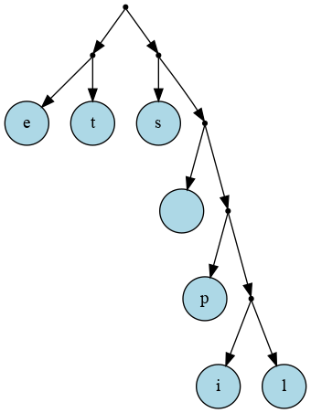
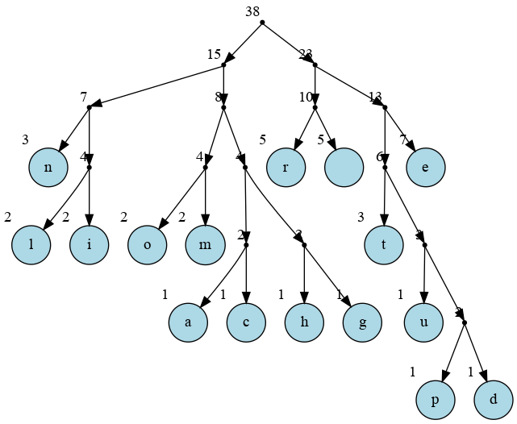




{{ titre_chapitre(num,niveau)}}

{{ citation("An algorithm must be seen to be believed, and the best way to learn what an algorithm is all about is to try it.
","D. Knuth","The Art of Computer Programming Vol. 1, 3rd edition") }}

## Cours

{{ affiche_cours(num) }}

## Travaux dirigés

{{ td(num) }}


## Travaux pratiques

!!! danger
    * Afin de tester les divers algorithmes sur les textes, on suppose dans tous les exercices qu'on dispose d'un fichier texte encodé au **format {{sc("ascii")}} standard** c'est-à-dire qu'on utilise **128 cractères tous encodés sur 8 bits**. De cette façon :
    
        * pour les algorithmes de recherche on pourra indexer chaque caractère par une table de 128 entiers (c'est-à-dire identifier un caractère à son code {{sc("ascii")}}.
        * pour mesurer les taux de compressions, on pourra considérer qu'un fichier contenant $n$ caractères a une taille de $8n$ bits (le cas de l'{{sc("utf-8")}} s'avère bien plus problématique puis qu'un caractère occupe de 1 à 4 octets.)

    * On donne ci dessous un tel fichier prêt à l'emploi à télécharger : il s'agit du livre *Notre-Dame de Paris* (V. {{sc("Hugo")}}, 1831) qui servira d'exemple pour les tests.   
    {{telecharger("Notre-Dame de Paris (ascii)","./files/C19/notredame_ascii.txt",false)}}
    * Pour produire de tels fichiers, on pourra partir de n'importe quel fichier texte au format {{sc("utf-8")}} (par exemple un livre téléchargeable sur le site du   [projet Gutenberg](https://www.gutenberg.org/){target=_blank}) puis convertir ce fichier au format {{sc("ascii")}} en effectuant une translittération, c'est-à-dire par exemple en remplaçant `à` par `a` ou encore `é` par `e` pour cela, on pourra utiliser l'utilitaire `iconv` en ligne de commande avec la syntaxe suivante :
    ```bash
    iconv -f utf-8 -t ascii//TRANSLIT <source> -o <destination>
    ```

!!! aide
    En Ocaml la fonction suivante `lire_fichier string -> string` permet de lire la totalité d'un fichier dont on donne le nom et renvoie le contenu sous la forme d'une chaine de caractère :

    ```ocaml
    let lire_fichier fname =
    let reader = open_in fname in
    In_channel.input_all reader;;
    ```

{{exo("Autour de la recherche naïve",[],0)}}


1. En OCaml

    1. Ecrire en OCaml l'algorithme de recherche naïf vu en cours et qui renvoie la liste de toutes les occurrences du motif dans la chaine 

    2. Tester la sortie anticipée d'une boucle à l'aide de la levée d'une exception de façon à renvoyer uniquement la première occurrence. On pourra utiliser l'exception prédéfinie `Exit` ou créer une exception  en déclarant par exemple `#!Ocaml exception Trouve;;`.


2. En C

    1. Ecrire l'algorithme de recherche naïf qui renvoie l'indice de la première occurence (ou `-1`) si le motif ne se trouve pas dans la chaine.

        !!!aide
            On pourra utiliser la fonction `strncmp` de `<string.h>` pour comparer directement le motif à n'importe quelle partie du texte.

    2. Ecrire une fonction qui renvoie les indices de toutes les occurrences sous la forme d'une liste chainée d'entiers (afin de revoir rapidement leur implémentation).

Dans les deux langages, pour tester les programmes, on pourra :

3. Ecrire une fonction qui prend en argument un nom de fichier et renvoie une chaine de caractères contenant les caractères du fichiers.


4. Tester les fonctions de recherche en écrivant un programme qui prend en argument sur la ligne de commande un motif et le nom du fichier contenant le texte.

    !!! aide
        On rappelle :  

        * qu'en C, la fonction `main` doit alors s'écrire `#!c main(int argc, char* argv[])` et que le tableau de chaines de caractères `argv` contient les arguments présents sur la ligne de commande à partir de l'indice 1 (`argv[0]` est le nom de l'exécutable).
        * qu'en OCaml, on peut récupérer directement l'argument numéro `i`  à l'aide de `#!ocaml Sys.argv.(i)` (comme en C, l'argument d'indice 0 est le nom de l'exécutable)

{{exo("Avec une table de décalage",[])}}

On rappelle qu'on peut accélérer la recherche en commençant par la fin du motif (de longueur $l_m$) et en utilisant une *table de décalage* $d$  qui indique de combien d'emplacement on peut avancer lorsqu'on rencontre deux caractères qui ne se correspondent pas :

* Si un caractère $c$ n'est pas dans le motif alors $d(c)=l_m$ 
* Si c est le dernier caractère du motif, alors $d(c)$ est la distance entre l'*avant-dernière* occurrence de $c$ et la fin du motif
* Sinon $d(c)$ est la distance entre la dernière occurrence de $c$ et la fin du motif

Dans une recherche naïve on teste les correspondances à chaque indice possible dans le texte, cette table de décalage permet d'avancer plus vite (au maximum on avance de la longueur du motif).

1. Ecrire la table de décalage du motif `petite`
2. Ecrire dans le langage de votre choix une fonction `decalage` qui prend en argument un motif et renvoie sa table de décalage. On rappelle qu'on utilise 128 caractères, on connait donc à l'avance la taille de la table de décalage. Tester votre fonction sur le motif `petite`
3. Implémenter l'algorithme de recherche de Boyer-Moore-Hoorspool
4. On propose de comparer le nombre de comparaisons effectués par la recherche naïve et par l'algorithme de Boyer-Moore-Hoorspool :

    * Modifier votre algorithme de recherche naïve afin qu'il renvoie aussi le nombre de comparaisons effectués (dans le cas du C, on pourra passer un pointeur vers un entier en argument et le modifier dès qu'une comparaison est faite)
    * Modifier de même votre implémentation de Boyer-Moore-Hoorspool afin d'obtenir le nombre de comparaisons effectués.
    * Conclure en testant par exemple sur la recherche de `Quasimodo` dans le fichier `notredame_ascii.txt` téléchargeable ci-dessus.

{{exo("Algorithme de Rabin-Karp",[])}}

1. Ecrire dans le langage de votre choix, une implémentation de l'algorithme de Rabin-Karp en utilisant la fonction de décalage qui effectue la somme des codes des caractères.

2. Modifier votre fonction afin de pouvoir obtenir en plus le nombre de collisions 

3. Tester en recherchant `ab` dans le fichier `notredame_ascii.txt`, combien de collisions ne sont *pas* des correspondances ? {{check_reponse("1803")}}

4.  Tester avec la nouvelle fonction de hachage   
$\displaystyle{h(s) = \sum_{i=0}^{n-1} 31^i \times c_i}$ (où les $c_i$ sont les caractères de la chaine $s$)

{{ exo("Algorithme de Huffmann en OCaml",[])}}

!!! Aide
    On rappelle  que lors de la phase de construction de l'arbre, on sélectionne à chaque étape les deux arbres ayant les nombres d'occurrences les plus faibles. La structure de données adaptée est donc celle *d'une file de priorité* puisqu'elle permet la mise à jour de la structure de données en complexité logarithmique. Cette structure de données  s'implémente usuellement à l'aide d'un tas min binaire. Une implémentation de cette structure de donnée en OCaml est donnée ci-dessous. Cependant, on pourra aussi utiliser une simple liste dans laquelle on recherchera à chaque étape les éléments de plus petites priorités (ou coder sa propre implémentation). L'interface fournie est la suivante :

    * `#!ocaml let cree_file t default` crée une file de priorité de taille maximale `t` d'éléments de type de celui de `default`. Par exemple `#!ocaml let test = cree_file 10 ""` crée une file de priorité de taille 10 contenant des chaines de caractères.
    * `#!ocaml let enfile elt fp` enfile l'élément `elt` (représenté par un couple `priorite,valeur`) dans la file de priorité  `fp`. Par exemple `enfile (2,"Albert") test` ajoute "Albert" avec la priorité 2 dans la file `test`.
    * `#!ocaml let defile fp` renvoie l'élement de plus petite priorité (sous la forme d'un couple `priorite,valeur`)
    * `#!ocmal let taille fp` renvoie le nombre d'élements de la file `fp`

    ??? ocaml "Implémentation d'une file de priorité"
        ```ocaml
        --8<-- "C19/file_prio.ml"
        ```


Dans tout la suite on suppose qu'on veut compresser un texte encodé en {{sc("ascii")}} et on suppose défini `#!ocaml let nbchar = 128`.

1. Ecrire  une fonction `occurences : string -> int array` qui prend en argument une chaine de caractères `texte` et renvoie un tableau d'entier `occ` tel que `occ.(i)` contienne le nombre d'occurrence du caractère de code `i` dans `texte` (on rappelle qu'on considère que les codes des caractères sont ceux de l'{{sc("ascii")}}) et donc vont de 0 à 127.


2. On définit à présent le type :
```ocaml
--8<-- "C19/huffman.ml:type"
```
qui permet de représenter un arbre de codage de Huffman, car c'est soit une feuille (avec le code du caractère) soit un noeud constitué d'un sous arbre droit et d'un sous arbre gauche. 
Ecrire une fonction `let initialise_file int array -> abh file priorite` qui prend en argument un tableau de taille 128 tel que `tab.(i)` contienne le nombre d'occurrence du caractère `i` et renvoie une file de priorité dans laquelle on a enfilé toutes les `Feuilles (char_of_int i)` pour `i=0...128` en leur donnant comme priorité le nombre d'occurrence du caractère de code `i` (si ce nombre d'occurrence est non nul)

3. Ecrire une fonction `construire_arbre abh file_priorite -> abh` qui prend en argument un tableau d'occurrence et construit l'arbre de codage de Huffmann correspondant.

    !!! aide
        On rapelle que l'algorithme consiste, tant que la file de priorité n'est pas réduit à un seul élément,  à extraire les deux ayant la plus grande priorité, les assembler en un nouvel arbre enfiler ce nouvel arbre en lui donnant la somme des priorités des deux éléments extraits.

4. Ecrire une fonction `huffmann string -> abh` qui prend en argument une chaine de caractères et renvoie l'arbre de codage de huffman de cette chaine de caractères.

    !!! note
        Une fonction de visualisation `abh -> unit` est fournie ci-dessous et vous permet de visualiser l'arbre construit :
        ??? ocaml "Visualisation d'un arbre de codage de Huffman"
            ```ocaml
            --8<-- "C19/huffman.ml:visualise"
            ```
        Par exemple, sur l'exemple du cours : `les petits tests`, vous devriez obtenir l'arbre suivant :
        {.imgcentre width=300px}

3. Ecrire une fonction `cree_code ab -> string array` qui prend en argument un arbre de codage de Huffmann et renvoie les codes des caractères qu'il contient (on ajoute un 0 lorsqu'on par à gauche et un 1 lorsqu'on part à droite).

5. Ecrire une fonction qui calcule le taux de compression du texte. Sur l'exemple précédent vous devriez obtenir un taux de compression  de $0,328125$.

6. Ecrire une fonction `lire_fichier string -> string` qui renvoie dans une chaine de caractère le contenu du fichier dont le nom est donné en argument

7. Tester l'algorithme de compression de Huffmann sur le fichier `notre_dame_ascii.txt` disponible en téléchargement ci-dessus. Quel taux de compression obtient-on (arrondir à 3 chiffres après la virgule) ? {{check_reponse("0.564")}} (le séparateur décimal est `.`)

{{ exo("Algorithme de Huffmann en C",[])}}

On veut maintenant implémenter l'algorithme de Huffman en C afin de compresser des textes encodé en {{sc("ascii")}}, on indiquera la taille du code en début de programme à l'aide d'une directive de compilation `#!c #define CODESIZE 128`

1. Ecrire une fonction de signature `#!c int *count(char *texte)` qui renvoie un tableau de taille `CODESIZE` contenant le nombre d'occurrence de chaque caractère dans le texte. Puisque le texte est encodé en {{sc("ascii")}}, le tableau sera de taille 128 et la valeur situé à l'indice `i` indique le nombre d'occurrences du caractère de code `i`.

    !!! rappel
        Une conversion de type depuis un `char c` vers un `uint8_t i` peut s'effectuer à l'aide d'un *cast* : `#!c t = (uint8_t)c`

2. On doit maintenant définir le type représentant un arbre binaire de Huffmann : 
    ```c
    --8<-- "C19/huffman.c:type"
    ```

    !!! note
        On remarquera bien que :

        * le champ `car` n'est utilisé que pour les feuilles de l'arbre 
        * on prévoit directement un champ `prio` afin d'y stocker la priorité de l'arbre
        * un arbre binaire de Huffman (`abh`) est un pointeur vers un noeud `node`, ce qui permet de représenter l'arbre vide par `NULL`.
    
    Et un type permettant de représenter un tas binaire min contenant des éléments de type `abh`

    ```c
    --8<-- "C19/huffman.c:heap"
    ```

    On doit donc commencer par écrire les fonctions permettant d'insérer et d'extraire des éléments de ce tas.

    1. Ecrire les fonctions utilitaires suivantes : 

        * `#!c int son(int i)` qui renvoie l'indice du fils gauche du noeud d'indice `i`.
        * `int father(int i)` qui renvoie l'indice du père du noeud `i`.
        * `void swap(abh *data, int i, int j)` qui échange les deux éléments d'indice `i` et `j` dans `data`.

    2. Ecrire la fonction `#!c heap make_heap(void)` qui renvoie un tas de taille vide avec un champ `data` pouvant contenant jusqu'à `CODESIZE` éléments.

        ??? aide "Proposition de correction"
            ```c
                --8<-- "C19/huffman.c:make_heap"
            ```

    3. Ecrire la fonction `#!c bool insert_heap(abh nv, heap *mh)` qui insère un élément `nv` dans le tas `mh` et renvoie un booléen indiquant si l'insertion à échoué (tas plein) ou non.
       
        ??? aide "Proposition de correction"
            ```c
                --8<-- "C19/huffman.c:insert_heap"
            ```

    4. Ecrire la fonction `#!c abh getmin(heap *mh)` qui renvoie le minimum du tas (on renvoie {{sc("null")}} si le tas est vide).
       
        ??? aide "Proposition de correction"
            ```c
                --8<-- "C19/huffman.c:getmin"
            ```
        
3. Ecrire les fonction suivantes :

    1. la fonction `#!c heap init_heap(char *texte)` qui permet d'initialiser le tas en y insérant chaque caractère contenu dans le texte avec son nombre d'occurrences, cette fonction utilise donc la fonction `count` écrite en début d'exercice.

        ??? aide "Proposition de correction"
            ```c
                --8<-- "C19/huffman.c:init_heap"
            ```

    2. la fonction `#!c abh make_huffman(heap *mh)` qui génère l'arbre de huffman à partir du tas initialisé à la question précédente.

        ??? aide "Proposition de correction"
            La proposition de correction ajoute un identifiant unique `node_idx` à chaque noeud de l'arbre qui n'est pas une feuille, cela permet d'écrire plus facilement la fonction de visualisation de l'arbre.

            ```c
                --8<-- "C19/huffman.c:make_huffman"
            ```
        
        ??? aide "Visualisation de l'arbre"
            ```c
                --8<-- "C19/huffman.c:view"
            ```

4. Tester votre fonction sur l'exemple "*comprendre un algorithme et le retenir*" et visualiser l'arbre obtenu. Vous devriez obtenir le résultat suivant :

    {.imgcentre width=400px}

5. Ecrire la fonction `#!c char ** make_code(abh mh)` qui à partir de l'arbre renvoie un tableau contenant le code de chaque caractère.

    !!! aide
        On pourra utiliser les fonctions de `<string.h>` telles que `strlen`, `strcpy` ou encore `strcat`.

6. Ecrire la fonction `#!c char *read_file(char *fname)` permettant de lire le contenu d'un fichier dont on donne le nom, et tester l'algorithme sur le fichier `notredame_ascii.txt` (voir exercice précédent en OCaml)

{{ exo("Algorithme LZW en Ocaml",[])}}

Le but de l'exercice est d'implémenter en OCaml l'algorithme {{sc("lzw")}}, on rappelle qu'on considère qu'on compresse des textes en {{sc("ascii")}} et qu'on identifie un caractère à son code (un entier compris entre 0 et 127). On se fixe un maximum pour la taille des codes (en bits) produits par l'algorithme. Lorsque ce maximum est atteint, on ne produit plus de codes pour les prefixes rencontrés.

1. Définir en début de programme une constante `taille_max`, qui contiendra la taille maximale en bits d'un code, on pourra prendre la valeur 16 (de cette façon, un code occupe au maximum 2 octets). Ecrire une fonction qui renvoie le numéro maximal d'un code en connaissant la taille maximale de code utilisée.

2. On stocke les codes de chacun préfixe dans une *table de hachage*, et on rappelle qu'initialement seuls les codes des lettres sont dans la table. Ecrire une fonction `code_ascii : () -> (string, int) Hashtbl` qui renvoie une table de hachage dont les clés sont les caractères {{sc("ascii")}} et les valeurs les codes associés.
        
    !!! aide
        * On pourra commencer par écrire une fonction `string_of_char : char -> string`  qui renvoie le caractère passé en argument sous la forme d'une chaine de caractère, par exemple `string_of_char 'A'` renvoie `"A"`.
        * On rappelle les fonctions suivantes du module `Hashtbl` :
            * `#!ocaml Hashtbl.mem` crée une table de hachage (on doit donner une taille initiale)
            * `#!ocaml Hashtbl.mem` permet de tester l'appartenance
            * `#!ocaml Hashtbl.add` permet d'ajouter un nouveau couple (clé, valeur)
            * `#!ocaml Hashtbl.find` permet de récupérer la valeur associée à une clé
            * `#!ocaml Hashtbl.replace` permet de modifier la valeur associée à une clé

3. Ecrire la fonction de compression de signature : `compression : string -> (string,int) Hashtbl -> int -> int list * int` qui prend en argument  la texte à compresser, la table de hachage, le nombre de caractères de l'alphabet initial et renvoie la liste des codes générés ainsi que le nombre total de codes.

    !!! aide
        On rappelle qu'à chaque étape :

        * on émet le code du plus long préfixe se trouvant dans la table
        * on crée un nouveau code pour ce préfixe augmenté du caractère suivant

4. Ecrire la fonction de décompression de signature `decompression : int list -> string` qui prend en argument la liste des codes et renvoie le texte décompressé. Cette fois, on a besoin d'un tableau de chaines de caractères dont indicé par le numéro des codes. Initialement ce tableau contient les caractères {{sc("ascii")}}.

5. Tester vos fonctions d'abord sur de petits exemples tels que ceux vu en cours puis des fichiers plus longs.

{{ exo("ASCII art et compression",[]) }}

L'[ASCII art](https://en.wikipedia.org/wiki/ASCII_art){target=_blank} consite à réaliser des images uniquement avec des lettres et ces caractères spéciaux contenus dans le code {{sc("ascii")}}. Voici l'exemple d'un *smiley* réalisé en ASCII art (crédit : Wikipédia):

```
                          oooo$$$$$$$$$$$$oooo
                      oo$$$$$$$$$$$$$$$$$$$$$$$$o
                   oo$$$$$$$$$$$$$$$$$$$$$$$$$$$$$$o         o$   $$ o$
   o $ oo        o$$$$$$$$$$$$$$$$$$$$$$$$$$$$$$$$$$$$o       $$ $$ $$o$
oo $ $ '$      o$$$$$$$$$    $$$$$$$$$$$$$    $$$$$$$$$o       $$$o$$o$
'$$$$$$o$     o$$$$$$$$$      $$$$$$$$$$$      $$$$$$$$$$o    $$$$$$$$
  $$$$$$$    $$$$$$$$$$$      $$$$$$$$$$$      $$$$$$$$$$$$$$$$$$$$$$$
  $$$$$$$$$$$$$$$$$$$$$$$    $$$$$$$$$$$$$    $$$$$$$$$$$$$$  '''$$$
   '$$$''''$$$$$$$$$$$$$$$$$$$$$$$$$$$$$$$$$$$$$$$$$$$$$$$$$     '$$$
    $$$   o$$$$$$$$$$$$$$$$$$$$$$$$$$$$$$$$$$$$$$$$$$$$$$$$$$     '$$$o
   o$$'   $$$$$$$$$$$$$$$$$$$$$$$$$$$$$$$$$$$$$$$$$$$$$$$$$$$       $$$o
   $$$    $$$$$$$$$$$$$$$$$$$$$$$$$$$$$$$$$$$$$$$$$$$$$' '$$$$$$ooooo$$$$o
  o$$$oooo$$$$$  $$$$$$$$$$$$$$$$$$$$$$$$$$$$$$$$$$$$$   o$$$$$$$$$$$$$$$$$
  $$$$$$$$'$$$$   $$$$$$$$$$$$$$$$$$$$$$$$$$$$$$$$$$     $$$$''''''''
 ''''       $$$$    '$$$$$$$$$$$$$$$$$$$$$$$$$$$$'      o$$$
            '$$$o     '''$$$$$$$$$$$$$$$$$$'$$'         $$$
              $$$o          '$$''$$$$$$''''           o$$$
               $$$$o                                o$$$'
                '$$$$o      o$$$$$$o'$$$$o        o$$$$
                  '$$$$$oo     ''$$$$o$$$$$o   o$$$$''
                     ''$$$$$oooo  '$$$o$$$$$$$$$'''
                        ''$$$$$$$oo $$$$$$$$$$
                                ''''$$$$$$$$$$$
                                    $$$$$$$$$$$$
                                     $$$$$$$$$$'
                                      '$$$'' 
```

Comme on peut le constater sur cet exemple, on trouve dans ce type d'image, de nombreuses répétitions du *même caractère*, (ici des suites de `$` ou de `"`). Aussi, on cherche à diminuer la taille de ces images en utilisant une compression de type [*RLE*](https://en.wikipedia.org/wiki/Run-length_encoding) qui consiste à remplacer des occurrences multiples d'un caractère par le nombre de répétition suivi du caractère, par exemple la chaine "AAAAABBBBCC" pourrait se compresser en  "5A4B2C". 

1. Afin de travailler sur ces images en OCaml, on propose dans un premier temps de les convertir en liste de caractères. Ecrire une fonction `list_of_string : string -> char list` qui prend en entrée une chaine de caractère et la convertit en une liste de caractère. Par exemple `list_of_string "XXXYY"` donne la liste `['X','X','X','Y','Y']`.

    !!! aide
        On pourra dans un premier temps ne pas soulever des problèmes de complexité et utiliser `String.sub` mais l'extraction d'une sous chaine est une opération en $\mathcal{O}(m)$ où $m$ est la taille de la sous chaine, aussi répéter l'extraction des sous chaines pour chaque emplacement donnera une complexité quadratique. Pour une solution de complexité linéraire, on pourra penser à utiliser `List.init`.

2. Ecrire une fonction `compression` qui prend en entrée une liste de caractère et renvoie une liste de couples (un entier et un caractère) correspondant à la compression *RLE* décrite ci-dessus par exemple `compression ['E';'E';'E';'C';'A';'A';'A';'A']` renvoie la liste `[(3,'E'),(1,'C'),(4,'A')]`

3. Compresser l'image du smiley ci-dessus, combien de couples `int*char` contient la liste obtenue ? Vérifier votre résultat : {{check_reponse("270")}}

4. Ecrire la fonction `décompression : int*char -> string` qui prend en entrée une liste de couples représentant une compression *RLE* d'une image en ASCII art et renvoie la chaine représentant cette image.

5. Tester votre fonction en décompressant l'image représenté par la liste suivante :
```
[(13,'_'); (1,'\n'); (1,'('); (1,' '); (1,'H'); (1,'e'); (2,'l'); (1,'o'); (1,' '); (1,'w'); (1,'o'); (1,'r'); (1,'l'); (1,'d'); (1,' '); (1,')'); (1,'\n'); (1,' '); (13,'-'); (1,'\n'); (8,' '); (1,'o'); (3,' '); (1,'^'); (2,'_'); (1,'^'); (1,'\n'); (9,' '); (1,'o'); (2,' '); (1,'('); (2,'o'); (1,')'); (1,'\\'); (7,'_'); (1,'\n'); (12,' '); (1,'('); (2,'_'); (1,')'); (7,' '); (1,')'); (1,'\\'); (1,'/'); (1,'\\'); (1,'\n'); (16,' '); (2,'|'); (4,'-'); (1,'w'); (1,' '); (1,'|'); (1,'\n'); (16,' '); (2,'|'); (5,' '); (2,'|'); ]1
```
Que peut-on lire sur cette image (respecter la casse) : {{check_reponse("Hello world")}}

6. On suppose à présent que chaque couple `int*char` utilise 2 octets, déterminer le taux de compression sur l'exemple du smiley.

7. Comparer avec les taux de compression de l'algorithme de Huffman codé aux exercices précédents.

8. Même question avec {{sc("lzw")}}.

## Humour d'informaticien

{.imgcentre width=500px}
